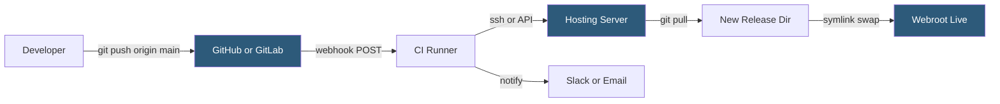

**Category:** Web Hosting Fundamentals
**Difficulty:** Intermediate
**Reading time:** 6 min read

---

Git integration on hosting platforms allows deployments triggered directly by version control events, replacing manual FTP uploads with automated, repeatable delivery. When a developer pushes to a branch, a webhook or pull mechanism synchronizes code to the target server, runs build steps, and optionally invalidates caches. This bridges the gap between source control and live infrastructure.

- **Webhook** — HTTP POST sent by GitHub/GitLab to a hosting endpoint when a push occurs
- **Deploy hook** — URL on the hosting platform that triggers a pull-and-deploy when called
- **Git remote** — a named reference to a remote repository; some hosts expose their own Git endpoint as a remote
- **CI/CD pipeline** — automated sequence of build, test, and deploy steps triggered by Git events
- **Branch-based deployment** — mapping specific branches (main → production, develop → staging) to environments
- **Atomic deployment** — swapping a symlink to a new release directory so the cutover is instantaneous
- **.gitignore** — file listing paths excluded from Git tracking (node_modules, .env, compiled assets)
- **Git submodule** — a repository embedded within a parent repository, often used for shared theme components

Most modern hosting platforms support Git-triggered deployments through one of two mechanisms. The push model uses a webhook registered in the Git provider; the hosting platform exposes a receiver URL that GitHub calls with a JSON payload on every push. The receiver validates the HMAC signature, identifies the branch, and executes a deployment script. The pull model is simpler: the hosting server runs a cron job or responds to a deploy hook URL by running `git pull` in the webroot directory.

More sophisticated setups use atomic deployments modeled after Capistrano. Each deployment creates a timestamped directory under `releases/`, runs build steps (Composer install, npm build), then atomically rewrites a `current` symlink to point at the new release. If anything fails, rolling back is a single symlink change. The webroot is configured to serve from `current/`.

Shared hosting environments often use cPanel's Git Version Control feature, which polls a connected repository and deploys on schedule or via a deploy hook. Managed WordPress hosts (WP Engine, Kinsta) provide push-to-deploy via their own Git endpoints — developers add the host as a second Git remote and push to trigger deployment.

Branch protection rules ensure only tested commits reach production branches, and required status checks block merges until CI passes, creating an auditable deployment trail.

- Automated deployment from main branch push without SSH login
- Rollback by repointing a symlink to a previous release directory
- Preview environments automatically created per pull request
- Tracking exactly which commit is running in production for debugging
- Multi-developer teams enforcing code review before production changes

| Advantage | Disadvantage |
|-----------|--------------|
| Eliminates manual FTP/SFTP file uploads | Requires initial pipeline setup and configuration |
| Every deployment is recorded in Git history | Broken builds can block deployments until fixed |
| Rollback is fast and deterministic | Binary assets and uploads require separate handling outside Git |
| Enforces code review via branch protection | Large repositories slow down deployment pull times |

- [Staging Environment Implementation](staging-environment-implementation.md)
- [Development vs Production Hosting Separation](development-vs-production-hosting-separation.md)
- [SSH Access Management for Shared Hosting](ssh-access-management-for-shared-hosting.md)

---
*Part of the [Web Hosting Fundamentals](index.md) category · [Back to Master Index](../../index.md)*
