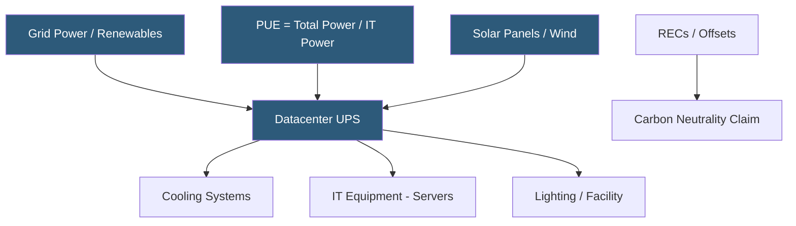

**Category:** Web Hosting Fundamentals
**Difficulty:** Beginner
**Reading time:** 5 min read

---

Green hosting providers offset or eliminate the carbon emissions of datacenter operations through renewable energy procurement, carbon offset certificates, and energy efficiency improvements. PUE (Power Usage Effectiveness) and renewable energy percentage are the primary metrics used to evaluate a provider's environmental credentials.

- **PUE (Power Usage Effectiveness)** — ratio of total datacenter energy to IT equipment energy; a PUE of 1.0 is perfect efficiency; industry average is approximately 1.58
- **Renewable Energy Certificates (RECs)** — tradeable instruments representing 1 MWh of renewable energy generated; purchased to offset grid electricity with equivalent green generation
- **Carbon offset** — financial instrument representing 1 tonne of CO2 equivalent prevented or removed elsewhere; used to counterbalance datacenter emissions
- **Direct air capture** — emerging technology that pulls CO2 directly from the atmosphere; expensive but increasingly used by hyperscalers
- **24/7 carbon-free energy (CFE)** — matching electricity consumption with clean generation on an hourly basis, not just annual averages
- **Free cooling** — using outside air or water sources (rivers, seawater) to cool server equipment, reducing compressor chiller energy consumption
- **LEED certification** — Leadership in Energy and Environmental Design rating for buildings; applied to datacenters for structural efficiency

Datacenters are among the largest electricity consumers globally, accounting for approximately 1–2% of worldwide electricity use. A typical server rack draws 10–20 kW; a medium-sized datacenter housing thousands of racks consumes tens of megawatts continuously.

PUE measures how efficiently that power is used. A datacenter with a PUE of 1.5 spends 50 cents on cooling, lighting, and distribution for every dollar spent on actual computing. Google's hyperscale facilities achieve PUE of 1.06–1.10 through hot/cold aisle containment, liquid cooling, and AI-optimized HVAC control. Traditional datacenter PUE averages around 1.5–1.8.

Green hosting providers address the remaining carbon footprint through three mechanisms. First, direct renewable energy procurement: building or purchasing power purchase agreements (PPAs) with wind and solar farms, ensuring actual clean electricity enters the grid. Second, Renewable Energy Certificates purchased in quantities matching annual consumption. Third, carbon offsets for unavoidable emissions — reforestation projects, methane capture, or direct air removal.

The distinction between "100% renewable energy" marketing and genuine 24/7 carbon-free energy is significant. Annual REC matching means a provider might use coal-heavy grid power at night while claiming green credentials based on daytime solar production averaged over the year. Google and Microsoft have committed to 24/7 hourly matching, requiring energy storage and diversified renewable sources.

Customers can verify provider claims through the Green Web Foundation database, which tracks hosting providers with verified green energy documentation.

- Organizations with corporate sustainability goals requiring supply chain emissions reduction
- Government and public sector websites subject to environmental procurement policies
- Consumer brands where environmental positioning influences purchasing decisions
- Climate tech companies requiring their own infrastructure to align with mission
- Hosting resellers differentiating through sustainability credentials

| Advantage | Disadvantage |
|-----------|--------------|
| Reduces organizational carbon footprint | Green premium adds 10–30% to hosting cost |
| Aligns with ESG reporting and sustainability goals | REC-based claims less rigorous than direct renewables |
| Can attract environmentally conscious customers | Geographic availability of genuine green facilities limited |
| Improves brand perception and marketing differentiation | Verification of provider claims requires due diligence |
| Some providers achieve efficiency that reduces costs | 24/7 CFE significantly harder and costlier than annual matching |

- [Hybrid Hosting Deployment Strategies](hybrid-hosting-deployment-strategies.md)
- [Cloud Hosting Scalability Principles](cloud-hosting-scalability-principles.md)
- [Container-Based Hosting Platforms](container-based-hosting-platforms.md)

---
*Part of the [Web Hosting Fundamentals](index.md) category · [Back to Master Index](../../index.md)*
