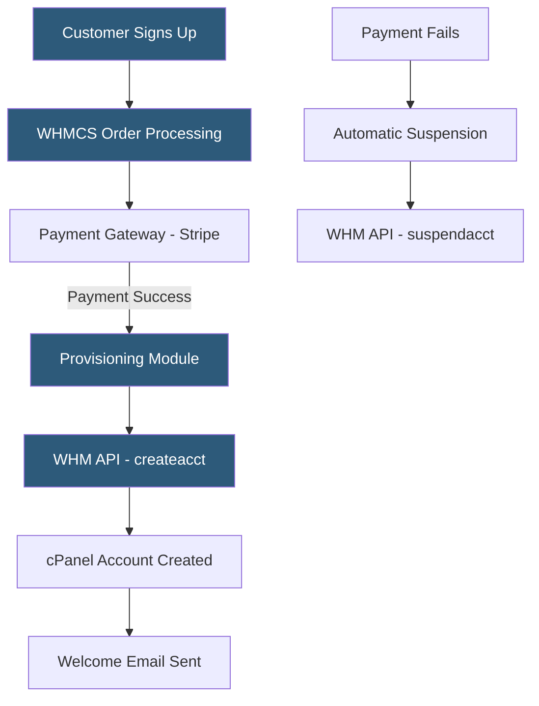

**Category:** Web Hosting Fundamentals
**Difficulty:** Intermediate
**Reading time:** 6 min read

---

Hosting account provisioning automation connects billing platforms to server management systems so that new customer signups, upgrades, suspensions, and cancellations trigger the corresponding server-side actions without manual administrator intervention. WHMCS is the dominant platform for this automation in the cPanel hosting ecosystem.

- **WHMCS** — Web Host Manager Complete Solution; billing, support, and provisioning automation platform used by thousands of hosting providers
- **Provisioning module** — WHMCS plugin that translates billing events (create, suspend, unsuspend, terminate) into control panel API calls
- **Welcome email** — automatically generated and sent to new customers containing hosting credentials, nameservers, and setup instructions
- **Automated suspension** — billing-triggered suspension of hosting accounts when payment is overdue, with automatic unsuspension on payment
- **API webhook** — event notification sent from billing platform to an external system when a subscription state changes
- **Idempotent provisioning** — design principle ensuring that running a provisioning action multiple times produces the same result as running it once
- **Provisioning queue** — job queue that retries failed provisioning attempts with exponential backoff to handle temporary API failures

WHMCS sits at the center of most shared and reseller hosting automation pipelines. It manages the customer journey from order placement through payment, provisioning, ongoing billing, support, and cancellation. Each phase triggers automated actions via module calls to the hosting control panel.

When a customer places an order, WHMCS creates a pending service record and routes payment to the configured gateway (Stripe, PayPal, Authorize.net). On payment confirmation, the provisioning module executes. For cPanel, this calls `createacct` via the WHM API with the package parameters defined in WHMCS. The API returns the new account's username, IP address, and nameservers. WHMCS stores this data and populates the welcome email template before dispatch.

The provisioning module handles the full account lifecycle. Upgrade calls modify the cPanel package assignment, adjusting resource limits. Suspension calls block the account from serving web requests while preserving its data. Cancellation triggers account termination with a configurable grace period before actual deletion.

Reliability requires careful error handling. API timeouts, server overloads, and network interruptions can cause provisioning calls to fail. WHMCS retries failed provisioning tasks automatically; idempotent API design ensures that retrying account creation for an already-created account returns success without creating a duplicate.

Custom automation extends beyond the standard module lifecycle. Hooks in WHMCS allow PHP code to execute on events: post-provisioning hooks can trigger DNS registration, send Slack notifications, update an internal CMDB, or activate add-on services.

- Shared hosting providers processing hundreds of new customer signups daily without manual effort
- Resellers automating the full customer lifecycle including billing, provisioning, and cancellations
- Enterprise hosting operations integrating customer onboarding with internal CRM and provisioning systems
- Managed WordPress providers triggering site setup (WordPress install, theme, plugins) automatically after account creation
- Hosting providers offering instant provisioning as a competitive differentiator

| Advantage | Disadvantage |
|-----------|--------------|
| Eliminates manual provisioning bottleneck | WHMCS licensing is a significant monthly expense |
| Consistent account configuration across all signups | Module bugs can cause silent provisioning failures |
| Automated billing reduces revenue leakage from manual errors | Complex multi-product setups require custom development |
| Scales to any volume without additional staff | Customer data concentrated in billing platform creates security risk |
| Welcome emails provide professional customer experience | API rate limits on hosting panels constrain throughput |

- [WHM Web Host Manager Automation](whm-web-host-manager-automation.md)
- [cPanel vs Plesk Control Panel Comparison](cpanel-vs-plesk-control-panel-comparison.md)
- [Reseller Hosting Business Models](reseller-hosting-business-models.md)

---
*Part of the [Web Hosting Fundamentals](index.md) category · [Back to Master Index](../../index.md)*
