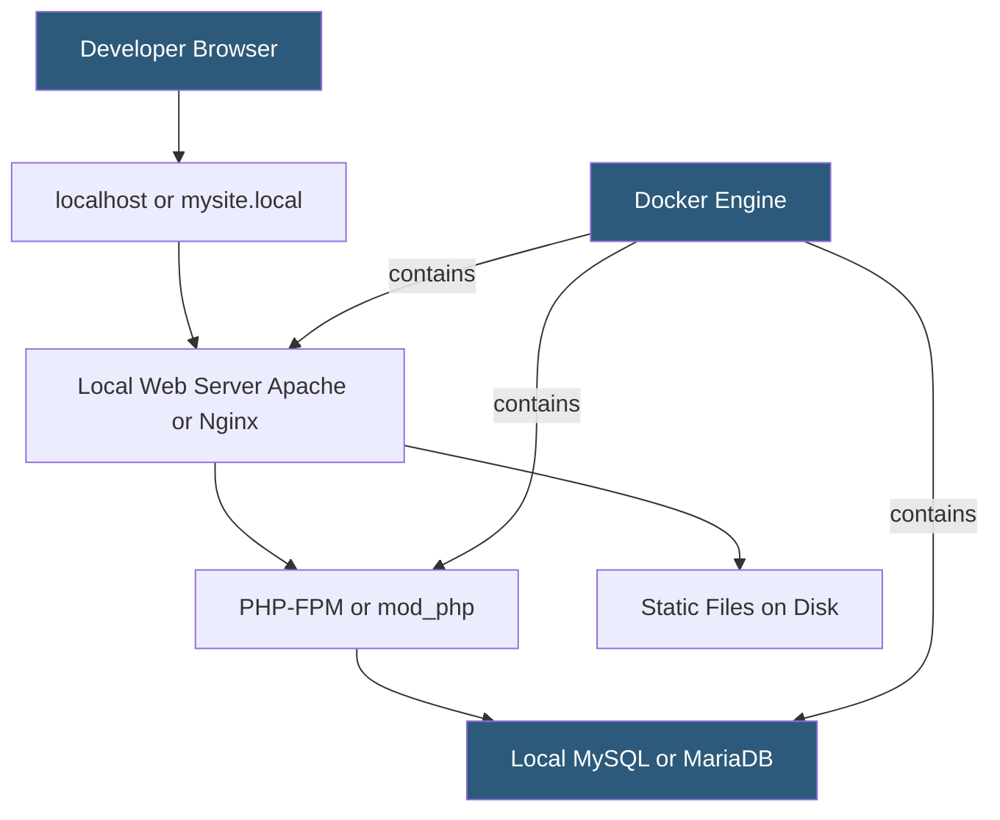

**Category:** Web Hosting Fundamentals
**Difficulty:** Beginner
**Reading time:** 5 min read

---

A local development environment replicates the web server, database, and runtime on a developer's own machine so they can build and test without network latency or shared-server risk. Common approaches include native stack installers, Docker-based environments, and virtualization tools. Matching local configuration as closely as possible to production prevents environment-specific surprises.

- **LAMP/LEMP stack** — Linux, Apache/Nginx, MySQL/MariaDB, PHP running locally
- **Docker Compose** — tool for defining multi-container local stacks with a single `docker-compose.yml`
- **LocalWP** — GUI application providing isolated WordPress environments per project
- **DDEV** — Docker-based local development tool focused on PHP frameworks and WordPress
- **Lando** — Docker-based local development tool with recipe-based configuration for multiple frameworks
- **hosts file** — OS-level DNS override mapping local domains (mysite.local) to 127.0.0.1
- **.env file** — local configuration file holding environment-specific variables excluded from source control
- **phpMyAdmin / Adminer** — browser-based MySQL admin interfaces commonly bundled with local stacks

The simplest local setup uses an all-in-one installer: XAMPP or MAMP bundles Apache, MariaDB, and PHP into a single application with a GUI control panel. These are fast to install but all projects share the same PHP version and config, making multi-version testing difficult.

Docker-based tools solve version isolation by containerizing each project's stack. DDEV reads a `.ddev/config.yaml` defining the PHP version, database type, and web server. Running `ddev start` pulls the appropriate Docker images, mounts the project directory, and configures a local `.ddev.site` domain with HTTPS via a local certificate authority. Each project is hermetically isolated — one project can run PHP 8.1 while another uses PHP 7.4.

The `hosts` file (on macOS/Linux at `/etc/hosts`, on Windows at `C:\Windows\System32\drivers\etc\hosts`) maps pretty local domains like `mysite.local` to `127.0.0.1`. Tools like DDEV and LocalWP automate this step. An HTTPS certificate for local domains is trusted by importing a local CA certificate into the OS certificate store.

Environment variables are loaded from a `.env` file at the project root. This file is listed in `.gitignore` and holds database credentials, API keys, and debug flags. The production server uses the same variable names but different values injected from a secrets manager.

- Building and debugging WordPress themes and plugins without affecting a live site
- Testing database migrations offline before running on production
- Developing new features without internet dependency or server costs
- Reproducing production bugs in a controlled local environment
- Running automated test suites quickly without CI pipeline delays

| Advantage | Disadvantage |
|-----------|--------------|
| No internet dependency for development | Local/production environment differences cause subtle bugs |
| Zero risk to production data or users | Docker adds RAM and CPU overhead on developer machines |
| Full PHP/server config control per project | Initial setup complexity for Docker-based tools |
| Fast feedback loop for iterative development | Large media files make database syncing slow |

- [Development vs Production Hosting Separation](development-vs-production-hosting-separation.md)
- [Staging Environment Implementation](staging-environment-implementation.md)
- [Git Integration for Hosting Platforms](git-integration-for-hosting-platforms.md)

---
*Part of the [Web Hosting Fundamentals](index.md) category · [Back to Master Index](../../index.md)*
