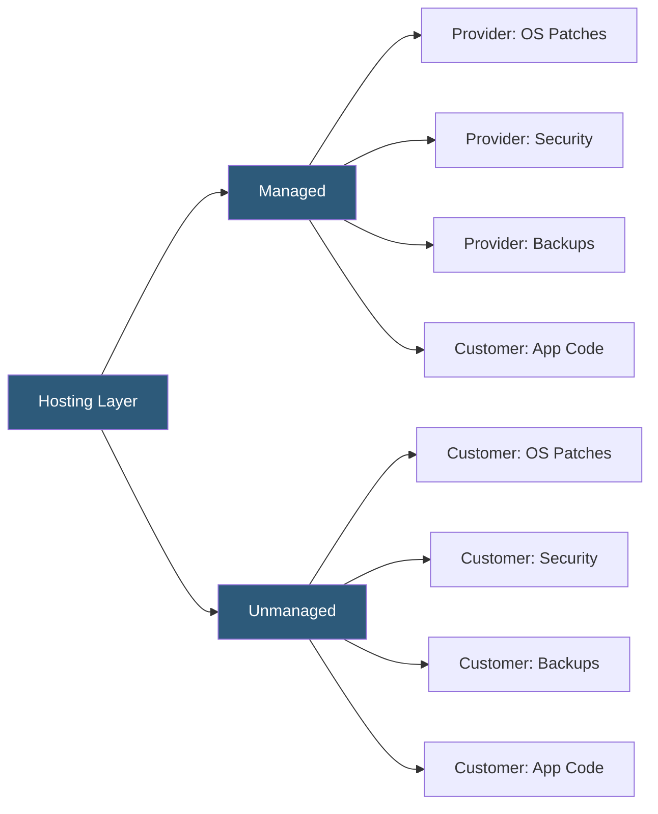

**Category:** Web Hosting Fundamentals
**Difficulty:** Beginner
**Reading time:** 5 min read

---

Managed hosting includes proactive server administration, security patching, monitoring, and technical support as part of the service. Unmanaged hosting provides raw infrastructure where the customer is responsible for all OS-level configuration, security, and maintenance tasks.

- **Managed hosting** — provider handles OS updates, security patches, firewall rules, performance tuning, and 24/7 monitoring
- **Unmanaged hosting** — provider supplies the server hardware and network; all software administration is the customer's responsibility
- **SLA (Service Level Agreement)** — contractual uptime guarantee; managed providers typically offer 99.9%+ with penalties for breaches
- **Patch management** — systematic process of applying security updates; on managed hosts, done automatically or by the provider
- **Control panel** — web-based administration interface (cPanel, Plesk) usually included with managed hosting
- **Managed database** — database engine maintained by the provider including backups, failover, and version upgrades
- **Proactive monitoring** — automated checks that detect and alert on CPU spikes, disk full, service crashes before customers notice

The core distinction lies in who performs server administration tasks. On an unmanaged VPS or dedicated server, the customer receives SSH credentials to a freshly installed OS — usually a minimal Linux distribution — and takes ownership from that point forward. Installing web servers, configuring firewalls, hardening SSH, setting up SSL certificates, writing cron jobs for backups, and responding to incidents all fall to the customer's team.

Managed hosting wraps a support layer around the same underlying hardware. The provider's system administrators install and configure the control panel, web server, PHP, MySQL, and firewall rules to industry-standard baselines. Automated monitoring agents (Nagios, Zabbix, or proprietary tools) watch CPU, memory, disk, and service health around the clock, triggering alerts and auto-remediation scripts for common failures.

Security patching is the highest-stakes difference. Unmanaged servers regularly fall victim to attacks exploiting known CVEs that were never patched because the customer lacked the time or expertise. Managed providers apply kernel updates, PHP patches, and SSL renewals on defined maintenance windows, often with zero downtime using techniques like kernel live patching (kpatch, livepatch).

The cost premium for managed hosting ranges from 20% to 200% depending on the service tier. Entry-level managed VPS plans add basic cPanel management; premium managed dedicated hosting includes DBA services, application-level optimization, and dedicated account engineers.

- Small businesses without in-house IT staff needing reliable hosting
- Agencies hosting client sites where uptime directly impacts reputation
- E-commerce stores where security compliance (PCI-DSS) requires expert configuration
- Unmanaged: DevOps teams deploying infrastructure-as-code who prefer full control
- Unmanaged: developers learning server administration in a real environment

| Advantage | Disadvantage |
|-----------|--------------|
| Managed: no sysadmin expertise required | Managed: higher monthly cost |
| Managed: faster incident response | Managed: less flexibility to customize stack |
| Unmanaged: full control over software stack | Unmanaged: requires sysadmin time and expertise |
| Unmanaged: lower cost for capable teams | Unmanaged: customer bears full security responsibility |
| Managed: included backups and monitoring | Managed: may lag on adopting bleeding-edge software |

- [cPanel vs Plesk Control Panel Comparison](cpanel-vs-plesk-control-panel-comparison.md)
- [Hosting Account Provisioning Automation](hosting-account-provisioning-automation.md)
- [Backup and Restore Mechanisms](backup-and-restore-mechanisms.md)

---
*Part of the [Web Hosting Fundamentals](index.md) category · [Back to Master Index](../../index.md)*
