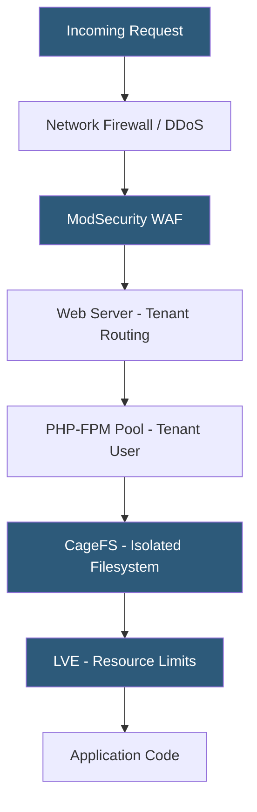

**Category:** Web Hosting Fundamentals
**Difficulty:** Advanced
**Reading time:** 7 min read

---

Multi-tenant hosting security addresses the challenge of safely running untrusted code from multiple customers on shared infrastructure. Effective isolation prevents one tenant's compromised application from reading, modifying, or disrupting other tenants' data, processes, or network traffic.

- **Tenant isolation** — use of OS-level mechanisms (namespaces, cgroups, chroot) to prevent cross-tenant file access and resource contention
- **Privilege escalation** — attack where a user process gains higher-privilege access; shared hosts must prevent PHP scripts from accessing files outside their document root
- **symlink attacks** — exploiting symbolic links to traverse outside a tenant's directory; mitigated by `open_basedir` restrictions and suexec
- **CloudLinux LVE** — commercial kernel module creating Lightweight Virtual Environments that enforce per-tenant CPU, RAM, and I/O limits with hard isolation
- **ModSecurity** — open-source Web Application Firewall deployable as an Apache/Nginx module; blocks common injection and XSS attacks across all tenants
- **Imunify360** — commercial server security platform combining WAF, malware scanner, reputation firewall, and intrusion detection for shared hosting
- **CageFS** — CloudLinux feature that places each user in a virtual filesystem cage, hiding other users' processes, files, and system binaries

Multi-tenant security relies on defense in depth — multiple independent isolation layers so that a failure in one layer doesn't result in full tenant compromise.

At the filesystem level, each tenant's files are owned by a unique system user. The web server's PHP-FPM configuration runs each tenant's PHP processes under their respective system user, preventing one tenant's PHP script from reading files owned by another user. CageFS extends this by presenting each user with a private view of the filesystem, so even system paths like `/etc/passwd` are virtualized and tenant-specific.

PHP security settings enforce additional boundaries: `open_basedir` restricts file operations to the tenant's home directory, `disable_functions` prevents dangerous PHP functions like `exec()`, `passthru()`, and `system()`, and `suhosin` (historically) or PHP's built-in hardening options limit code injection vectors.

Process isolation prevents one tenant from seeing other tenants' running processes. In a standard Linux environment, any user can list all processes via `/proc`. CageFS and kernel namespace features restrict `/proc` to show only the tenant's own processes, preventing reconnaissance and process injection attacks.

Network-level security includes IP reputation filtering, rate limiting per tenant IP space, and WAF rules matching OWASP Top 10 attack patterns. ModSecurity with the OWASP Core Rule Set (CRS) blocks SQL injection, XSS, path traversal, and remote file inclusion attacks before they reach application code.

Malware scanning runs daily or real-time on tenant file writes, detecting webshells, cryptomining scripts, and phishing page uploads — common payloads installed after an application-level compromise.

- Shared hosting providers protecting thousands of customer accounts on single servers
- Educational hosting platforms running student code with strict isolation requirements
- Multi-tenant SaaS platforms ensuring customer data separation at the infrastructure layer
- Reseller hosting where the reseller's clients must be isolated from each other
- Hosting providers offering PCI-DSS compliant shared hosting tiers

| Advantage | Disadvantage |
|-----------|--------------|
| CageFS prevents cross-tenant filesystem attacks | Performance overhead from virtualized filesystem layer |
| LVE limits prevent resource exhaustion by one tenant | CloudLinux licensing adds per-server cost |
| WAF blocks known attack patterns automatically | False positives can block legitimate application requests |
| Per-tenant PHP-FPM prevents privilege escalation | Complex configuration management across many tenants |
| Malware scanning catches compromised sites early | Scanning overhead for tenants with large file counts |

- [Shared Hosting Architecture and Resource Allocation](shared-hosting-architecture-and-resource-allocation.md)
- [Web Server Security Hardening](../web-server-technologies/web-server-security-hardening.md)
- [SSH Access Management for Shared Hosting](ssh-access-management-for-shared-hosting.md)

---
*Part of the [Web Hosting Fundamentals](index.md) category · [Back to Master Index](../../index.md)*
