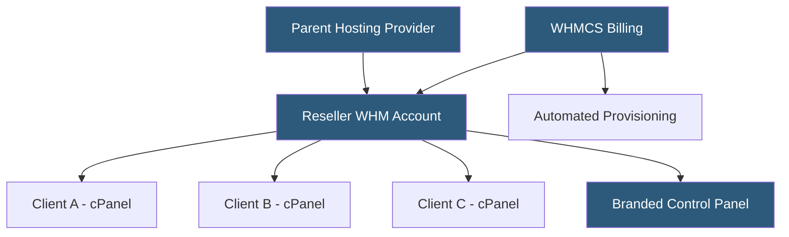

**Category:** Web Hosting Fundamentals
**Difficulty:** Intermediate
**Reading time:** 6 min read

---

Reseller hosting allows individuals or companies to purchase hosting capacity in bulk from a parent provider and redistribute it under their own brand to end customers. The reseller manages client accounts, billing, and support while the parent provider maintains the underlying infrastructure.

- **WHM (Web Host Manager)** — the administrative layer above cPanel that resellers use to create and manage individual cPanel accounts
- **Private label hosting** — branding all customer-facing interfaces with the reseller's own name, hiding the parent provider
- **Allocatable resources** — total disk space, bandwidth, and account slots purchased from the parent and distributed among clients
- **Overselling** — allocating more total resources to clients than physically purchased, relying on average utilization being lower than the maximum
- **WHMCS** — popular billing and client management platform used by resellers for invoicing, support tickets, and automated provisioning
- **Bandwidth pooling** — some reseller plans aggregate all client bandwidth into a single pool rather than per-account caps
- **Root reseller** — a reseller who can create sub-resellers, building multi-tier hosting distribution chains

A reseller purchases a WHM account from a hosting provider, which allocates a pool of disk space (commonly 50 GB to unlimited), monthly bandwidth, and a maximum number of cPanel accounts. The reseller then logs into WHM to create individual hosting accounts for clients, assigning each a slice of the total allocation.

WHMCS or similar billing platforms integrate with WHM via API to automate the full customer lifecycle: a client signs up and pays online, WHMCS calls the WHM API to create the cPanel account immediately, sends credentials by email, and tracks renewal dates. This automation allows a one-person reseller operation to manage hundreds of clients without manual intervention.

The reseller sets their own pricing, which must cover the parent provider cost while leaving a margin. Typical markup is 200–500% over wholesale costs. The reseller's brand appears in the control panel nameservers (ns1.yourcompany.com), email headers, and billing portal — the parent provider is never visible to end clients.

Support responsibilities fall entirely to the reseller for application-level issues. The parent provider handles hardware failures and network outages. This creates a tiered support model where the reseller must triage: application and CMS problems are resolved directly, while server-level hardware issues are escalated.

Revenue models include monthly recurring subscriptions, annual plans with discounts, or managed service bundles that add maintenance, backups, and site speed optimization as premium tiers.

- Web design agencies hosting client websites on a single managed platform
- Freelance developers offering hosting as a recurring revenue add-on service
- Niche hosting providers targeting specific industries or geographic markets
- Digital marketing agencies combining hosting, SEO, and maintenance packages
- Technology consultants building managed hosting practices without data center investment

| Advantage | Disadvantage |
|-----------|--------------|
| No hardware investment required | Dependent on parent provider uptime and quality |
| Recurring revenue potential from client base | Thin margins require volume to be profitable |
| Full branding control for professional appearance | Responsible for first-line support on shared infrastructure |
| Easy to start with low initial cost | Overselling creates risk during traffic spikes |
| Automated billing and provisioning via WHMCS | Client churn can erode profitability quickly |

- [WHM (Web Host Manager) Automation](whm-web-host-manager-automation.md)
- [White-Label Hosting Solutions](white-label-hosting-solutions.md)
- [cPanel vs Plesk Control Panel Comparison](cpanel-vs-plesk-control-panel-comparison.md)

---
*Part of the [Web Hosting Fundamentals](index.md) category · [Back to Master Index](../../index.md)*
