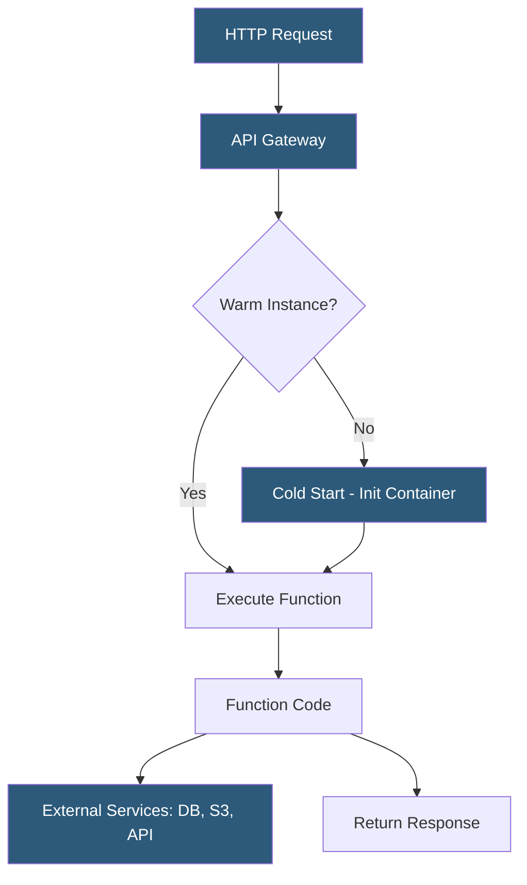

**Category:** Web Hosting Fundamentals
**Difficulty:** Intermediate
**Reading time:** 7 min read

---

Serverless hosting executes application code in ephemeral, stateless function containers managed entirely by the cloud provider, billing only for actual compute time. Developers deploy function code without provisioning servers, and the platform handles scaling from zero to millions of invocations automatically.

- **Function as a Service (FaaS)** — execution model where individual functions are the deployment unit; AWS Lambda, Google Cloud Functions, Cloudflare Workers
- **Cold start** — latency penalty (50ms–2s) when a function container is initialized after a period of inactivity
- **Warm instance** — pre-initialized function container that responds without cold start latency; platforms maintain warm pools for active functions
- **Event trigger** — the event that invokes a function: HTTP request, S3 upload, database change, queue message, scheduled cron
- **Execution timeout** — maximum function runtime; AWS Lambda defaults to 3 seconds, configurable up to 15 minutes
- **Concurrency limit** — maximum simultaneous function invocations; default AWS account limit is 1,000 concurrent Lambda executions
- **Edge functions** — serverless functions executed at CDN PoPs (Cloudflare Workers, Vercel Edge Functions) for ultra-low latency globally

In a serverless architecture, the developer writes functions — discrete units of logic triggered by specific events — and uploads them to the platform. The runtime (Node.js, Python, Go, Java, etc.) and execution environment are managed by the provider. The developer's only responsibility is the function code itself.

When an HTTP request arrives at API Gateway (AWS) or an equivalent routing layer, it is matched to the appropriate Lambda function. If a warm container is available from a recent invocation, the function executes immediately with sub-millisecond overhead. If no warm containers exist (cold start scenario), the platform must allocate a microVM (Firecracker on AWS Lambda), initialize the runtime, and execute the function initialization code before the handler runs — introducing latency that varies by runtime and package size.

Billing is strictly consumption-based: AWS Lambda charges per request ($0.20 per million) plus compute time measured in GB-seconds. A function consuming 128 MB of RAM running for 100ms costs a fraction of a cent. This model makes serverless extremely cost-effective for variable or low-traffic workloads but can become expensive for sustained high-throughput applications.

State management is explicitly external: functions are stateless by design. Persistent data lives in DynamoDB, RDS, S3, or Redis. This forces clean architectural separation and enables perfect horizontal scaling without sticky session considerations.

Edge serverless (Cloudflare Workers, Deno Deploy) executes functions at CDN nodes using lightweight V8 isolates instead of full containers, eliminating cold starts and achieving consistent 0–5ms startup times globally.

- REST and GraphQL API backends with unpredictable or bursty traffic patterns
- Image and file processing triggered by S3 uploads (thumbnailing, transcoding)
- Scheduled batch jobs and data transformation pipelines via cron triggers
- Webhook handlers for third-party service integrations
- Authentication middleware and request transformation at the edge

| Advantage | Disadvantage |
|-----------|--------------|
| Zero infrastructure management | Cold start latency for infrequently called functions |
| Automatic scaling to any concurrency level | Execution time limits unsuitable for long-running jobs |
| Pay-per-invocation cost model | Debugging and local testing more complex |
| No idle server costs | Vendor lock-in to platform-specific APIs |
| Functions deploy independently, enabling microservices | Statelessness requires external state management |

- [Cloud Hosting Scalability Principles](cloud-hosting-scalability-principles.md)
- [Container-Based Hosting Platforms](container-based-hosting-platforms.md)
- [Edge Hosting and CDN Integration](edge-hosting-and-cdn-integration.md)

---
*Part of the [Web Hosting Fundamentals](index.md) category · [Back to Master Index](../../index.md)*
