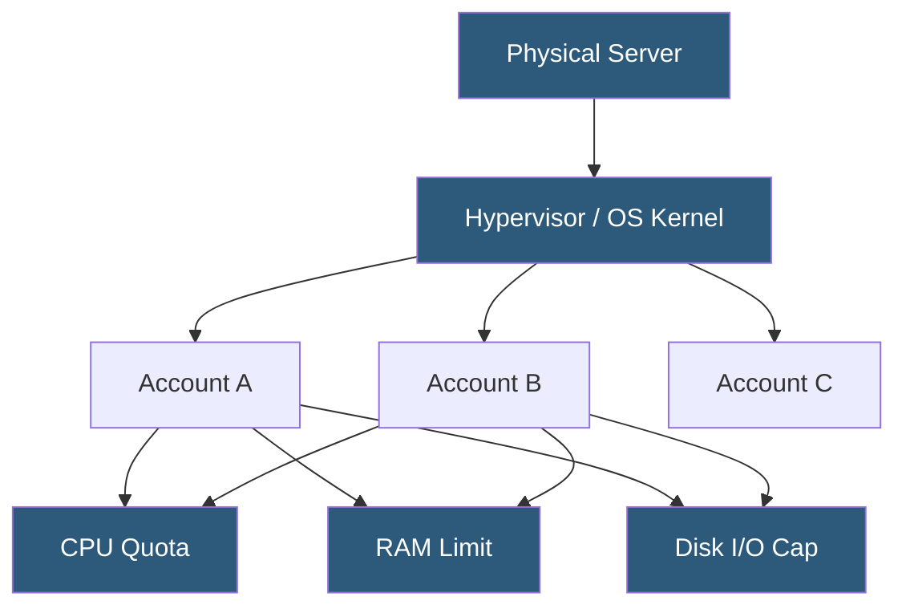

**Category:** Web Hosting Fundamentals
**Difficulty:** Beginner
**Reading time:** 6 min read

---

Shared hosting places multiple websites on a single physical server, dividing CPU, RAM, disk I/O, and bandwidth among all tenants. Resource allocation policies determine how fairly each account is served and how neighbor behavior impacts site performance.

- **Tenant isolation** — logical separation of accounts via OS-level users and filesystem permissions so one tenant cannot read another's files
- **Resource limits** — per-account quotas on CPU time, RAM usage, and concurrent processes enforced by kernel cgroups or commercial tools like CloudLinux
- **Disk I/O throttling** — rate-limiting read/write operations so a single high-traffic site does not starve others of storage throughput
- **Noisy neighbor effect** — performance degradation experienced by tenants when one account consumes disproportionate shared resources
- **Inodes** — filesystem metadata units; shared hosts cap inode counts to prevent runaway file creation from degrading directory performance
- **Oversubscription ratio** — the ratio of total provisioned resources to physical capacity; acceptable ratios vary by workload type
- **Connection limits** — caps on simultaneous database and HTTP connections per account to protect server stability

A shared hosting server runs a single operating system kernel that hosts dozens to hundreds of customer accounts simultaneously. The web server process (typically Apache or LiteSpeed) handles incoming HTTP requests and routes them to the correct account's document root based on the domain name in the request header.

Resource allocation is enforced at multiple layers. At the kernel level, Linux control groups (cgroups) assign CPU shares and memory limits to each account's PHP or CGI process group. Disk quotas track storage consumption per user. Commercial solutions like CloudLinux add a Lightweight Virtual Environment (LVE) that wraps each tenant in isolated resource containers with real-time throttling, ensuring that a spike in one account's traffic does not cascade into latency for all others.

Database connections are pooled or limited per account. MySQL's `max_user_connections` parameter restricts how many simultaneous queries a single account can run, preventing one database-heavy application from exhausting the server's connection table.

Inbound bandwidth is managed at the network interface level, with burst allowances that allow short traffic spikes while enforcing sustained rate limits. The hosting control panel (cPanel, Plesk) provides dashboards showing real-time and historical resource usage so administrators can identify misbehaving accounts and take corrective action before other tenants are affected.

- Low-traffic personal websites and blogs that do not require dedicated resources
- Development and staging environments for testing before production deployment
- Small business sites with predictable, modest traffic patterns
- Student projects and portfolios needing inexpensive online presence
- Email hosting combined with a simple informational website

| Advantage | Disadvantage |
|-----------|--------------|
| Very low cost per account | Noisy neighbor risk affects performance |
| No server administration required | Limited ability to install custom software |
| Managed security patching | Resource caps can throttle high-traffic events |
| Instant provisioning | Shared IP reputation can affect email deliverability |
| Suitable for beginners | Less suitable for resource-intensive applications |

- [VPS Hosting vs Dedicated Server Comparison](vps-hosting-vs-dedicated-server-comparison.md)
- [Multi-Tenant Hosting Security](multi-tenant-hosting-security.md)
- [cPanel vs Plesk Control Panel Comparison](cpanel-vs-plesk-control-panel-comparison.md)

---
*Part of the [Web Hosting Fundamentals](index.md) category · [Back to Master Index](../../index.md)*
