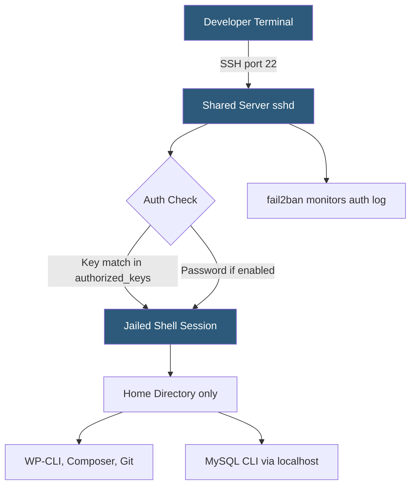

**Category:** Web Hosting Fundamentals
**Difficulty:** Intermediate
**Reading time:** 6 min read

---

SSH (Secure Shell) access on shared hosting provides a terminal session to the server, enabling command-line tasks like running WP-CLI, Composer, and Git that are impossible through a control panel alone. Shared hosting SSH is more restricted than dedicated server access — users are jailed to their own home directory and cannot escalate privileges. Managing keys, hardening authentication, and understanding shell restrictions is essential for safe, productive use.

- **SSH (Secure Shell)** — cryptographic protocol providing encrypted terminal access over port 22
- **SSH key pair** — asymmetric key pair where the public key is stored on the server and the private key stays with the user
- **authorized_keys** — file on the server listing allowed public keys for a specific account
- **jailed shell** — restricted shell environment preventing users from navigating above their home directory
- **WP-CLI** — WordPress command-line interface executable only via SSH, not via browser
- **Port forwarding** — tunneling local ports through an SSH connection for database GUI access
- **fail2ban** — daemon that bans IPs making repeated failed SSH authentication attempts
- **SSH config file** — `~/.ssh/config` file storing connection aliases to simplify host connection commands

On shared hosting, SSH is enabled per-account either by the host by default or through a cPanel toggle. The server runs an OpenSSH daemon listening on port 22 (or a non-standard port on some hosts to reduce bot noise). Each shared hosting user is mapped to a system account with a home directory — typically `/home/username`. The shell environment uses jailing techniques: either a chroot jail confining the session to the account's file tree, or CloudLinux's CageFS, which presents a virtualized filesystem with selected system binaries replicated per user.

Key-based authentication is strongly preferred over passwords. The user generates a 4096-bit RSA or Ed25519 key pair locally with `ssh-keygen`. The public key is added to `~/.ssh/authorized_keys` on the server (or uploaded via cPanel's SSH Key Manager). Private keys should be passphrase-protected and stored in the local SSH agent.

Password authentication should be disabled where possible; many hosts allow this setting per-account. Two-factor authentication for SSH is not commonly available on shared hosts but is standard practice on VPS and dedicated servers.

Common SSH tasks on shared hosting include: running `wp-cli` to update WordPress core and plugins in bulk, running `composer install` after deploying a PHP application, executing `git pull` to deploy updates, and accessing MySQL via `mysql -u user -p database < dump.sql` for large import operations that time out in phpMyAdmin.

Local `~/.ssh/config` entries store connection shortcuts: `Host mysite`, `HostName mysite.com`, `User myaccount`, `IdentityFile ~/.ssh/mysite_ed25519` — reducing the `ssh` command to just `ssh mysite`.

- Running WP-CLI commands to bulk-update plugins without page timeout risk
- Importing large SQL files directly into MySQL from the command line
- Executing Composer dependency installs for PHP applications
- Setting up Git deployments triggered by remote push
- Diagnosing server-side issues like disk usage with `du` and `df`

| Advantage | Disadvantage |
|-----------|--------------|
| Enables CLI tools unavailable via web interface | Jailed environment limits available system utilities |
| Key-based auth is more secure than passwords | Not all shared hosts enable SSH; may require plan upgrade |
| Fast for large file operations vs FTP | Root access unavailable; cannot install system packages |
| Port forwarding enables secure GUI DB access | SSH botnet scanning requires firewall or fail2ban protection |

- [FTP vs SFTP vs FTPS Protocols](ftp-vs-sftp-vs-ftps-protocols.md)
- [Git Integration for Hosting Platforms](git-integration-for-hosting-platforms.md)
- [WHM Web Host Manager Automation](whm-web-host-manager-automation.md)

---
*Part of the [Web Hosting Fundamentals](index.md) category · [Back to Master Index](../../index.md)*
