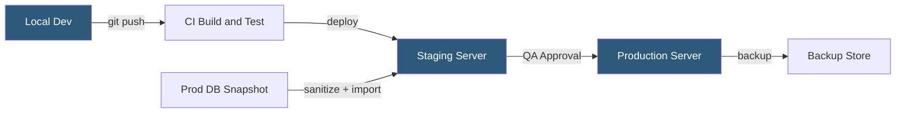

**Category:** Web Hosting Fundamentals
**Difficulty:** Intermediate
**Reading time:** 6 min read

---

A staging environment is an isolated replica of a production site used to test changes before they go live. It mirrors the production stack — same PHP version, database engine, and server configuration — while remaining inaccessible to end users. Proper staging prevents regressions and data loss caused by untested deployments.

- **Staging environment** — a pre-production server or subdomain mirroring production for safe testing
- **Environment parity** — keeping staging and production as identical as possible to reduce surprises
- **Database sanitization** — removing PII and resetting credentials when copying production data to staging
- **Feature flag** — code-level switch enabling features in staging without separate branch deployments
- **Password protection** — HTTP Basic Auth or IP allowlisting restricting staging access to authorized users
- **Deployment pipeline** — automated sequence moving code from development → staging → production
- **robots.txt disallow** — preventing search engines from indexing the staging domain
- **Snapshot** — point-in-time copy of files and database enabling rollback of failed deployments

Staging is typically provisioned as a subdomain (staging.example.com) or a separate domain, hosted either on the same physical server as production or a dedicated staging instance. The staging database is populated by exporting production data, running a sanitization script to remove PII and reset user passwords, then importing the cleaned dump. This ensures realistic data volumes without exposing real customer information.

File synchronization between staging and production uses rsync, Git-based deployments, or hosting-panel push-button cloning common in cPanel environments. Environment-specific values — database credentials, API keys, payment gateway endpoints — are injected via `.env` files or server-level environment variables and never hardcoded in source files.

Access control is critical: staging must be blocked from search engine indexing using `X-Robots-Tag: noindex` response headers and a `robots.txt` with `Disallow: /`. HTTP Basic Auth provides a quick access gate for external reviewers, while IP allowlists are preferable for internal teams.

Automated end-to-end tests, visual regression tools, and manual QA sessions are performed against staging. Only after explicit sign-off does code proceed to production via the same deployment script used for staging, preserving process consistency and reducing human error.

- Testing WordPress plugin updates before applying them to live sites
- Validating database schema migrations on realistic data volumes
- Running end-to-end browser tests against a full application stack
- Previewing design changes for client approval before public launch
- Training new team members on the application without risking production data

| Advantage | Disadvantage |
|-----------|--------------|
| Catches bugs before users are affected | Requires additional server resources or cost |
| Enables safe database migration testing | Staging drift from production hides environment-specific bugs |
| Provides a client preview environment | Keeping databases synchronized is operationally complex |
| Reduces emergency rollback frequency | Developers may bypass staging under time pressure |

- [Development vs Production Hosting Separation](development-vs-production-hosting-separation.md)
- [Git Integration for Hosting Platforms](git-integration-for-hosting-platforms.md)
- [Backup and Restore Mechanisms](backup-and-restore-mechanisms.md)

---
*Part of the [Web Hosting Fundamentals](index.md) category · [Back to Master Index](../../index.md)*
