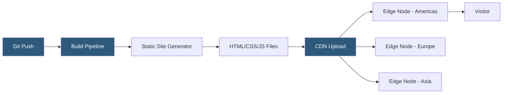

**Category:** Web Hosting Fundamentals
**Difficulty:** Beginner
**Reading time:** 5 min read

---

Static site hosting serves pre-built HTML, CSS, JavaScript, and media files directly from CDN edge nodes without any server-side processing. This architecture delivers exceptional performance, near-zero operational overhead, and typically free or very low-cost hosting for most use cases.

- **Static site generator (SSG)** — tool (Jekyll, Hugo, Next.js, Gatsby) that compiles templates and content into static HTML files at build time
- **JAMstack** — architecture pattern combining JavaScript, APIs, and pre-built Markup; decouples frontend from backend processing
- **Edge serving** — CDN nodes geographically distributed to serve static files with sub-50ms latency globally
- **Atomic deploys** — deployment strategy that switches the live URL to a new build version atomically, eliminating partial deployment states
- **Branch deploys** — preview URLs automatically generated for each git branch enabling per-PR environment testing
- **Build pipeline** — CI/CD process triggered by git push that runs the SSG, runs tests, and deploys to CDN
- **Object storage** — AWS S3, Cloudflare R2, or GCS buckets configured as static website origins

Traditional dynamic websites execute server-side code on each request, querying databases and assembling HTML in real time. Static sites invert this model: all pages are generated once at build time, producing a directory of files that any web server or object store can serve without executing code.

Platforms like Netlify, Vercel, and Cloudflare Pages connect to a GitHub, GitLab, or Bitbucket repository. When code is pushed, the platform clones the repository, runs the build command (e.g., `hugo --minify` or `npm run build`), and deploys the output directory to a globally distributed CDN. The entire process typically completes in under two minutes.

DNS is configured to point the domain at the CDN's anycast IP space. When a visitor requests the site, their DNS resolver returns the IP address of the nearest CDN PoP (Point of Presence), which serves the static HTML file directly from its cache with response times under 50 milliseconds in most regions.

Dynamic functionality — contact forms, user authentication, comments, search — is handled through client-side JavaScript calling third-party APIs (Netlify Forms, Auth0, Algolia, Disqus). This keeps the hosting layer completely static while the interactivity requirements are met by purpose-built services.

Atomic deployments are a critical operational advantage. The CDN switches the URL mapping from old build to new build as a single operation, meaning there is never a state where some edge nodes serve old files and others serve new files — eliminating the class of deployment bugs common in traditional FTP-based deployments.

- Documentation sites and developer portals with infrequent content updates
- Marketing landing pages and product sites requiring global fast load times
- Personal portfolios and blogs using Hugo, Jekyll, or Eleventy
- Company websites with content managed through a headless CMS
- Event microsites with defined time horizons and no backend complexity

| Advantage | Disadvantage |
|-----------|--------------|
| Near-zero hosting cost for most traffic levels | Build time delays mean content isn't instantly live |
| Exceptional global performance from CDN edge | Dynamic personalization requires JavaScript APIs |
| No server attack surface — nothing to exploit | Large sites with thousands of pages have long build times |
| Atomic deployments eliminate partial-state bugs | Server-side rendering requires hybrid approach |
| Version control integration provides full history | Real-time features (live chat, auctions) need separate infrastructure |

- [Serverless Hosting Architectures](serverless-hosting-architectures.md)
- [Edge Hosting and CDN Integration](edge-hosting-and-cdn-integration.md)
- [Git Integration for Hosting Platforms](git-integration-for-hosting-platforms.md)

---
*Part of the [Web Hosting Fundamentals](index.md) category · [Back to Master Index](../../index.md)*
