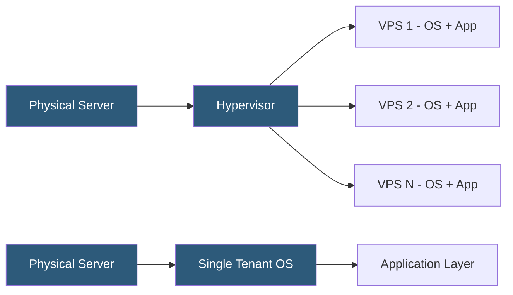

**Category:** Web Hosting Fundamentals
**Difficulty:** Intermediate
**Reading time:** 7 min read

---

Virtual Private Servers (VPS) partition a physical machine using hypervisor technology, giving each tenant isolated OS instances with guaranteed resources. Dedicated servers assign the entire physical machine to a single customer, eliminating virtualization overhead and resource competition entirely.

- **Hypervisor** — software layer (KVM, VMware ESXi, Xen) that creates and manages virtual machines on a physical host
- **vCPU** — virtual CPU core allocated to a VPS; performance depends on the physical CPU's thread count and scheduling
- **Bare metal** — a dedicated server with no virtualization layer; all CPU cycles and memory directly available to the OS
- **IOPS** — Input/Output Operations Per Second; dedicated servers typically offer higher sustained IOPS than VPS
- **Root access** — full administrative control over the OS; available on both VPS and dedicated but with different implications
- **Burst capacity** — ability of a VPS to temporarily use more CPU than its allocation when the host has idle capacity
- **NUMA topology** — Non-Uniform Memory Access; relevant for dedicated servers where physical CPU socket placement affects memory latency

A VPS is created by running a hypervisor (most commonly KVM on modern hosting platforms) on a physical server and using it to spawn isolated virtual machines. Each VPS receives a guaranteed allocation of vCPUs, RAM, and storage, backed by SLAs. The hypervisor schedules CPU time across all VMs, meaning that under heavy contention, a VPS may not consistently achieve its nominal CPU allocation during burst periods.

Storage on VPS platforms is usually network-attached (Ceph, SAN) or local NVMe presented as a virtual block device. Latency is slightly higher than bare metal due to the virtualization layer, though on modern KVM with hardware-assisted virtualization (Intel VT-x, AMD-V), overhead is typically under 5%.

A dedicated server skips the hypervisor entirely. The customer's OS boots directly on hardware, with full access to all CPU cores, all RAM DIMMs, and the storage controller. This matters for workloads requiring consistent low-latency I/O, precise CPU affinity settings, or specialized hardware (GPU cards, FPGA accelerators, 10GbE NICs) that cannot be virtualized efficiently.

Management differs significantly: VPS providers offer rapid provisioning, snapshot backups, and live migration. Dedicated servers require hardware provisioning time (minutes to days), and failures require physical intervention, though IPMI/iDRAC remote management minimizes hands-on time.

- VPS: development servers, staging environments, medium-traffic web applications
- VPS: applications requiring root access without the cost of a full dedicated machine
- Dedicated: high-traffic databases requiring maximum IOPS and consistent latency
- Dedicated: rendering, scientific computing, or machine learning inference requiring full CPU/GPU resources
- Dedicated: compliance environments where multi-tenancy is prohibited

| Advantage | Disadvantage |
|-----------|--------------|
| VPS: cheaper, faster to provision | VPS: hypervisor overhead, resource contention possible |
| Dedicated: no virtualization overhead | Dedicated: higher cost, longer provisioning time |
| VPS: easy snapshots and migration | VPS: vCPU performance can vary under load |
| Dedicated: full hardware control | Dedicated: hardware failure requires physical repair |
| Both: full root access | Both: require OS management skills |

- [Cloud Hosting Scalability Principles](cloud-hosting-scalability-principles.md)
- [Managed vs Unmanaged Hosting Services](managed-vs-unmanaged-hosting-services.md)
- [Container-Based Hosting Platforms](container-based-hosting-platforms.md)

---
*Part of the [Web Hosting Fundamentals](index.md) category · [Back to Master Index](../../index.md)*
