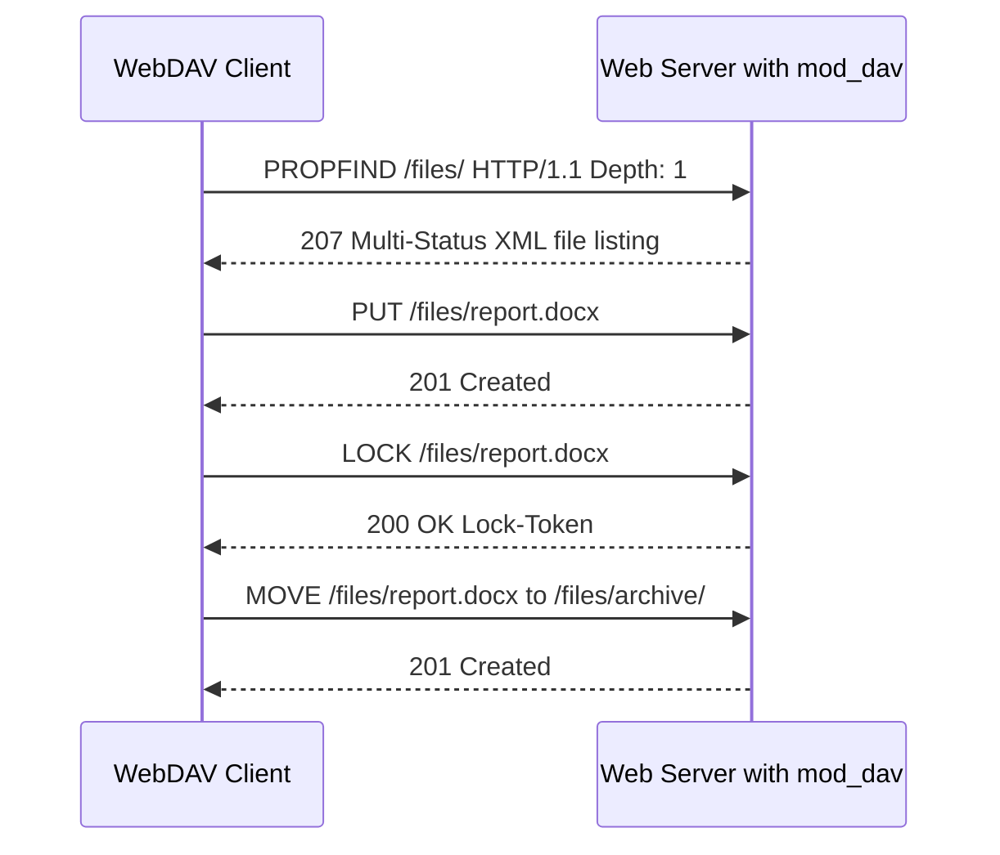

**Category:** Web Hosting Fundamentals
**Difficulty:** Intermediate
**Reading time:** 5 min read

---

WebDAV (Web Distributed Authoring and Versioning) extends HTTP to support remote file management operations such as create, delete, move, copy, and lock. It allows a web server to function as a network file system accessible through operating system file browsers and desktop applications without installing additional client software. While largely superseded by cloud storage APIs, WebDAV remains relevant for CMS file management, CalDAV/CardDAV extensions, and on-premise collaboration tools.

- **WebDAV** — HTTP extension adding methods (PROPFIND, MKCOL, COPY, MOVE, LOCK) for remote file management
- **PROPFIND** — WebDAV method retrieving file properties (size, modified date, author) as XML
- **MKCOL** — WebDAV method creating a collection (directory) on the server
- **LOCK/UNLOCK** — WebDAV methods preventing concurrent write conflicts by locking resources
- **Depth header** — HTTP header specifying whether a PROPFIND applies to the resource itself or recursively to its contents
- **CalDAV** — WebDAV extension for calendar data (iCalendar format) used by Apple Calendar and Thunderbird
- **CardDAV** — WebDAV extension for contact data (vCard format) used for address book synchronization
- **Digest authentication** — challenge-response HTTP auth scheme safer than Basic Auth over HTTP

WebDAV is implemented as a server module: `mod_dav` and `mod_dav_fs` in Apache, or `ngx_http_dav_module` in Nginx. The server marks a directory as a WebDAV collection by configuration, and clients discover its contents using the `PROPFIND` method, which returns a `207 Multi-Status` XML response containing file metadata for every item.

File uploads use the standard HTTP `PUT` method. Directory creation uses `MKCOL`. Moves and copies are handled by `MOVE` and `COPY` methods with a `Destination` header specifying the target URL. The `LOCK` and `UNLOCK` methods provide collaborative editing protection: a client that locks a file receives a lock token, and the server rejects writes from other clients presenting no valid token.

Authentication is typically HTTP Basic Auth over HTTPS. Digest Auth is an alternative for cleartext HTTP but offers weaker security than modern TLS. Access control lists map user credentials to specific WebDAV paths, restricting who can read, write, or delete within a collection.

Operating systems mount WebDAV shares as network drives: Windows via "Map Network Drive" using an `https://` URL, macOS via Finder's "Connect to Server", and Linux via `davfs2` in `/etc/fstab`. Content management systems like Nextcloud, ownCloud, and Alfresco expose WebDAV endpoints for file synchronization, extending the protocol's relevance in on-premise enterprise deployments.

- Mounting a hosting server's file tree as a network drive on Windows or macOS
- CalDAV/CardDAV calendar and contact synchronization for self-hosted groupware
- Collaborative document editing locks in on-premise CMS platforms
- WordPress media library access via WebDAV-enabled plugins
- Remote file management for hosting control panels that expose WebDAV endpoints

| Advantage | Disadvantage |
|-----------|--------------|
| Native OS mounting without extra client software | Performance poor over high-latency connections vs native FS |
| Standards-based; broad application support | XML overhead makes large directory listings slow |
| LOCK mechanism prevents concurrent write conflicts | Security depends on HTTPS; insecure over plain HTTP |
| CalDAV/CardDAV extend protocol to calendar and contacts | Less feature-rich than modern sync APIs (Dropbox, OneDrive) |

- [FTP vs SFTP vs FTPS Protocols](ftp-vs-sftp-vs-ftps-protocols.md)
- [SSH Access Management for Shared Hosting](ssh-access-management-for-shared-hosting.md)
- [Website Migration Tools and Processes](website-migration-tools-and-processes.md)

---
*Part of the [Web Hosting Fundamentals](index.md) category · [Back to Master Index](../../index.md)*
