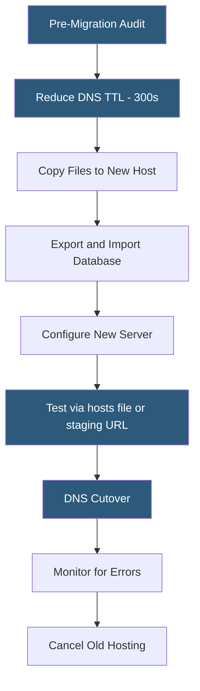

**Category:** Web Hosting Fundamentals
**Difficulty:** Intermediate
**Reading time:** 6 min read

---

Website migration moves a site's files, databases, email, and DNS configuration from one hosting provider to another with minimal downtime. A structured process using migration tools, DNS TTL management, and pre-migration testing prevents data loss and service interruption during the transfer.

- **DNS TTL (Time to Live)** — the duration DNS resolvers cache a record; reducing TTL before migration minimizes propagation delay during cutover
- **Downtime window** — the period during which the site may be inaccessible during the DNS changeover between old and new servers
- **Pre-migration audit** — inventory of all components to migrate: files, databases, email accounts, cron jobs, SSL certificates, and custom server configurations
- **Migration plugin** — WordPress tools (All-in-One WP Migration, Duplicator, Migrate Guru) that package a complete site for transfer
- **WHM Transfer Tool** — cPanel's built-in account transfer feature that copies a complete cPanel account between WHM servers
- **Rsync** — command-line tool for efficient incremental file synchronization; used for large site migrations where manual upload is impractical
- **Database dump** — SQL export of a MySQL/PostgreSQL database for transfer; imported on the destination server before DNS cutover

A professional website migration follows a structured sequence designed to minimize both downtime and risk. The pre-migration phase begins 48–72 hours before the planned cutover by reducing DNS TTL values from typical settings (3600 seconds or more) down to 300 seconds. This ensures that when the DNS change is made, it propagates globally within five minutes rather than hours.

File migration methods vary by site size and hosting access. Small sites (under 1 GB) are downloaded via FTP and re-uploaded to the new host. WordPress sites use specialized migration plugins: All-in-One WP Migration or Duplicator packages the entire site (files + database) into a single archive, which is uploaded and unpacked on the destination. For cPanel-to-cPanel transfers, WHM's Transfer Tool moves the complete account including email, DNS zones, and cron jobs in a single operation.

Database migration requires exporting a SQL dump from the source (via phpMyAdmin, mysqldump, or WP-CLI for WordPress), creating a new empty database on the destination, and importing the dump. Database search-and-replace for URL changes (old domain or path differences) must be performed before testing — incorrectly replaced URLs in serialized WordPress data are a common migration failure point.

Testing before DNS cutover is critical. Editing the local `hosts` file to point the domain at the new server IP allows full testing in the actual hosting environment without affecting live visitors. All pages, forms, payment flows, and email sending should be verified.

The cutover itself is a DNS record update (typically an A record change) at the domain registrar. With a 300-second TTL, global propagation completes within 5–10 minutes. Old hosting should be retained for 7–14 days after migration as a fallback.

- Moving from slow shared hosting to a VPS or managed WordPress host
- Consolidating multiple client sites from various providers onto a single managed platform
- Transferring sites when a hosting provider is shutting down or raises prices significantly
- Migrating from HTTP to HTTPS with domain consolidation
- Moving development sites from local environments to production hosting

| Advantage | Disadvantage |
|-----------|--------------|
| Migration tools automate complex multi-step processes | Errors in database migration can break dynamic sites |
| Low TTL strategy minimizes DNS propagation downtime | Email can be disrupted during MX record changes |
| WHM transfer preserves all cPanel settings | Large sites take hours to transfer, extending migration window |
| Pre-migration testing catches issues before cutover | Serialized database data requires careful URL replacement |
| Retaining old hosting provides rollback option | Custom server configurations must be manually recreated |

- [Backup and Restore Mechanisms](backup-and-restore-mechanisms.md)
- [FTP vs SFTP vs FTPS Protocols](ftp-vs-sftp-vs-ftps-protocols.md)
- [Staging Environment Implementation](staging-environment-implementation.md)

---
*Part of the [Web Hosting Fundamentals](index.md) category · [Back to Master Index](../../index.md)*
