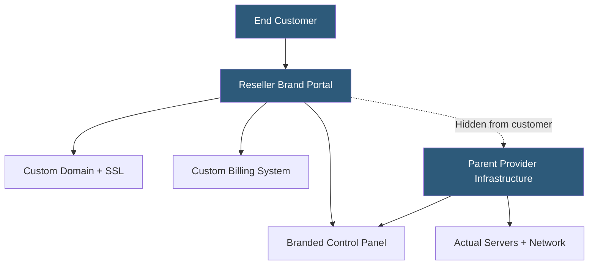

**Category:** Web Hosting Fundamentals
**Difficulty:** Intermediate
**Reading time:** 6 min read

---

White-label hosting allows agencies, ISPs, and technology companies to offer branded hosting services powered by an underlying provider's infrastructure, without the end customer being aware of the original provider. The reseller controls the brand identity, pricing, and customer relationship while leveraging the infrastructure and economies of scale of the parent.

- **Private label** — complete brand replacement; the underlying provider's name, logos, and references are removed from all customer-facing surfaces
- **Nameserver branding** — custom nameservers (ns1.yourbrand.com, ns2.yourbrand.com) that hide the parent provider's DNS infrastructure
- **Branded control panel** — cPanel or custom portal with the reseller's logo, color scheme, and support contact details
- **Custom billing portal** — WHMCS or equivalent platform presenting invoices, upgrade paths, and account management under the reseller's brand
- **Support escalation SLA** — contractual response time guarantees from the parent provider when the reseller escalates tickets
- **Infrastructure abstraction** — the parent provider's network, datacenter, and hardware details are entirely hidden from the end customer
- **Sub-reseller program** — white-label arrangement where the reseller can themselves offer white-label accounts to their own business partners

White-label hosting begins with a reseller agreement that grants access to infrastructure at wholesale pricing with full branding rights. The parent provider configures the WHM environment to suppress all references to their brand: control panel headers are customized, default nameservers are updated to the reseller's domains, and email templates are modified to use the reseller's contact information.

Custom nameservers are registered at the domain registrar and pointed at the parent provider's authoritative DNS servers. From the customer's perspective, DNS resolution flows through ns1.yourbrand.com — entirely under the reseller's brand. SSL certificates on the customer portal and control panel are issued for the reseller's domains.

The billing platform is deployed on the reseller's own domain with custom branding. WHMCS offers full template customization; the parent provider's name never appears in invoices, welcome emails, or the client area. Payment processing uses the reseller's payment gateway credentials.

Support creates the primary challenge in white-label hosting. The parent provider's support team typically does not interact with end customers — all tickets are received by the reseller, who resolves application-level issues and escalates server-level issues to the parent as their own tickets. The response time and quality of first-line support entirely depends on the reseller's capability.

Premium white-label programs offered by providers like WHMCS-integrated hosts (EasyDNS, Reseller Club, HostGator Reseller) include API access for automated provisioning, branded documentation portals, and dedicated escalation channels for reseller partners.

- Web design agencies adding hosting as a recurring revenue service under their own brand
- Telecommunications companies offering web hosting as a bundled product with internet service
- Domain registrars expanding into hosting services without building their own infrastructure
- IT service providers offering complete digital presence packages including hosting and email
- SaaS platforms embedding hosting functionality within their product under a unified brand

| Advantage | Disadvantage |
|-----------|--------------|
| Professional brand identity without infrastructure investment | Dependent on parent provider quality and uptime |
| Full control over pricing and customer relationships | Reseller bears first-line support burden |
| Rapid time-to-market for hosting service launch | Thin margins require volume to sustain profitability |
| Leverages parent provider's security and compliance | Limited ability to customize infrastructure stack |
| Scalable without capital expenditure on hardware | Customer discovery of parent provider can damage trust |

- [Reseller Hosting Business Models](reseller-hosting-business-models.md)
- [WHM Web Host Manager Automation](whm-web-host-manager-automation.md)
- [cPanel vs Plesk Control Panel Comparison](cpanel-vs-plesk-control-panel-comparison.md)

---
*Part of the [Web Hosting Fundamentals](index.md) category · [Back to Master Index](../../index.md)*
