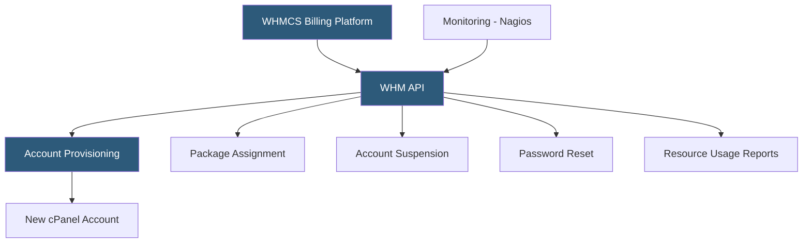

**Category:** Web Hosting Fundamentals
**Difficulty:** Intermediate
**Reading time:** 6 min read

---

WHM (Web Host Manager) is the administrative control panel layer above cPanel that hosting providers and resellers use to manage server configurations, create hosting packages, and automate account provisioning. WHM exposes a comprehensive API enabling full integration with billing platforms, monitoring tools, and custom provisioning workflows.

- **WHM API** — RESTful JSON and legacy XML API providing programmatic access to all WHM functions including account creation, suspension, and modification
- **cPanel account package** — predefined resource bundle (disk space, bandwidth, email accounts, databases) applied when creating new hosting accounts
- **EasyApache** — WHM's Apache and PHP compilation and configuration tool; replaced by EasyApache 4 with RPM-based module system
- **AutoSSL** — server-wide SSL certificate automation that uses Let's Encrypt to issue and renew certificates for all domains on the server
- **Server health dashboard** — WHM interface showing real-time CPU load, memory usage, disk capacity, and running process counts
- **Backup configuration** — WHM settings defining backup frequency, retention, destination (local, remote FTP, S3), and compression settings
- **Tweak Settings** — WHM's global PHP, Apache, and security configuration panel affecting all accounts on the server

WHM sits above cPanel in the administrative hierarchy and is accessible to root administrators and resellers (with restricted permissions). While cPanel handles individual site management, WHM manages the server itself and all the cPanel accounts on it.

The WHM API is the backbone of hosting automation. WHMCS integrates with WHM via the cPanel/WHM provisioning module, which calls API endpoints when customers sign up, upgrade, downgrade, or cancel. Account creation (`createacct`), modification (`modifyacct`), suspension (`suspendacct`), and deletion (`removeacct`) are all API-driven, executing in seconds without manual administrator involvement.

Hosting packages define the resource limits applied to new accounts. A "Basic" package might specify 5 GB disk, 50 GB bandwidth, 10 email accounts, and 3 MySQL databases. WHM enforces these limits through cgroups and quota systems; customers receive usage warnings as they approach limits and cannot exceed hard caps.

EasyApache 4 manages the Apache and PHP environment. Unlike the legacy EasyApache 3 which compiled Apache and PHP from source (taking 20–40 minutes), EasyApache 4 installs pre-compiled RPM packages in seconds. Administrators can install multiple PHP versions (7.4, 8.0, 8.1, 8.2, 8.3) simultaneously, and CloudLinux's PHP Selector lets individual cPanel users choose their PHP version per domain.

Server monitoring automation typically integrates with external tools via WHM API calls that retrieve CPU history, disk usage, and process lists. Scripts can parse these outputs to feed monitoring dashboards or trigger alerts when thresholds are crossed.

- Hosting providers automating new customer account creation via WHMCS billing integration
- Administrators scripting mass account operations (bulk password resets, package upgrades)
- Monitoring systems pulling server health metrics via API for dashboards
- Automated SSL renewal management for all hosted domains via AutoSSL
- DevOps teams scripting server migrations using WHM's transfer accounts functionality

| Advantage | Disadvantage |
|-----------|--------------|
| Comprehensive API enables full automation | WHM-specific knowledge required; not transferable to other panels |
| WHMCS integration covers entire customer lifecycle | cPanel/WHM per-account licensing can be expensive at scale |
| EasyApache 4 rapid PHP version management | WHM tied to cPanel licensing model |
| AutoSSL eliminates SSL renewal administration | Limited to Linux/cPanel ecosystem |
| Granular reseller permission controls | Some advanced configurations require root SSH access |

- [cPanel vs Plesk Control Panel Comparison](cpanel-vs-plesk-control-panel-comparison.md)
- [Reseller Hosting Business Models](reseller-hosting-business-models.md)
- [Hosting Account Provisioning Automation](hosting-account-provisioning-automation.md)

---
*Part of the [Web Hosting Fundamentals](index.md) category · [Back to Master Index](../../index.md)*
