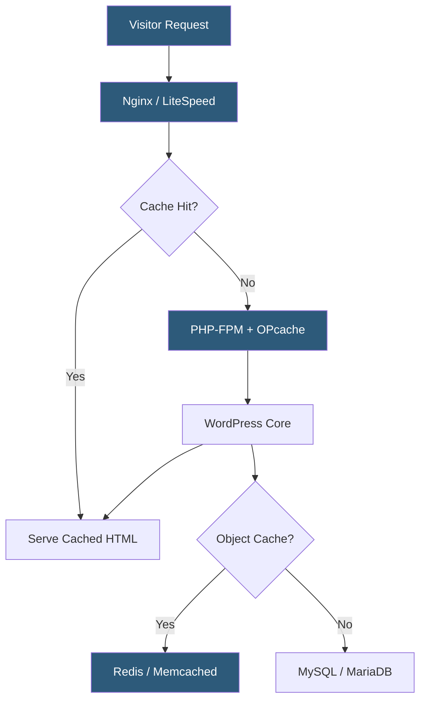

**Category:** Web Hosting Fundamentals
**Difficulty:** Intermediate
**Reading time:** 7 min read

---

WordPress-optimized hosting configures the server stack specifically for WordPress's PHP, MySQL, and file I/O patterns, delivering faster page loads and better scalability than generic hosting. Techniques include full-page object caching, PHP opcode caching, database query optimization, and CDN integration tuned to WordPress asset structures.

- **Object cache** — server-side in-memory store (Redis, Memcached) that caches expensive database query results across PHP requests
- **Full-page cache** — stores rendered HTML of WordPress pages, serving repeat visitors without executing PHP or querying MySQL
- **OPcache** — PHP's built-in bytecode cache that eliminates repeated compilation of PHP files on each request
- **wp-config.php tuning** — database connection settings, PHP memory limits, and debug flags critical to production performance
- **Database table optimization** — regular `OPTIMIZE TABLE` runs on autoloaded options, transients, and post revisions to maintain query speed
- **PHP-FPM pools** — isolated FastCGI process pools per WordPress site preventing resource contention between sites
- **WP-CLI** — command-line interface for WordPress enabling scripted maintenance, plugin updates, and cache purging

WordPress generates pages dynamically by executing PHP code that queries MySQL, assembles HTML, and returns it to the browser. Without caching, every page view repeats this entire cycle, creating bottlenecks under moderate traffic.

Full-page caching intercepts requests before they reach PHP. Plugins like WP Rocket, W3 Total Cache, or server-level solutions like Nginx FastCGI Cache store the rendered HTML output. Subsequent requests for the same URL return the cached file in microseconds. Cache invalidation — clearing the cached version when content changes — is triggered by WordPress hooks on post publish, comment submit, or plugin updates.

PHP OPcache is essential. WordPress loads hundreds of PHP files per request. Without OPcache, the PHP interpreter parses and compiles each file from source on every request. OPcache stores compiled bytecode in shared memory, reducing per-request PHP execution time by 40–70%.

Database optimization focuses on the `wp_options` table, where many plugins store configuration as autoloaded rows. Autoloaded options are fetched on every page load via a single query; poorly coded plugins accumulate megabytes of rarely-used data here. Regular audits with `SELECT option_name, length(option_value) FROM wp_options WHERE autoload='yes' ORDER BY length(option_value) DESC` identify bloat.

Managed WordPress hosts (WP Engine, Kinsta, Flywheel) bundle these optimizations with intelligent cache warming, automatic plugin update testing, and staging environments that mirror production exactly.

- High-traffic WordPress blogs requiring sub-second response times
- WooCommerce stores needing consistent checkout performance under load
- News sites with content publishing workflows requiring smart cache invalidation
- Agency networks managing dozens of WordPress sites from a single optimized platform
- Membership sites where object caching reduces per-member query overhead

| Advantage | Disadvantage |
|-----------|--------------|
| Dramatically reduced server load through caching | Cache invalidation complexity for dynamic content |
| Faster TTFB improves SEO rankings | Managed WP hosting costs more than generic VPS |
| PHP-FPM isolation prevents cross-site contamination | Requires WordPress-specific expertise to configure |
| Automated backups and staging included | Proprietary caching layers can conflict with plugins |
| Optimized MySQL tuning improves query speed | Not portable to non-WordPress applications |

- [Staging Environment Implementation](staging-environment-implementation.md)
- [One-Click Application Installers](one-click-application-installers.md)
- [Backup and Restore Mechanisms](backup-and-restore-mechanisms.md)

---
*Part of the [Web Hosting Fundamentals](index.md) category · [Back to Master Index](../../index.md)*
