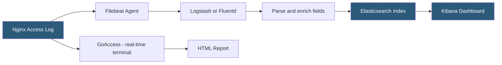

**Category:** Web Server Technologies
**Difficulty:** Intermediate
**Reading time:** 6 min read

---

Access log analysis extracts actionable intelligence from raw web server request records: identifying top pages, tracking error rates, detecting anomalous traffic patterns, and measuring response time distributions. Analysis ranges from simple command-line tools to dedicated platforms like GoAccess, AWStats, and ELK Stack. Effective log analysis is one of the cheapest and most privacy-respecting forms of web analytics available to server operators.

- **GoAccess** — real-time terminal and HTML web log analyzer supporting multiple log formats
- **AWStats** — Perl-based static web log analyzer generating HTML reports
- **Graylog / ELK Stack** — centralized log management platforms ingesting, indexing, and visualizing log data
- **log pipeline** — chain of tools (Filebeat → Logstash → Elasticsearch → Kibana) processing log data at scale
- **percentile response time** — P95/P99 metrics representing the response time below which 95%/99% of requests complete
- **status code distribution** — breakdown of 2xx, 3xx, 4xx, 5xx responses revealing error rates and redirect ratios
- **top URLs** — most-requested paths useful for caching prioritization and content optimization
- **bot detection** — identifying automated traffic via User-Agent strings and request pattern analysis

Command-line analysis is the fastest entry point. `awk '{print $9}' access.log | sort | uniq -c | sort -rn | head` extracts HTTP status codes and counts their frequency, immediately showing whether 5xx errors are spiking. `awk '{print $7}' access.log | sort | uniq -c | sort -rn | head -20` reveals the 20 most-requested URLs. These one-liners work on any server without additional software.

GoAccess processes log files or stdin in real time, displaying a terminal dashboard with visitor counts, top URLs, status code distribution, bandwidth usage, and geographic data. Running `goaccess access.log --log-format=COMBINED -o report.html` generates a standalone interactive HTML dashboard. GoAccess can tail a live log file, refreshing the dashboard every second via WebSocket for real-time monitoring.

The ELK Stack (Elasticsearch, Logstash, Kibana) or its lighter alternative LGTM (Loki, Grafana, Tempo, Mimir) provides enterprise-scale log aggregation. Filebeat ships log lines from the server to Logstash, which applies a Grok filter to parse the Combined Log Format into structured fields (IP, status, URL, response time). Elasticsearch indexes the structured events, and Kibana visualizes them in dashboards — enabling filtered queries like "all 500 errors on /checkout in the last hour."

Identifying bots requires User-Agent analysis. Legitimate bots (Googlebot, Bingbot) use well-known User-Agent strings and are identifiable. Malicious scanners often use recognizable patterns (sqlmap, nikto, curl without a legitimate UA). High request rates from a single IP in seconds — visible as repeated IP entries with millisecond timestamp intervals — indicate scanning or DDoS.

Response time analysis from `$request_time` in Nginx logs reveals P95 and P99 latencies for each endpoint. Sorting by average request time highlights slow queries or endpoints needing caching.

- Identifying the top 10 pages generating 80% of traffic to prioritize caching
- Detecting a brute-force attack on `/wp-login.php` from spike in 429 responses
- Measuring real user response times before and after a performance optimization
- Auditing which bots are consuming bandwidth and whether they should be allowed
- Compliance reporting on access patterns to sensitive data endpoints

| Advantage | Disadvantage |
|-----------|--------------|
| No client-side JavaScript required; works for crawlers and bots | Cached pages and CDN-served requests may not appear in origin logs |
| Complete server-side view including bots, APIs, and non-browser clients | Large log files require significant processing time or log rotation |
| Historical analysis possible by retaining archived log files | IP-level data requires GDPR-compliant retention and anonymization |
| Free tools (GoAccess, AWStats) require no external services | Real-time dashboards require ELK/Grafana infrastructure investment |

- [Web Server Logging Formats](web-server-logging-formats.md)
- [Error Log Monitoring](error-log-monitoring.md)
- [Rate Limiting at Web Server](rate-limiting-at-web-server.md)

---
*Part of the [Web Server Technologies](index.md) category · [Back to Master Index](../../index.md)*
