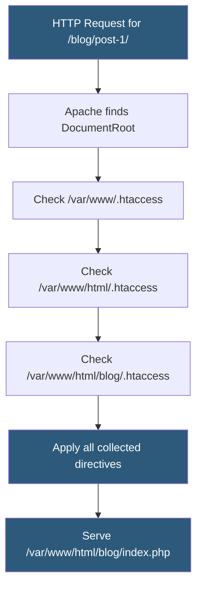

**Category:** Web Server Technologies
**Difficulty:** Intermediate
**Reading time:** 6 min read

---

The `.htaccess` file is a per-directory Apache configuration override used widely on shared hosting to control URL rewriting, authentication, caching headers, and PHP settings without root access. While powerful, `.htaccess` files have a measurable performance cost and should be migrated to main server config wherever possible for production workloads. Understanding their optimization is critical for both performance tuning and security hardening.

- **.htaccess** — Apache per-directory configuration file read on every HTTP request when AllowOverride is enabled
- **AllowOverride** — httpd.conf directive controlling which .htaccess directives are permitted; None disables parsing
- **mod_rewrite** — Apache module for URL transformation; the most common .htaccess use case
- **RewriteRule** — directive mapping incoming URL patterns (PCRE regex) to new URLs or file paths
- **RewriteCond** — conditional check applied before a RewriteRule executes
- **ExpiresActive** — mod_expires directive enabling HTTP Expires headers for browser caching
- **FilesMatch** — directive block applying settings to files matching a regex pattern
- **Options -Indexes** — directive preventing Apache from generating directory listing pages

Apache reads `.htaccess` files from every directory in the path from the filesystem root to the requested file on every single HTTP request. For a request to `/var/www/html/blog/post-1/index.php`, Apache checks for `.htaccess` in `/`, `/var/`, `/var/www/`, `/var/www/html/`, and `/var/www/html/blog/`. This filesystem traversal occurs even if no `.htaccess` files exist, because Apache must verify their absence. The result is multiple `stat()` system calls per request — measurable overhead under high load.

WordPress places rewrite rules in `.htaccess` to send all requests through `index.php`. The canonical WordPress block uses `RewriteEngine On`, a condition checking that the request is not for an existing file or directory (`!-f`, `!-d`), and a rule forwarding to `index.php`. Custom permalink structures generate different `%{REQUEST_URI}` patterns that RewriteRules translate.

Cache-control headers added via `.htaccess` use `mod_expires` to set `Expires` and `Cache-Control: max-age` for static assets. A common pattern sets 1-year expiry for CSS, JS, and image files, significantly reducing repeat visitor load times.

Security hardening in `.htaccess` includes: `Options -Indexes` to disable directory listings, blocking access to sensitive files with `<FilesMatch "\.(env|log|bak|sql)$">` returning 403, and blocking known malicious `User-Agent` strings.

For maximum performance on servers with root access, `.htaccess` rules should be moved to the site's `<Directory>` block in `httpd.conf` and `AllowOverride None` set, eliminating the per-request filesystem scanning entirely.

- WordPress permalink rewriting without access to httpd.conf
- Per-directory password protection via AuthType Basic blocks
- Setting browser cache headers for static assets on shared hosting
- Blocking access to sensitive files (.env, .git, composer.lock)
- Forcing HTTPS redirects when SSL cannot be configured in main config

| Advantage | Disadvantage |
|-----------|--------------|
| No server root access needed to configure rules | Filesystem scan on every request adds latency |
| Enables tenant-controlled rules on shared hosting | Syntax errors disable the directory with 500 errors |
| Changes take effect immediately without server reload | AllowOverride All is a security risk if users upload malicious .htaccess |
| Supports per-directory caching and security policies | Rules in httpd.conf are always faster; .htaccess is a workaround |

- [Apache HTTP Server Configuration](apache-http-server-configuration.md)
- [Apache mod_rewrite Rules](apache-mod-rewrite-rules.md)
- [Web Server Security Hardening](web-server-security-hardening.md)

---
*Part of the [Web Server Technologies](index.md) category · [Back to Master Index](../../index.md)*
