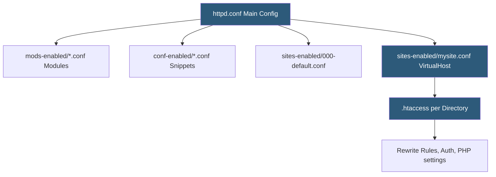

**Category:** Web Server Technologies
**Difficulty:** Intermediate
**Reading time:** 6 min read

---

Apache HTTP Server is the most widely deployed web server, known for its module-based architecture and `.htaccess` per-directory configuration. Configuring Apache properly involves selecting the correct Multi-Processing Module, tuning worker limits, setting up virtual hosts, and enabling performance modules. Its flexibility makes it the foundation for most shared hosting stacks.

- **httpd.conf** — main Apache configuration file loaded at startup
- **Virtual host** — named configuration block serving a different site per domain or IP
- **MPM (Multi-Processing Module)** — module controlling how Apache handles concurrent connections (prefork, worker, event)
- **mod_php** — Apache module embedding PHP interpreter directly in server processes
- **ServerName / ServerAlias** — directives binding a virtual host to specific domain names
- **AllowOverride** — directive controlling which httpd.conf directives can be overridden per-directory in .htaccess
- **DirectoryIndex** — ordered list of filenames Apache serves when a directory URL is requested
- **LogLevel** — verbosity setting for Apache's error and access logs (warn, notice, info, debug)

Apache uses a modular architecture where almost every feature — URL rewriting, SSL, PHP execution, compression — is implemented as a loadable module. On Debian/Ubuntu systems, modules are enabled or disabled with `a2enmod` / `a2dismod`, which symlinks module configuration files into `mods-enabled/`. The main `httpd.conf` (or `apache2.conf`) uses an Include directive to load all files from these directories at startup.

Virtual host blocks (`<VirtualHost *:80>`) allow a single Apache process to serve hundreds of websites. Each block specifies `ServerName`, `DocumentRoot`, `ErrorLog`, and `CustomLog`. Name-based virtual hosting routes requests by comparing the `Host:` header to `ServerName` and `ServerAlias` values across all configured virtual hosts.

The `AllowOverride All` directive in a `<Directory>` block permits `.htaccess` files to override main configuration on a per-directory basis. This is the mechanism shared hosting uses to give tenants URL rewrite control without root access. The performance cost of `.htaccess` is real — Apache must check for an `.htaccess` file in every directory from the filesystem root to the requested file on every request. Setting `AllowOverride None` and moving rules to the main config eliminates this overhead.

Graceful restarts (`apachectl graceful`) reload configuration without dropping active connections, making them safe for production use. Configuration syntax is validated with `apachectl configtest` before applying changes.

- Running shared hosting stacks serving hundreds of virtual hosts per server
- WordPress deployment using mod_rewrite for permalink rewriting
- SSL termination for HTTPS using mod_ssl with Let's Encrypt certificates
- Proxying requests to a backend application server via mod_proxy
- Fine-grained per-directory access control and authentication via .htaccess

| Advantage | Disadvantage |
|-----------|--------------|
| Massive ecosystem of modules for every use case | mod_php + prefork MPM uses high memory per connection |
| .htaccess enables tenant-controlled configuration | Parsing .htaccess on every request degrades performance |
| Excellent documentation and community support | Lower raw performance vs Nginx for static file serving |
| Fine-grained per-directory access control | Configuration syntax is verbose compared to Nginx |

- [Apache Virtual Host Setup](apache-virtual-host-setup.md)
- [Apache .htaccess Optimization](apache-htaccess-optimization.md)
- [Apache MPM Multi-Processing Modules](apache-mpm-multi-processing-modules.md)

---
*Part of the [Web Server Technologies](index.md) category · [Back to Master Index](../../index.md)*
