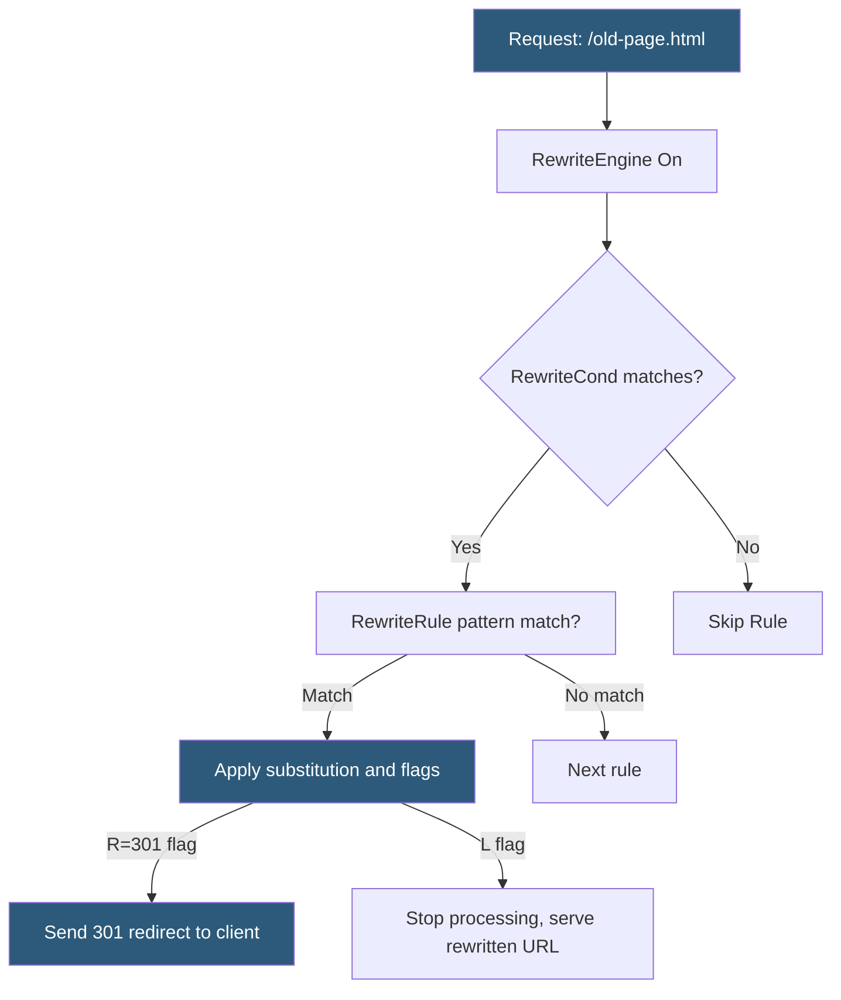

**Category:** Web Server Technologies
**Difficulty:** Intermediate
**Reading time:** 6 min read

---

mod_rewrite is Apache's URL manipulation engine, using Perl-Compatible Regular Expressions to rewrite request URIs, redirect browsers, and set environment variables based on arbitrary conditions. It powers WordPress pretty permalinks, canonical URL enforcement, legacy URL migration, and application routing. Mastering its syntax is essential for any Apache-based web server administration.

- **RewriteEngine On** — directive activating mod_rewrite in a context (VirtualHost, Directory, .htaccess)
- **RewriteRule** — core directive mapping a URL pattern to a substitution string with optional flags
- **RewriteCond** — condition directive checked before the following RewriteRule; supports server variables
- **Backreference** — captured group from a RewriteRule pattern (`$1`, `$2`) or RewriteCond pattern (`%1`, `%2`)
- **[R=301]** — redirect flag sending HTTP 301 Moved Permanently to the client
- **[L]** — last flag stopping rule processing after a match
- **[QSA]** — query string append flag preserving original query string in the rewritten URL
- **%{HTTP_HOST}** — RewriteCond server variable containing the incoming Host header value

mod_rewrite processes rules sequentially in the order they appear. Each `RewriteRule` has three parts: a pattern (PCRE regex matching the URL path), a substitution string (the new URL or `-` to pass unchanged), and optional flags in square brackets. If the pattern matches, the substitution is applied. Multiple `RewriteCond` directives before a rule act as AND conditions — all must match for the rule to fire. An `[OR]` flag on a condition creates an OR relationship.

The WordPress permalink rewrite block demonstrates canonical usage: `RewriteCond %{REQUEST_FILENAME} !-f` checks that the requested path is not an existing file; `RewriteCond %{REQUEST_FILENAME} !-d` verifies it is not a directory. If both conditions pass, `RewriteRule . /index.php [L]` sends all unmatched requests to `index.php`, which then routes them internally. This pattern applies to Laravel, Symfony, and other PHP frameworks using a front controller.

HTTPS enforcement uses `RewriteCond %{HTTPS} off` or `RewriteCond %{HTTP:X-Forwarded-Proto} !https` (for load balancers) followed by `RewriteRule ^ https://%{HTTP_HOST}%{REQUEST_URI} [R=301,L]`.

The `[NC]` flag makes pattern matching case-insensitive. The `[NE]` flag prevents special characters in the substitution from being re-encoded. RewriteLog (Apache 2.2) or `LogLevel rewrite:trace5` (Apache 2.4) enables detailed per-request rule tracing for debugging.

- WordPress permalink routing via front controller pattern
- Migrating old URL structures to new ones with permanent 301 redirects
- Enforcing www or non-www canonical URLs across an entire site
- Forcing HTTPS for all HTTP visitors
- Blocking requests from specific User-Agent strings or IP ranges

| Advantage | Disadvantage |
|-----------|--------------|
| Extremely powerful and flexible URL manipulation | Complex regex rules are difficult to read and debug |
| Handles virtually any rewrite or redirect scenario | Processing overhead per request, especially with many rules |
| Available in .htaccess without server root access | Rule order bugs cause subtle, hard-to-trace issues |
| Supports conditional rewrites based on dozens of variables | Regex escaping errors create 500 errors or infinite redirect loops |

- [Apache .htaccess Optimization](apache-htaccess-optimization.md)
- [Apache HTTP Server Configuration](apache-http-server-configuration.md)
- [Nginx Architecture](nginx-architecture.md)

---
*Part of the [Web Server Technologies](index.md) category · [Back to Master Index](../../index.md)*
