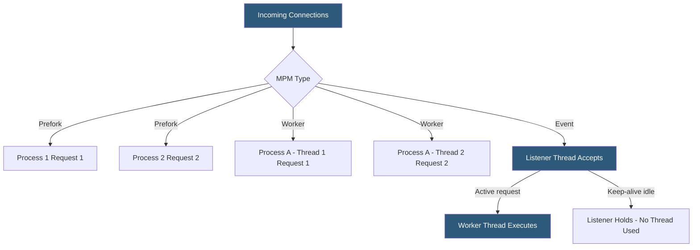

**Category:** Web Server Technologies
**Difficulty:** Advanced
**Reading time:** 6 min read

---

Apache's Multi-Processing Modules (MPMs) control how the server manages processes and threads to handle concurrent HTTP connections. The choice between prefork, worker, and event MPM directly impacts memory usage, concurrency ceiling, and PHP compatibility. Event MPM is the modern default on Apache 2.4, delivering significantly higher throughput for keep-alive connections compared to the older prefork model.

- **Prefork MPM** — each request handled by a separate forked process; no threading, safe for non-thread-safe extensions
- **Worker MPM** — hybrid multi-process/multi-thread model; fewer processes, more threads, lower memory than prefork
- **Event MPM** — extends worker by offloading keep-alive connection waiting to a dedicated listener thread
- **MaxRequestWorkers** — maximum number of simultaneous connections Apache will serve
- **ServerLimit** — maximum number of server processes (sets the ceiling for MaxRequestWorkers)
- **ThreadsPerChild** — number of threads each child process creates in worker/event MPM
- **MinSpareThreads / MaxSpareThreads** — idle thread range Apache maintains to absorb traffic spikes
- **mod_php** — embedded PHP module only compatible with prefork due to non-thread-safe (NTS) PHP runtime

Prefork creates a pool of child processes at startup, each capable of handling exactly one request at a time. When a new request arrives, Apache assigns it to an idle process. Because each process is a full fork of the parent, the memory footprint grows linearly with `MaxRequestWorkers`. Prefork's main advantage is safety: each process has an isolated memory space, so a crash in one does not affect others. It is the only MPM compatible with mod_php since PHP's Zend Engine is not thread-safe in its default non-thread-safe (NTS) build.

Worker MPM introduces threading: each child process spawns `ThreadsPerChild` threads, and each thread handles one connection at a time. With 4 processes and 25 threads each, Worker can handle 100 simultaneous connections using far less memory than 100 prefork processes. Worker requires a thread-safe PHP SAPI — typically PHP-FPM, which runs as a separate daemon and receives requests via FastCGI.

Event MPM extends Worker by adding a dedicated listener thread per process. This thread accepts new connections and manages keep-alive sockets. When a connection is merely waiting idle between requests (HTTP keep-alive), it occupies only the listener — no worker thread is blocked. Worker threads are released to handle new active requests immediately. This makes Event dramatically more efficient under high concurrency with many idle keep-alive connections, which is the norm for modern browsers opening multiple connections.

PHP-FPM is the recommended PHP handler for both Worker and Event MPMs. It runs independently, maintains its own process pool, and communicates with Apache via a Unix socket or TCP, decoupling PHP scaling from Apache process configuration.

- Shared hosting legacy stacks where mod_php forces prefork MPM
- High-traffic news sites using Event MPM with PHP-FPM for maximum concurrency
- API servers handling thousands of simultaneous long-poll connections
- Benchmarking MPM configurations to find optimal thread/process ratios
- Migrating from prefork to event MPM as part of a hosting performance upgrade

| Advantage | Disadvantage |
|-----------|--------------|
| Prefork: simple, isolated, compatible with mod_php | Prefork: high memory consumption at scale |
| Event: best concurrency for keep-alive workloads | Event: more complex tuning with two thread pools |
| Worker: good balance of memory and concurrency | Worker/Event: require thread-safe PHP (PHP-FPM) |
| All MPMs support dynamic child process scaling | Incorrect MaxRequestWorkers can cause OOM or request queuing |

- [Apache HTTP Server Configuration](apache-http-server-configuration.md)
- [Apache Virtual Host Setup](apache-virtual-host-setup.md)
- [Web Server Resource Limits](web-server-resource-limits.md)

---
*Part of the [Web Server Technologies](index.md) category · [Back to Master Index](../../index.md)*
