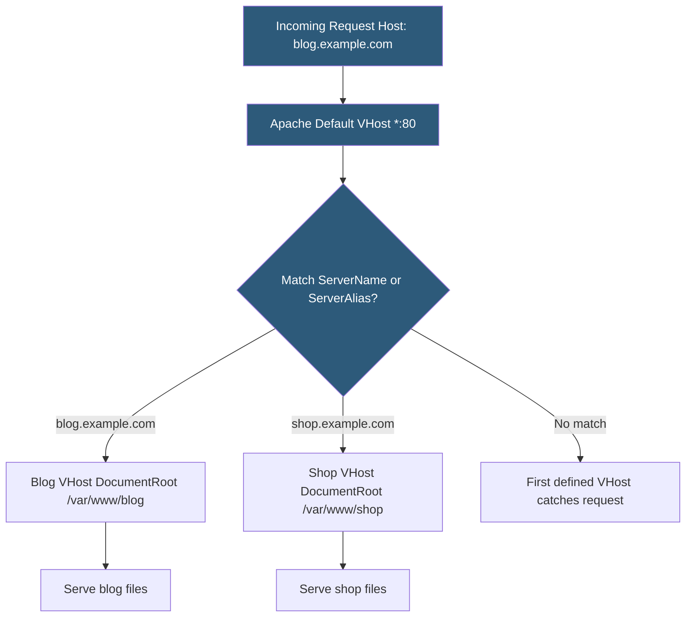

**Category:** Web Server Technologies
**Difficulty:** Beginner
**Reading time:** 5 min read

---

Apache virtual hosts allow a single server running a single Apache instance to serve multiple websites with distinct domain names, document roots, and logging. Name-based virtual hosting uses the HTTP `Host:` header to route incoming requests to the correct site configuration. Virtual host setup is one of the most common tasks in web server administration.

- **Name-based virtual hosting** — routing requests to virtual hosts by matching the HTTP Host header, not the IP address
- **IP-based virtual hosting** — assigning a separate IP address per site (rarely needed today)
- **VirtualHost block** — Apache configuration directive block defining all settings for one site
- **DocumentRoot** — filesystem path Apache serves files from for a virtual host
- **ServerName** — primary domain the virtual host responds to
- **ServerAlias** — additional domains (www. variants, legacy domains) the virtual host accepts
- **NameVirtualHost** — Apache 2.2 directive (removed in 2.4) enabling name-based hosting; `*:80` syntax replaced it
- **a2ensite / a2dissite** — Debian/Ubuntu commands to symlink or remove virtual host config files from sites-enabled/

On Apache 2.4, all virtual hosts bind to a socket address in the `<VirtualHost>` opening tag, typically `*:80` for HTTP or `*:443` for HTTPS. Using `*` means Apache listens on all IP addresses for that port. Multiple virtual host blocks can share the same socket; Apache reads the incoming request's `Host:` header and compares it to each virtual host's `ServerName` and `ServerAlias` directives in configuration file order.

If no `ServerName` matches, Apache falls back to the first virtual host defined for that port — making the order of Include or site file loading significant. On Debian/Ubuntu, site configuration files in `/etc/apache2/sites-available/` are activated with `a2ensite sitename.conf`, which creates a symlink in `sites-enabled/`. Files are loaded alphabetically, so `000-default.conf` loads first and acts as the fallback host.

Each virtual host block typically specifies: `DocumentRoot` pointing to the site's web root, `ErrorLog` and `CustomLog` for per-site logging to separate files, and optionally `<Directory>` blocks granting specific permissions. SSL virtual hosts require a `<VirtualHost *:443>` block with `SSLEngine on`, `SSLCertificateFile`, and `SSLCertificateKeyFile` directives pointing to certificate and private key files.

Certbot (Let's Encrypt client) automatically modifies virtual host configurations to add SSL directives and a redirect from HTTP to HTTPS, making certificate deployment a single command.

- Hosting 20 client websites on one VPS using separate virtual host configs
- Separating a main site and a staging subdomain on the same server with different document roots
- Redirecting all www. requests to the non-www canonical domain via ServerAlias and Redirect
- Per-site error and access logging for billing or debugging purposes
- Running WordPress multisite with subdomain mapping to multiple virtual hosts

| Advantage | Disadvantage |
|-----------|--------------|
| Single server IP hosts unlimited sites | First-defined VHost silently catches unmatched domains |
| Per-site logging simplifies debugging | SSL SNI required for HTTPS name-based hosting on old clients |
| Fine-grained per-site configuration | Configuration file ordering matters; easy to introduce errors |
| Easy to enable/disable sites with a2ensite | Reloading Apache applies changes to all virtual hosts simultaneously |

- [Apache HTTP Server Configuration](apache-http-server-configuration.md)
- [Apache .htaccess Optimization](apache-htaccess-optimization.md)
- [Web Server SSL/TLS Configuration](web-server-ssl-tls-configuration.md)

---
*Part of the [Web Server Technologies](index.md) category · [Back to Master Index](../../index.md)*
