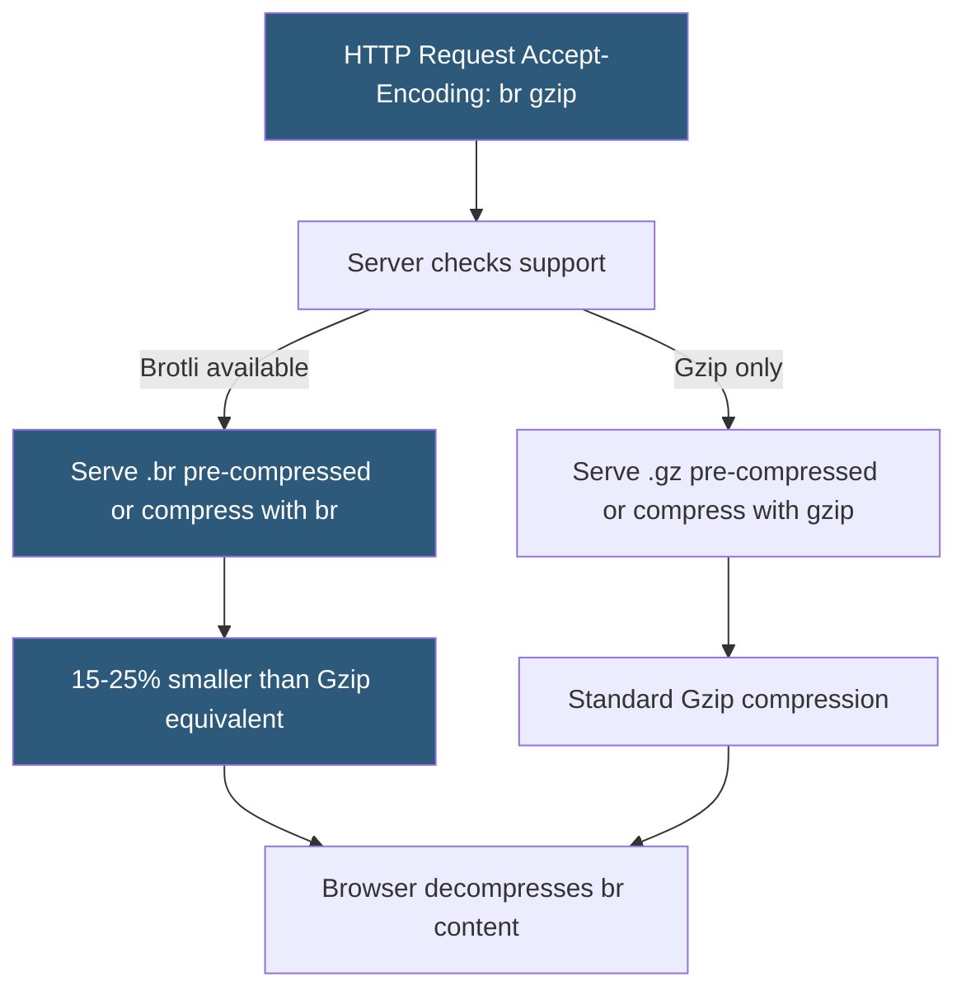

**Category:** Web Server Technologies
**Difficulty:** Intermediate
**Reading time:** 5 min read

---

Brotli is a lossless compression algorithm developed by Google, standardized in RFC 7932, that achieves 15–25% better compression ratios than Gzip for web content while maintaining similar decompression speeds. Supported by all modern browsers since 2017, Brotli requires HTTPS (browsers only advertise `Accept-Encoding: br` over secure connections) and a web server module or pre-compressed files. It is particularly effective on JavaScript bundles and HTML.

- **Brotli** — lossless compression algorithm using a static dictionary of common web patterns for improved compression
- **Accept-Encoding: br** — HTTP request header advertising Brotli support; browsers only send this over HTTPS
- **Content-Encoding: br** — response header indicating Brotli-compressed content
- **ngx_brotli** — Nginx module (maintained by Google) adding Brotli support to Nginx
- **mod_brotli** — Apache 2.4+ module providing Brotli compression
- **pre-compressed files** — `.br` files generated at build time served by Nginx without runtime compression
- **brotli_comp_level** — Nginx/ngx_brotli quality level 0–11; level 6 balances compression and CPU cost
- **Brotli static dictionary** — built-in 120KB dictionary of common HTML/CSS/JS patterns enabling superior compression without training

Brotli uses a combination of LZ77 string matching, Huffman coding, and a static 120KB dictionary containing common substrings from HTML, CSS, and JavaScript. This dictionary was built by analyzing a corpus of the most common web content, giving Brotli a head start on typical web files. When compressing a file, Brotli can reference dictionary entries directly rather than encoding them from scratch, producing smaller output.

At quality level 6, Brotli achieves significantly better compression than Gzip level 6 on JavaScript bundles — often 20%+ smaller. The compression operation itself is slower than Gzip at equivalent quality levels, which is why pre-compression at build or deploy time is strongly recommended for static assets. Pre-compressed `.br` files are served directly by Nginx without runtime compression cost.

Nginx requires the `ngx_brotli` module, which is not included in standard Nginx packages and must be compiled in or loaded dynamically. The `brotli_static on;` directive checks for a corresponding `.br` file (e.g., `style.css.br`) before compressing dynamically, serving the pre-generated file when available. `brotli_types text/html text/css application/javascript;` specifies which content types receive dynamic compression for requests without a pre-compressed file.

Apache's `mod_brotli` (included in Apache 2.4.26+) is simpler: `AddOutputFilterByType BROTLI_COMPRESS text/html text/css application/javascript` enables Brotli for specified types. Unlike Nginx's static file approach, Apache applies compression dynamically.

Build tools like webpack and Vite have Brotli plugins (vite-plugin-compression, compression-webpack-plugin) that generate `.br` files alongside compiled assets, enabling zero-runtime-cost Brotli serving.

- Reducing JavaScript bundle sizes for React/Vue/Next.js applications by an additional 20% over Gzip
- Pre-compressing static assets at CI/CD pipeline build time for deployment to CDN or web server
- Improving Core Web Vitals (LCP) scores by reducing asset download times on mobile connections
- Cutting CDN egress costs where bandwidth is billed per GB
- Replacing Gzip with Brotli on HTTPS-only APIs that return large JSON responses

| Advantage | Disadvantage |
|-----------|--------------|
| 15–25% better compression than Gzip for text content | Requires HTTPS; browsers do not advertise br over HTTP |
| Decompression speed comparable to Gzip (client-side) | ngx_brotli requires compilation; not in default Nginx packages |
| Pre-compressed .br files eliminate any runtime overhead | Compression at high quality levels (10–11) is very slow |
| All modern browsers support Brotli (100% coverage since 2020) | Must maintain both .gz and .br pre-compressed files for full coverage |

- [Gzip Compression Configuration](gzip-compression-configuration.md)
- [HTTP/3 and QUIC Protocol](http-3-and-quic-protocol.md)
- [Web Server Benchmarking](web-server-benchmarking.md)

---
*Part of the [Web Server Technologies](index.md) category · [Back to Master Index](../../index.md)*
