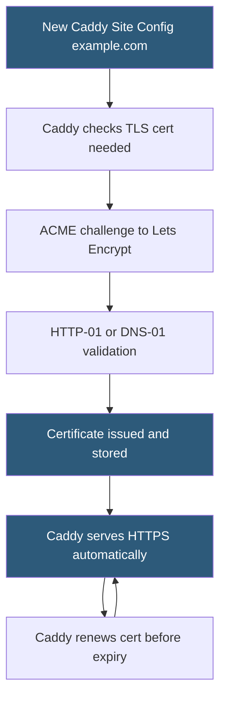

**Category:** Web Server Technologies
**Difficulty:** Intermediate
**Reading time:** 5 min read

---

Caddy is a modern open-source web server written in Go that automatically provisions and renews TLS certificates from Let's Encrypt without any manual configuration. Its Caddyfile syntax is significantly more concise than Apache or Nginx configurations, and its JSON API allows dynamic configuration changes at runtime without server restarts. Caddy is gaining adoption for development environments, small to medium production sites, and as a reverse proxy.

- **Automatic HTTPS** — Caddy's defining feature: obtaining, installing, and renewing TLS certificates from Let's Encrypt with zero config
- **Caddyfile** — human-readable configuration format using site addresses as top-level blocks
- **Admin API** — JSON REST API at `localhost:2019` for dynamically loading and modifying config without restarting
- **directive** — Caddyfile instruction (like `reverse_proxy`, `file_server`, `php_fastcgi`) configuring site behavior
- **reverse_proxy** — Caddy directive forwarding requests to an upstream backend with automatic load balancing
- **php_fastcgi** — Caddy directive for forwarding PHP requests to a PHP-FPM socket
- **encode** — Caddy directive enabling Gzip and Brotli compression automatically
- **Caddy modules** — Go plugins extending Caddy's functionality, compiled into the binary or loaded dynamically

Caddy's automatic HTTPS is its most distinctive feature. When a domain name appears as a site address in the Caddyfile (e.g., `example.com`), Caddy automatically initiates an ACME challenge with Let's Encrypt to obtain a certificate. It stores certificates in `~/.local/share/caddy/certificates/` (Linux) and schedules renewal at 2/3 of the certificate lifetime. This requires that port 80 is accessible for HTTP-01 challenges. DNS-01 challenges are supported via DNS provider plugins for domains behind firewalls.

The Caddyfile syntax maps site addresses to directive blocks. A complete reverse proxy with HTTPS, compression, and access logging is three lines: `example.com { reverse_proxy localhost:3000 }`. Caddy infers HTTPS from the domain name and handles the rest automatically. The equivalent Nginx configuration would require 20+ lines with a separate Certbot invocation.

The admin API enables Caddy to be configured and reconfigured at runtime. A `POST` to `/config/` replaces the entire configuration; `PATCH` to specific config paths allows atomic updates. This API is the foundation for Caddy's use as a programmable proxy where configuration is generated and applied by orchestration systems without human intervention.

PHP hosting uses the `php_fastcgi` directive with a Unix socket path: `php_fastcgi unix//run/php/php8.2-fpm.sock`. Caddy handles the FastCGI protocol, passing requests to PHP-FPM and returning responses. Static files are served directly with `file_server`.

Caddy's `encode gzip zstd` directive enables both Gzip and Zstandard compression with content negotiation, applied to all compressible response types without per-type configuration.

- Development HTTPS proxies for local application testing with real certificates
- Small production sites where certificate management overhead is a concern
- Dynamic proxy configuration managed by automation systems via the admin API
- Replacing Nginx or Apache in Docker-based stacks for simpler TLS configuration
- Personal sites and APIs where operational simplicity is prioritized

| Advantage | Disadvantage |
|-----------|--------------|
| Automatic TLS with zero certificate management | Smaller community and fewer tutorials than Apache or Nginx |
| Caddyfile is dramatically more concise than nginx.conf | Dynamic module loading is more limited than Apache |
| Admin API enables runtime reconfiguration | Less hardened in extremely high-traffic production environments |
| Written in Go: single binary, easy deployment | Custom module development requires Go knowledge and recompilation |

- [Nginx Architecture](nginx-architecture.md)
- [Web Server SSL/TLS Configuration](web-server-ssl-tls-configuration.md)
- [HTTP/2 Server Push](http-2-server-push.md)

---
*Part of the [Web Server Technologies](index.md) category · [Back to Master Index](../../index.md)*
