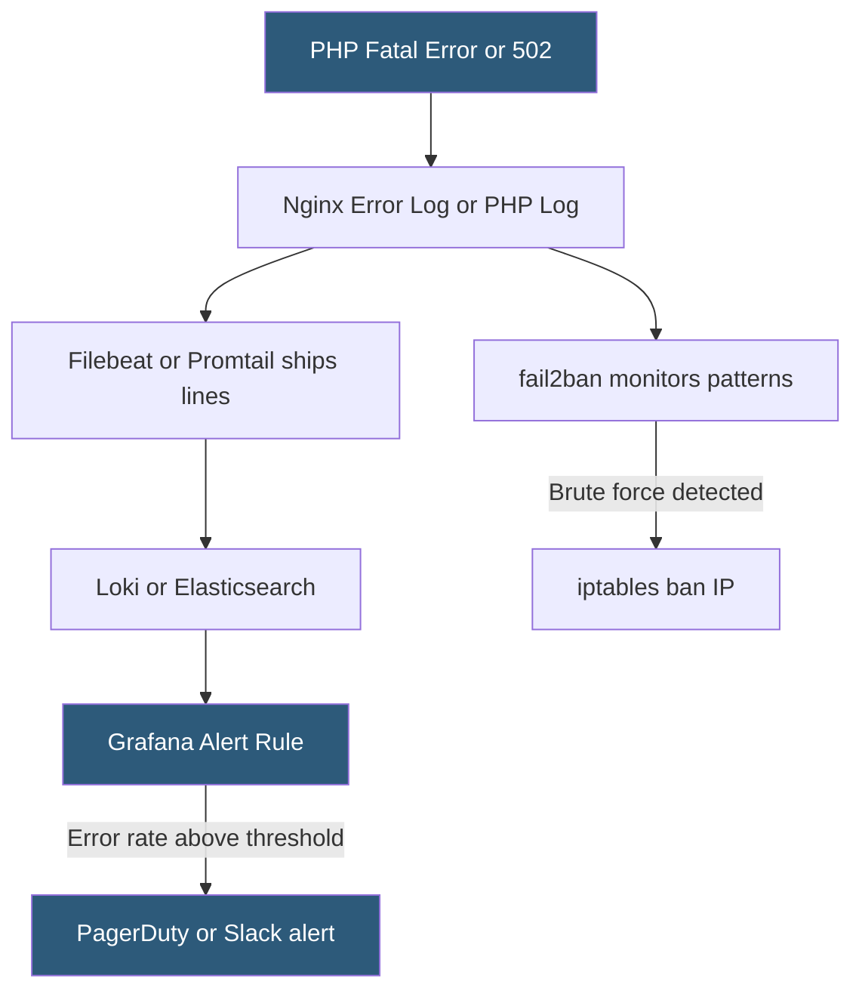

**Category:** Web Server Technologies
**Difficulty:** Intermediate
**Reading time:** 5 min read

---

Error log monitoring tracks server-side failures — PHP fatal errors, upstream connection failures, permission denials, configuration problems — providing immediate visibility into degraded application state. Effective monitoring moves beyond manual log inspection to alert-based systems that notify engineers when error rates exceed thresholds. Tools range from simple log tailers to integrated observability platforms with anomaly detection.

- **error_log** — web server file recording errors, warnings, and diagnostic messages with severity levels
- **PHP error log** — separate log file for PHP parse errors, fatal errors, and warnings, configured in php.ini
- **log level** — severity classification (emerg, alert, crit, error, warn, notice, info, debug) filtering which events are recorded
- **fail2ban** — daemon monitoring log files for suspicious patterns and applying firewall bans automatically
- **logwatch** — tool summarizing daily log activity and emailing reports to administrators
- **Sentry / Bugsnag** — application error tracking platforms capturing stack traces with context
- **tail -f** — Linux command streaming new log entries to the terminal in real time for manual monitoring
- **alert threshold** — configurable rate of errors per time window above which a notification is triggered

Nginx error log entries include a timestamp, severity level, process ID, client IP, and message. A 502 Bad Gateway generates: `2026/05/25 14:30:00 [error] 1234#0: *42 connect() failed (111: Connection refused) while connecting to upstream, client: 203.0.113.1`. This immediately identifies the upstream backend was unavailable. The `[crit]` level indicates SSL certificate issues; `[warn]` typically appears for non-fatal configuration observations.

PHP errors are written to a separate PHP error log file defined in `php.ini` with `error_log = /var/log/php/error.log`. PHP error types include `E_FATAL` (script halted), `E_WARNING`, `E_NOTICE`, and `E_DEPRECATED`. WordPress and other PHP applications may suppress error display (`display_errors = Off`) for security but should always log to file (`log_errors = On`).

Real-time monitoring uses log shipping agents (Promtail for Loki, Filebeat for Elasticsearch) that tail log files and stream new lines to a centralized platform. Alert rules count error-level entries per minute and fire notifications via PagerDuty, Opsgenie, or Slack webhooks when counts exceed thresholds. Rate-of-change alerts are more useful than absolute counts — a sudden increase from 0 to 50 errors/minute is more actionable than a constant background noise of 10 errors/minute.

For application-layer error tracking, Sentry integrates with PHP, Python, Node.js, and other runtimes to capture exceptions with full stack traces, request context, user information, and release version. This provides much richer debugging context than raw log strings.

fail2ban monitors error logs for authentication failure patterns and issues `iptables` or `firewalld` commands to block abusive IPs, working in coordination with rate limiting at the web server level.

- Alerting on-call engineers within minutes of a backend going down (502 spike)
- Detecting PHP memory exhaustion errors before they become user-visible
- Identifying configuration errors introduced by a deployment (permission denied, file not found)
- Correlating error log spikes with specific deployment timestamps for rapid rollback decisions
- Building daily error summary reports emailed to developers for proactive issue resolution

| Advantage | Disadvantage |
|-----------|--------------|
| Real-time visibility into server-side failures | High-volume error logs require significant storage and processing |
| fail2ban integration converts log events into automated protection | Alert fatigue from noisy logs degrades on-call response quality |
| Centralized platforms enable cross-server error correlation | PHP error logs can contain sensitive data requiring access controls |
| Free tools (tail, logwatch) require no infrastructure | Application-level errors require separate Sentry/Bugsnag integration |

- [Web Server Logging Formats](web-server-logging-formats.md)
- [Access Log Analysis](access-log-analysis.md)
- [Web Server Security Hardening](web-server-security-hardening.md)

---
*Part of the [Web Server Technologies](index.md) category · [Back to Master Index](../../index.md)*
