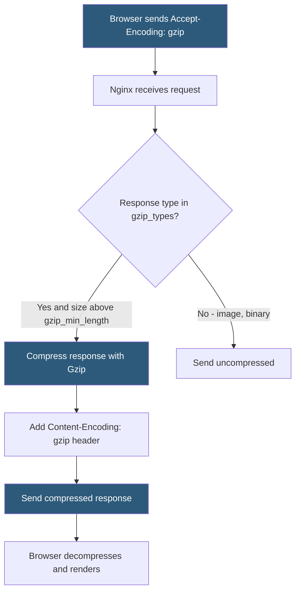

**Category:** Web Server Technologies
**Difficulty:** Beginner
**Reading time:** 5 min read

---

Gzip compression reduces the size of HTTP responses — HTML, CSS, JavaScript, JSON — by 60–80% before transmission, significantly reducing page load times and bandwidth costs. Both Apache and Nginx provide built-in Gzip support through configuration directives. Gzip is one of the highest-ROI performance optimizations available: minimal CPU cost for measurable improvements in load time, particularly on slower connections.

- **gzip** — lossless compression algorithm applied to HTTP responses; universally supported by browsers
- **Accept-Encoding: gzip** — HTTP request header browsers send to advertise Gzip support
- **Content-Encoding: gzip** — HTTP response header confirming the response body is Gzip-compressed
- **gzip_types** — Nginx/Apache directive listing MIME types eligible for compression
- **gzip_comp_level** — compression level 1–9; level 6 is the standard balance of speed vs compression ratio
- **gzip_min_length** — minimum response size threshold below which compression is not applied (default 20 bytes)
- **Vary: Accept-Encoding** — response header instructing CDNs and proxies to cache separate compressed and uncompressed versions
- **Brotli** — newer Google compression algorithm with 15–25% better compression than Gzip at equivalent CPU cost

Nginx enables Gzip with `gzip on;` in the `http` block. The `gzip_types` directive specifies which content types to compress. Images (JPEG, PNG, GIF, WebP) and other binary formats are already compressed and should not be listed — attempting to Gzip a JPEG wastes CPU and may slightly increase response size. The canonical types list includes `text/html text/css text/javascript application/javascript application/json application/xml`.

`gzip_comp_level 6;` sets the compression intensity. Level 1 is fastest with least compression; level 9 provides maximum compression with highest CPU cost. Level 6 is the standard recommendation, achieving 90%+ of level 9 compression at a fraction of the CPU cost. For static assets served from disk, pre-compressed `.gz` files generated at deploy time eliminate runtime compression entirely.

`gzip_min_length 1000;` prevents compressing tiny responses below 1KB — the overhead of the Gzip header and decompression time can exceed the transmission savings for small payloads. `gzip_vary on;` adds the `Vary: Accept-Encoding` header, signaling to Varnish, CDNs, and other caches to store separate versions for compressed and uncompressed clients.

Apache's equivalent uses `mod_deflate` (confusingly named but implements Gzip): `AddOutputFilterByType DEFLATE text/html text/css application/javascript` enables compression per MIME type. `BrowserMatch ^Mozilla/4 gzip-only-text/html` handles older Netscape 4.x browsers that had broken Gzip support — a legacy directive still seen in many configs.

Brotli (available via `ngx_brotli` module for Nginx) achieves 15–25% smaller output than Gzip at similar CPU cost. Browsers that support Brotli send `Accept-Encoding: br`, and servers can serve `.br` pre-compressed files for the best of both worlds.

- Reducing JavaScript bundle transfer size for React/Vue/Angular single-page applications
- Compressing large HTML pages with inline content for faster first-byte times
- Reducing API response size for JSON-heavy REST APIs on mobile connections
- Cutting bandwidth costs on cloud servers where egress is billed per GB
- Improving Core Web Vitals scores by reducing LCP resource download times

| Advantage | Disadvantage |
|-----------|--------------|
| 60–80% size reduction for text-based responses | CPU overhead for runtime compression (negligible with pre-compression) |
| Universally supported by all modern browsers | Should not compress already-compressed formats (images, video, archives) |
| Reduces bandwidth costs on metered connections | gzip_vary required to prevent CDN serving compressed to non-supporting clients |
| Pre-compressed static files eliminate runtime cost entirely | Brotli requires module compilation or installation on most servers |

- [Brotli Compression](brotli-compression.md)
- [Nginx Caching Strategies](nginx-caching-strategies.md)
- [Web Server Benchmarking](web-server-benchmarking.md)

---
*Part of the [Web Server Technologies](index.md) category · [Back to Master Index](../../index.md)*
