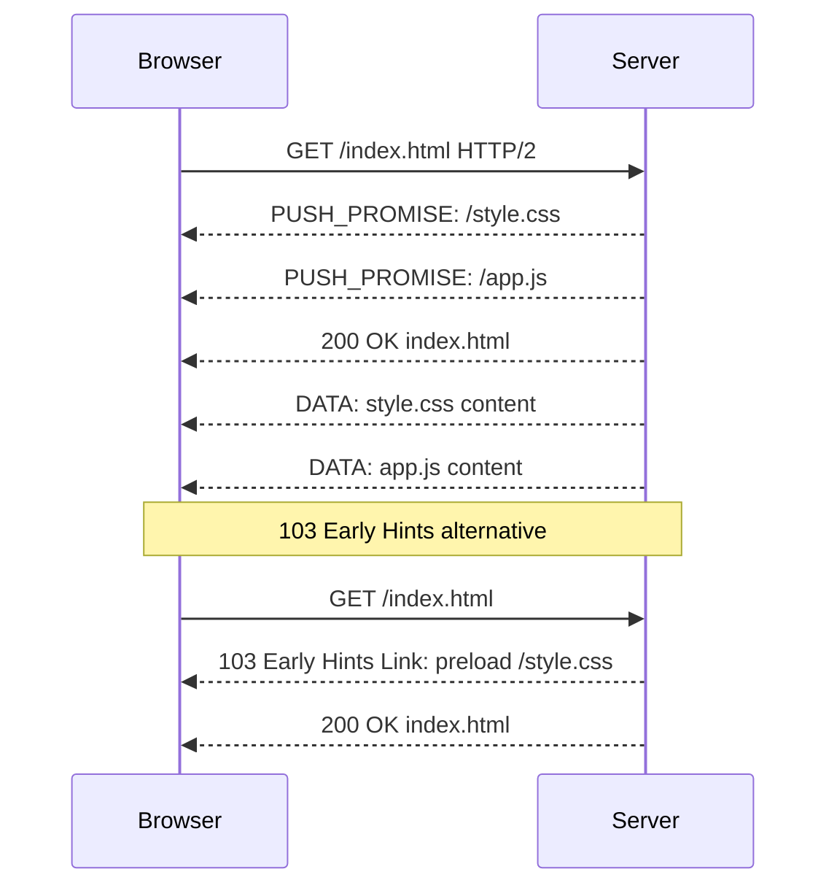

**Category:** Web Server Technologies
**Difficulty:** Advanced
**Reading time:** 6 min read

---

HTTP/2 Server Push allows a web server to proactively send resources — CSS, JavaScript, fonts — to the client before the browser requests them, eliminating the round-trip latency for critical page assets. While the feature promised significant performance gains, real-world results have been mixed, and most browsers have deprecated or removed support in favor of the `103 Early Hints` response code as a more reliable alternative.

- **HTTP/2 multiplexing** — single TCP connection carrying multiple concurrent request/response streams
- **Server Push** — HTTP/2 mechanism for servers to send promised resources alongside an HTML response
- **PUSH_PROMISE frame** — HTTP/2 frame advertising a resource the server intends to push before the client requests it
- **Link: rel=preload** — HTTP response header that triggers server push in Nginx/Apache and signals preload to browsers
- **push_preload** — Nginx directive enabling server push based on Link preload headers
- **Cache digests** — proposed HTTP extension allowing clients to tell servers which resources they already have cached
- **103 Early Hints** — modern replacement for server push: server sends preliminary headers for preloading before the full response
- **RST_STREAM** — HTTP/2 frame a client sends to cancel a pushed resource it already has cached

In HTTP/2, the server can respond to a GET request for HTML with `PUSH_PROMISE` frames advertising additional resources before sending the HTML body. The browser reserves stream IDs for the promised resources and processes the pushed data when it arrives, without issuing new requests. This collapses what would be two round trips — HTML download → parse → CSS/JS request — into a single round trip.

Nginx enables server push with `http2_push /style.css;` in a location block, or more dynamically using `http2_push_preload on;` which reads `Link: </style.css>; rel=preload` headers from backend responses and converts them to push frames automatically. Apache's HTTP/2 module similarly uses `H2PushResource` directives or `Link` header parsing.

The critical weakness of server push is the cache problem: there is no reliable way for the server to know which resources the client already has cached. Pushing a cached resource wastes bandwidth; the browser must send a `RST_STREAM` frame to cancel the push after it starts. Cache Digests (RFC draft) proposed a solution — clients sending a compressed cache inventory — but never gained browser implementation.

This limitation led to most major browsers removing server push support (Chrome removed it in version 106, 2022) in favor of `103 Early Hints`. A 103 response is sent before the server finishes generating the full response, carrying `Link: preload` headers. The browser starts fetching the hinted resources while waiting for the 200 OK. Unlike server push, Early Hints does not push actual content — the browser fetches from its cache if available, or makes network requests only for uncached resources.

- Pushing render-blocking CSS alongside HTML response on legacy HTTP/2 setups
- Understanding why server push was deprecated and how to migrate to 103 Early Hints
- Evaluating Cloudflare's and Fastly's 103 Early Hints implementations at CDN edge
- Debugging unexpected bandwidth usage from unwanted push frames
- Performance auditing tools identifying pushed vs fetched resources

| Advantage | Disadvantage |
|-----------|--------------|
| Eliminates one round trip for critical render-blocking resources | Cannot detect client cache state; wastes bandwidth on cached resources |
| Works within existing HTTP/2 infrastructure | Chrome, Firefox have deprecated or removed server push support |
| Pairs well with Link preload headers for progressive enhancement | Complex to implement correctly without cache-aware logic |
| 103 Early Hints is a better replacement with wider support | Early Hints requires server-side changes to send 103 before full response |

- [HTTP/3 and QUIC Protocol](http-3-and-quic-protocol.md)
- [Nginx Caching Strategies](nginx-caching-strategies.md)
- [Gzip Compression Configuration](gzip-compression-configuration.md)

---
*Part of the [Web Server Technologies](index.md) category · [Back to Master Index](../../index.md)*
