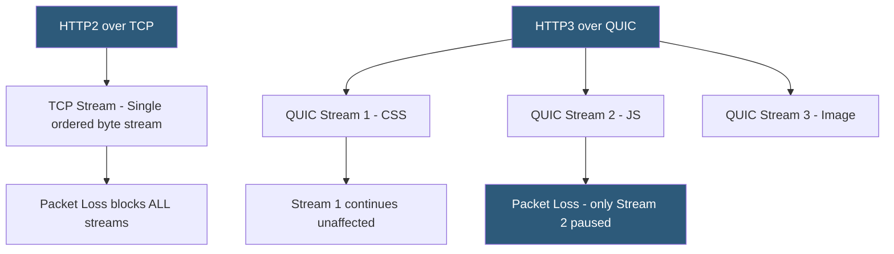

**Category:** Web Server Technologies
**Difficulty:** Advanced
**Reading time:** 7 min read

---

HTTP/3 is the third major version of HTTP, replacing TCP as the transport layer with QUIC — a multiplexed, encrypted, UDP-based protocol developed at Google and standardized in RFC 9000. QUIC eliminates the head-of-line blocking inherent in TCP multiplexing, reduces connection establishment latency with 0-RTT resumption, and builds TLS 1.3 directly into the transport layer. HTTP/3 adoption is accelerating, with LiteSpeed, Nginx (experimental), and Cloudflare providing production-grade implementations.

- **QUIC** — UDP-based transport protocol providing multiplexing, reliability, and congestion control without TCP head-of-line blocking
- **0-RTT connection resumption** — QUIC feature allowing returning clients to send data immediately without a new handshake
- **Connection ID** — QUIC identifier enabling connections to survive IP address changes (e.g., mobile network switches)
- **Stream multiplexing** — QUIC streams are independent; packet loss on one stream does not delay others
- **Alt-Svc header** — HTTP response header advertising HTTP/3 availability, prompting clients to upgrade on next request
- **TLS 1.3 in QUIC** — QUIC mandates TLS 1.3 and integrates the handshake into the transport, reducing setup latency
- **Head-of-line blocking** — TCP problem where a lost packet stalls all subsequent data; solved by QUIC's independent streams
- **UDP port 443** — standard port for QUIC/HTTP3 traffic (same as HTTPS but UDP not TCP)

HTTP/2 over TCP achieved multiplexing at the HTTP layer but retained TCP's single ordered byte stream at the transport level. A single lost TCP packet triggers retransmission and stalls all HTTP/2 streams sharing that connection until the lost packet is received in order — this is TCP head-of-line blocking. QUIC solves this by managing each stream's ordering independently: a lost UDP packet triggers retransmission for its stream only, while other streams continue without interruption.

QUIC builds TLS 1.3 into the handshake. A new QUIC connection combines the transport and TLS handshakes into a single exchange, achieving TLS-secured communication in one round trip (1-RTT). With 0-RTT session resumption, a returning client can send encrypted application data in the very first QUIC packet, before the server responds — reducing latency to zero additional round trips for repeat connections.

Connection migration is another QUIC differentiator. Connections are identified by Connection IDs, not IP/port pairs. When a mobile device switches from WiFi to LTE, its IP address changes, breaking a TCP connection. QUIC connections survive this change: the client includes its Connection ID in packets on the new IP, and the server recognizes and continues the existing connection.

HTTP/3 maps HTTP semantics onto QUIC streams using QPACK header compression (replacing HPACK from HTTP/2). QPACK handles the challenge of header compression across independent QUIC streams without introducing ordering dependencies.

Server support: LiteSpeed natively supports HTTP/3. Nginx requires the quic branch with BoringSSL. Caddy supports HTTP/3 via `x/net/quic`. Cloudflare proxies automatically enable HTTP/3 for all sites. Servers advertise HTTP/3 availability via the `Alt-Svc: h3=":443"` response header.

- High-latency mobile networks where 0-RTT and connection migration reduce perceived lag
- Large web pages with many concurrent resource loads where HOL blocking is measurable
- Real-time applications (video conferencing, gaming) sensitive to stream-level latency
- CDN edge deployments where Cloudflare or Fastly transparently provide HTTP/3
- Auditing existing sites to verify HTTP/3 is offered via Alt-Svc headers

| Advantage | Disadvantage |
|-----------|--------------|
| Eliminates TCP head-of-line blocking for parallel streams | UDP blocked by some corporate firewalls and middleboxes |
| 0-RTT reduces repeat connection latency significantly | 0-RTT replay attack risk requires idempotent request handling |
| Connection migration survives IP address changes | Larger CPU overhead for UDP processing vs optimized TCP stack |
| TLS 1.3 mandatory — no negotiation of weaker ciphers | Implementation maturity lags behind battle-tested TCP stacks |

- [HTTP/2 Server Push](http-2-server-push.md)
- [LiteSpeed Web Server](litespeed-web-server.md)
- [Web Server SSL/TLS Configuration](web-server-ssl-tls-configuration.md)

---
*Part of the [Web Server Technologies](index.md) category · [Back to Master Index](../../index.md)*
