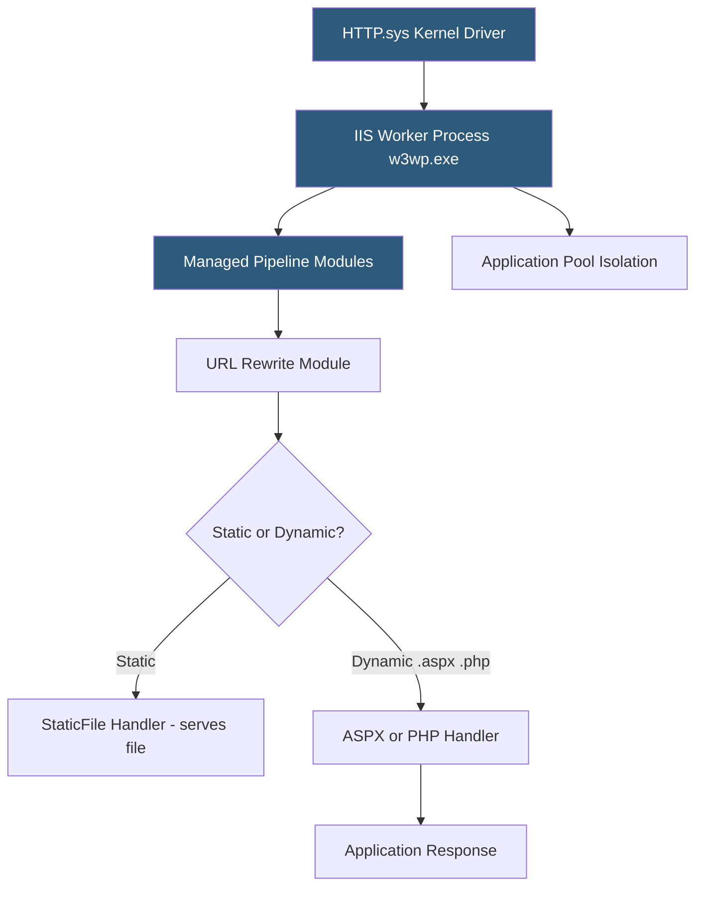

**Category:** Web Server Technologies
**Difficulty:** Intermediate
**Reading time:** 6 min read

---

Internet Information Services (IIS) is Microsoft's web server built into Windows Server and available on Windows desktop editions. It serves ASP.NET applications, static content, and reverse proxies via a pipeline-based request processing model with a rich GUI management interface. IIS is the default web server for .NET Framework and .NET Core applications hosted on Windows and integrates tightly with Active Directory and Windows authentication.

- **IIS Manager** — MMC-based GUI for configuring sites, application pools, bindings, and modules
- **Application Pool** — isolated worker process container running one or more web applications under a specific identity
- **w3wp.exe** — IIS worker process executable hosting application pool content
- **web.config** — XML configuration file for IIS sites equivalent to Apache .htaccess
- **URL Rewrite Module** — IIS extension providing regex-based URL rewriting similar to Apache mod_rewrite
- **Application Request Routing (ARR)** — IIS extension for reverse proxying and load balancing
- **ASPX / ASP.NET pipeline** — IIS integrated mode pipeline merging IIS and ASP.NET request processing
- **Site binding** — mapping of a site to an IP address, port, and optional hostname for name-based hosting

IIS uses HTTP.sys, a kernel-mode driver, as its HTTP listener. HTTP.sys handles connection acceptance, SSL/TLS offload, and basic request parsing before passing requests to user-space worker processes. This design means the kernel handles the network layer efficiently, and worker process crashes do not affect new incoming connections.

Each website in IIS is associated with an Application Pool — a worker process group with configurable identity (Application Pool Identity, NetworkService, custom user), .NET CLR version, and recycling schedule. Isolating sites in separate application pools prevents one application's crash or memory leak from affecting others. IIS Manager's "Application Pools" view shows the running/stopped state and the number of requests served since last recycle.

`web.config` files placed in site directories control IIS behavior per-directory, similar to Apache's `.htaccess`. The URL Rewrite Module extends `web.config` with `<rewrite><rules>` blocks supporting regex pattern matching, conditions, and redirect types (301/302). The RewriteRule syntax differs from Apache's but supports equivalent capabilities.

For .NET 5+ and .NET Core applications, IIS acts as a reverse proxy to the Kestrel in-process or out-of-process web server. The ASP.NET Core Module (ANCM) replaces the traditional managed pipeline, forwarding requests to the self-hosted .NET process.

PHP hosting on IIS uses PHP-CGI or FastCGI via the PHP Manager for IIS extension, configuring `php-cgi.exe` as the handler for `.php` files. Performance is typically lower than Linux-based LAMP stacks due to Windows's higher context-switch overhead for CGI.

- Hosting ASP.NET Framework or .NET Core web applications on Windows Server
- Serving static content alongside .NET APIs in enterprise intranets
- Reverse proxying to a .NET Core Kestrel application with ARR
- Windows authentication for internal corporate web applications via Active Directory
- Running legacy Classic ASP applications that require Windows-only dependencies

| Advantage | Disadvantage |
|-----------|--------------|
| Deep Windows and Active Directory integration | Windows Server licensing adds significant cost |
| GUI management reduces CLI knowledge barrier | Higher resource usage than Linux-based Nginx/Apache |
| HTTP.sys kernel driver provides solid DDoS baseline protection | Limited module ecosystem compared to Apache or Nginx |
| Application pools provide strong multi-tenant isolation | PHP/Python hosting on IIS is awkward compared to Linux stacks |

- [Apache HTTP Server Configuration](apache-http-server-configuration.md)
- [Nginx Architecture](nginx-architecture.md)
- [Web Server SSL/TLS Configuration](web-server-ssl-tls-configuration.md)

---
*Part of the [Web Server Technologies](index.md) category · [Back to Master Index](../../index.md)*
