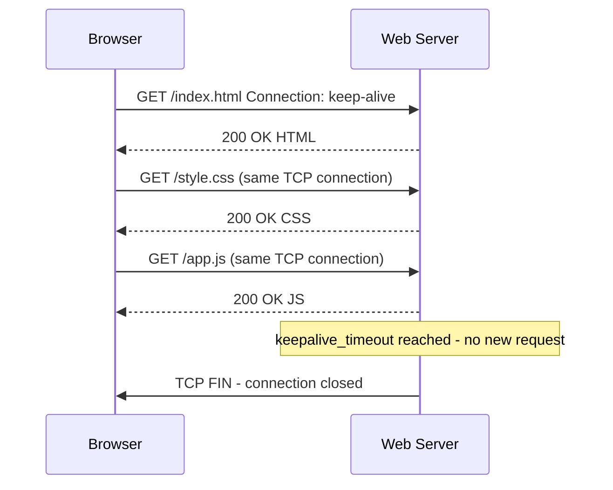

**Category:** Web Server Technologies
**Difficulty:** Intermediate
**Reading time:** 5 min read

---

HTTP Keep-Alive (persistent connections) allows multiple HTTP requests to reuse the same TCP connection, eliminating the latency and CPU cost of establishing new connections for every resource. Proper keep-alive tuning balances connection reuse benefits against the risk of holding connections open too long and exhausting available worker slots. HTTP/2 makes keep-alive irrelevant for multiplexed streams, but HTTP/1.1 keep-alive tuning remains important for mixed-protocol environments.

- **Keep-Alive** — HTTP/1.1 feature allowing multiple requests over a single TCP connection (default on in HTTP/1.1)
- **KeepAliveTimeout** — Apache directive specifying how long an idle keep-alive connection is held open
- **keepalive_timeout** — Nginx directive equivalent to Apache's KeepAliveTimeout
- **MaxKeepAliveRequests** — Apache directive limiting the number of requests per keep-alive connection
- **keepalive_requests** — Nginx equivalent of MaxKeepAliveRequests
- **Connection: close** — HTTP header terminating the connection after the response, disabling keep-alive for that request
- **TIME_WAIT** — TCP state a connection enters after closing; occupied connections cannot reuse the port briefly
- **HTTP/2 multiplexing** — HTTP/2 feature sending multiple requests concurrently over a single connection, superseding keep-alive for modern clients

Without keep-alive, each HTTP request requires a new TCP handshake (SYN → SYN-ACK → ACK), adding 1 round trip of latency before the first byte of data. A modern web page loads 50-100 resources; without keep-alive, that would require 50-100 TCP handshakes. Keep-alive connections are established once and reused across multiple requests, dramatically reducing handshake overhead.

In Nginx, `keepalive_timeout 65;` holds idle keep-alive connections open for 65 seconds. This must balance two competing concerns: longer timeouts improve performance for users browsing multiple pages, but each idle connection occupies a file descriptor and potentially a worker connection slot. Under load, too many idle keep-alive connections can exhaust `worker_connections`, preventing new connections from being accepted.

`keepalive_requests 1000;` limits how many requests a single connection can serve before the server closes and forces a new TCP handshake. This prevents very long-lived connections from monopolizing resources and provides natural load distribution in upstream scenarios.

For connections between Nginx as a reverse proxy and upstream application servers, keep-alive connections to upstreams are separately configured with the `keepalive 32;` directive in the `upstream` block. This pool maintains 32 idle connections to the upstream at all times, eliminating TCP overhead for high-frequency backend calls.

With HTTP/2, keep-alive in the traditional HTTP/1.1 sense is replaced by multiplexing: a single HTTP/2 connection carries all requests simultaneously, not sequentially. `http2_max_requests` in Nginx limits requests per HTTP/2 connection. For clients that only support HTTP/1.1 (APIs, legacy apps), proper HTTP/1.1 keep-alive tuning remains important.

- Reducing TCP handshake overhead on high-traffic sites with many resources per page
- Tuning upstream keep-alive pools for Nginx-to-backend API proxy connections
- Diagnosing worker_connections exhaustion caused by long-lived idle keep-alive connections
- Setting KeepAliveTimeout appropriately for image-heavy e-commerce pages
- Load testing to identify the optimal balance between connection timeout and concurrency limits

| Advantage | Disadvantage |
|-----------|--------------|
| Eliminates per-request TCP handshake latency | Idle keep-alive connections consume worker slots and file descriptors |
| Reduces CPU overhead from TCP connection setup | Long KeepAliveTimeout can exhaust connections under heavy load |
| Critical for HTTP/1.1 performance on resource-heavy pages | HTTP/2 makes per-request keep-alive tuning less impactful |
| Upstream keep-alive pools dramatically reduce backend overhead | Incorrect MaxKeepAliveRequests can cause premature connection cycling |

- [Web Server Resource Limits](web-server-resource-limits.md)
- [Nginx Architecture](nginx-architecture.md)
- [Web Server Benchmarking](web-server-benchmarking.md)

---
*Part of the [Web Server Technologies](index.md) category · [Back to Master Index](../../index.md)*
