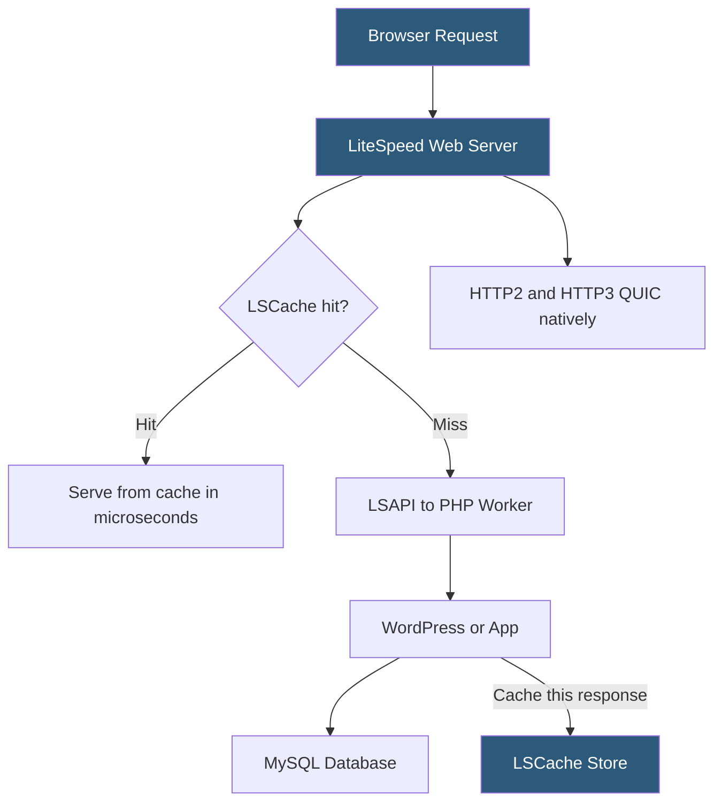

**Category:** Web Server Technologies
**Difficulty:** Intermediate
**Reading time:** 6 min read

---

LiteSpeed Web Server (LSWS) is a commercial, high-performance web server that is a drop-in replacement for Apache on cPanel-based hosting stacks. It reads Apache configuration files and .htaccess rules natively, requiring no application changes, while delivering significantly higher throughput and lower memory usage through its event-driven architecture. LSWS is particularly valued in WordPress and PHP hosting markets for its built-in LSCache acceleration.

- **LiteSpeed Web Server (LSWS)** — commercial event-driven web server compatible with Apache config syntax
- **LSCache** — LiteSpeed's built-in full-page cache integrated with plugins for WordPress, Magento, and other CMSes
- **LSAPI** — LiteSpeed's PHP handler protocol, faster than FastCGI for PHP execution
- **ESI (Edge Side Includes)** — markup standard LiteSpeed supports to cache fragments of dynamic pages independently
- **HTTP/3 support** — LSWS natively supports QUIC/HTTP3 without additional module installation
- **drop-in replacement** — ability to substitute LSWS for Apache with the same config files, no application rewrites
- **LiteSpeed Plugin for WordPress** — official plugin connecting WordPress to LSCache for automated cache management
- **WebAdmin Console** — browser-based GUI for managing LiteSpeed configuration, cache, and SSL

LiteSpeed's event-driven architecture handles thousands of concurrent connections without the per-process overhead of Apache's prefork MPM. The server reads existing Apache `httpd.conf` and `.htaccess` files on startup, translating them to its native configuration internally. For shared hosting operators, this means switching from Apache to LiteSpeed requires no changes to tenant `.htaccess` files or virtual host configurations.

PHP execution uses LSAPI, a proprietary protocol between LSWS and its PHP worker processes that is more efficient than FastCGI for PHP workloads, particularly for short-lived requests common in WordPress. Benchmarks consistently show LSWS + LSAPI outperforming Apache/Nginx + PHP-FPM combinations for WordPress at equivalent PHP-FPM pool sizes.

LSCache is the centerpiece of LiteSpeed's WordPress advantage. The LiteSpeed Cache WordPress plugin hooks into WordPress actions to purge cached pages when content is published or updated. The cache is stored in memory and on disk, served before PHP is invoked — delivering pages at speeds comparable to a static file serve. ESI support allows dynamic widgets (login status, cart counts) to be excluded from cached page fragments, enabling partial caching of pages that would otherwise be impossible to cache as a whole.

HTTP/3 and QUIC support is built-in without requiring separate compilation or third-party modules, putting LiteSpeed ahead of Apache and stock Nginx in protocol modernity.

OpenLiteSpeed is the open-source, free variant of LiteSpeed, lacking some enterprise features but retaining the core performance architecture and LSCache compatibility.

- Shared hosting providers replacing Apache with LiteSpeed for better tenant density
- WordPress hosting optimization using LSCache to eliminate PHP execution for cached pages
- E-commerce hosting requiring HTTP/3 and built-in caching for Magento or WooCommerce
- cPanel hosting migrations where Apache compatibility prevents application changes
- High-traffic PHP applications needing better concurrency without infrastructure changes

| Advantage | Disadvantage |
|-----------|--------------|
| Drop-in Apache replacement — no app changes required | Commercial license cost for LSWS (OpenLiteSpeed is free) |
| LSCache delivers near-static performance for WordPress | Smaller community than Apache or Nginx |
| Native HTTP/3 support without extra modules | Less flexibility in non-PHP workloads vs Nginx |
| LSAPI outperforms PHP-FPM for high request rates | Enterprise features like clustering require higher license tier |

- [OpenLiteSpeed Performance](openlitespeed-performance.md)
- [Nginx Architecture](nginx-architecture.md)
- [Apache HTTP Server Configuration](apache-http-server-configuration.md)

---
*Part of the [Web Server Technologies](index.md) category · [Back to Master Index](../../index.md)*
