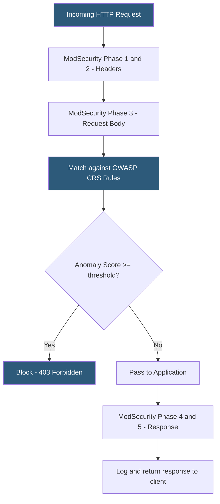

**Category:** Web Server Technologies
**Difficulty:** Advanced
**Reading time:** 7 min read

---

ModSecurity is an open-source Web Application Firewall (WAF) module for Apache, Nginx, and IIS that inspects HTTP request and response data against configurable rule sets. The OWASP Core Rule Set (CRS) provides a comprehensive default rule set detecting SQL injection, cross-site scripting, remote code execution, and other OWASP Top 10 attacks. Proper WAF deployment requires balancing security coverage against false positive rates.

- **ModSecurity** — open-source WAF module inspecting HTTP traffic against rule definitions
- **OWASP CRS (Core Rule Set)** — community-maintained ModSecurity rule set covering OWASP Top 10 attack categories
- **SecRule** — ModSecurity directive defining an inspection rule with a target variable, operator, and action
- **Paranoia Level** — CRS setting (1–4) controlling rule strictness; higher levels catch more attacks but increase false positives
- **Anomaly Scoring** — CRS mode accumulating a risk score across all matching rules before blocking; threshold typically 5
- **Detection mode** — ModSecurity running in log-only mode (SecRuleEngine DetectionOnly) for tuning without blocking
- **Exclusion rule** — custom ModSecurity rule suppressing a specific false positive for a known-good request pattern
- **Phase** — ModSecurity processing phase (1=connection, 2=request headers, 3=request body, 4=response headers, 5=response body)

ModSecurity operates in five processing phases aligned with HTTP transaction stages. Phase 1 inspects connection metadata; Phase 2 evaluates request headers; Phase 3 analyzes the request body (POST data, JSON payloads, file uploads); Phase 4 and 5 review response headers and body. Rules can run in any phase appropriate to their inspection targets.

A `SecRule` has three components: the target variable (`ARGS`, `REQUEST_URI`, `REQUEST_HEADERS`), the operator (`@rx` for regex, `@contains`, `@detectSQLi`), and the action (`deny,status:403` or `pass,nolog`). CRS uses an anomaly scoring model: each matching rule increments a score rather than blocking immediately. The accumulated score is compared to a threshold (default 5 for inbound, 4 for outbound) at the end of phases 2 and 4. This approach prevents single false positives from blocking legitimate traffic while still stopping coordinated attacks that trigger multiple rules.

Paranoia Level controls how aggressively rules are applied. Level 1 covers critical protections with low false positive risk. Level 2 adds more rules covering common attacks on most applications. Levels 3 and 4 add highly sensitive rules that frequently false-positive on complex applications and require significant exclusion tuning.

False positive management is the core operational challenge. WordPress, Magento, and complex SaaS applications commonly trigger CRS rules on legitimate admin actions (rich text editors, code snippets, configuration updates). Exclusion rules suppress specific rule IDs for specific URL paths or request parameters: `SecRuleUpdateTargetById 942100 "!ARGS:content"` exempts the `content` parameter from rule 942100's SQL injection check on `/wp-admin/` paths.

- Protecting WordPress installations from automated SQLi and XSS exploit attempts
- PCI-DSS compliance requiring a WAF as one of the cardholder data protection controls
- Blocking zero-day exploit attempts while patching is in progress
- Auditing application vulnerabilities in detection mode before enabling blocking
- Centralizing attack protection at the web server layer for multiple backend applications

| Advantage | Disadvantage |
|-----------|--------------|
| Blocks OWASP Top 10 attacks without application code changes | False positives require ongoing tuning effort |
| Anomaly scoring reduces single-rule false positive blocks | High paranoia levels impractical for complex applications |
| Detection mode allows safe tuning before enabling blocking | Request body inspection adds latency and CPU overhead |
| Open-source with active OWASP CRS community | Encrypted payloads at HTTPS termination bypass response inspection |

- [Web Server Security Hardening](web-server-security-hardening.md)
- [Rate Limiting at Web Server](rate-limiting-at-web-server.md)
- [Web Server Logging Formats](web-server-logging-formats.md)

---
*Part of the [Web Server Technologies](index.md) category · [Back to Master Index](../../index.md)*
