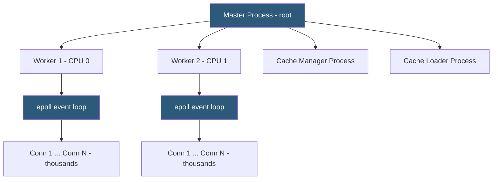

**Category:** Web Server Technologies
**Difficulty:** Intermediate
**Reading time:** 6 min read

---

Nginx was built from the ground up to solve the C10K problem — serving tens of thousands of simultaneous connections without spawning a thread or process per connection. Its event-driven, non-blocking architecture uses a small, fixed number of worker processes, each handling thousands of connections in a single-threaded event loop. This design delivers predictable memory usage and exceptional throughput for static files, reverse proxy, and SSL termination workloads.

- **Master process** — root-privileged Nginx process that reads config and manages worker processes
- **Worker process** — single-threaded process handling all I/O via an event loop; count typically equals CPU cores
- **Event loop** — loop that monitors file descriptors for I/O readiness using epoll (Linux) or kqueue (BSD)
- **nginx.conf** — main configuration file using a block-based `{ }` syntax with `server`, `location`, and `upstream` contexts
- **server block** — Nginx equivalent of Apache's VirtualHost, matching requests by `server_name` and port
- **location block** — rule matching URI prefixes or regex patterns within a server block
- **upstream block** — defines a pool of backend servers for load balancing or proxying
- **worker_connections** — maximum simultaneous connections a single worker process can handle

At startup, the master process reads and validates `nginx.conf`, then forks the configured number of worker processes (typically one per CPU core, set with `worker_processes auto`). The master process retains root privileges for binding to port 80/443 and for managing worker lifecycle — reloading config or sending signals — but all request handling happens in unprivileged workers.

Each worker runs a tight event loop using the OS's most efficient I/O notification mechanism — `epoll` on Linux, `kqueue` on BSD/macOS. The worker registers all active connections (sockets) with epoll and sleeps until the kernel notifies it that one or more connections have data to read or space to write. Because the worker never blocks waiting for a single connection, a single worker process can multiplex thousands of connections simultaneously.

Configuration is hierarchical: the `http` context contains `server` blocks (virtual hosts) matched by `listen` port and `server_name`. Inside server blocks, `location` blocks match URL paths using prefix matching or POSIX/PCRE regular expressions. Location matching priority: exact (`=`), then longest prefix match without regex, then first regex match in config order.

When Nginx serves static files, it uses `sendfile()` to transfer file data from the kernel's page cache directly to the network socket without copying through user space — a zero-copy operation. For PHP applications, Nginx forwards requests to a PHP-FPM backend using the FastCGI protocol via `fastcgi_pass`.

- Serving static assets for high-traffic websites with minimal CPU and memory
- Reverse proxying Node.js, Python, or PHP-FPM application servers
- TLS termination fronting a cluster of unencrypted backend servers
- Load balancing across multiple application server instances
- Rate limiting API endpoints to protect backend services from abuse

| Advantage | Disadvantage |
|-----------|--------------|
| Extremely low and predictable memory usage | No per-directory config override (.htaccess does not exist) |
| Handles tens of thousands of simultaneous connections | PHP must run as a separate FPM daemon, not embedded |
| Zero-copy sendfile() for static file serving | Blocking modules (DNS resolvers) can stall entire worker |
| Config changes applied with zero-downtime reload | Smaller module ecosystem than Apache |

- [Nginx Reverse Proxy Configuration](nginx-reverse-proxy-configuration.md)
- [Nginx Load Balancing](nginx-load-balancing.md)
- [Nginx Caching Strategies](nginx-caching-strategies.md)

---
*Part of the [Web Server Technologies](index.md) category · [Back to Master Index](../../index.md)*
