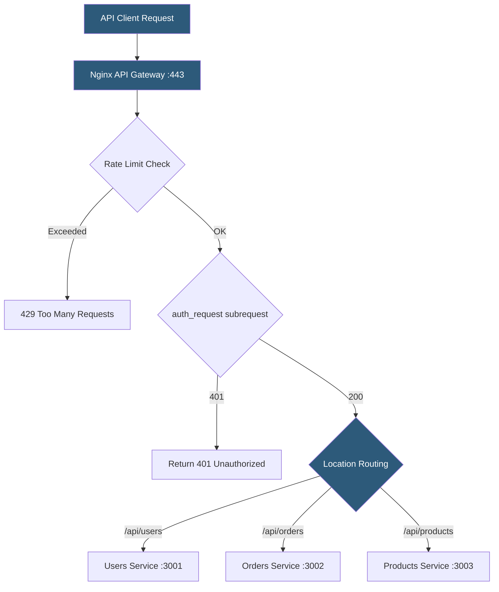

**Category:** Web Server Technologies
**Difficulty:** Advanced
**Reading time:** 6 min read

---

Nginx can function as a lightweight API gateway, handling authentication, rate limiting, routing, TLS termination, and response caching for microservice backends. While purpose-built API gateways (Kong, AWS API Gateway) offer richer features, Nginx's native modules provide the core gateway capabilities required by many organizations at a fraction of the operational complexity.

- **API gateway** — reverse proxy layer providing cross-cutting concerns (auth, rate limiting, routing) for backend APIs
- **location routing** — Nginx location blocks routing `/api/users` to one backend and `/api/orders` to another
- **limit_req_zone** — shared memory zone storing request rate counters per IP or API key
- **limit_req** — directive applying a rate limit from a defined zone to a location block
- **auth_request** — module delegating authentication to a subrequest to an auth backend
- **JWT validation** — Nginx Plus feature verifying JSON Web Tokens without forwarding to the auth backend
- **CORS headers** — response headers added by Nginx to allow cross-origin API calls from browsers
- **API versioning** — routing `/v1/` and `/v2/` URL prefixes to different backend service versions

Nginx routes API requests by matching location blocks to URL prefixes. Each location block uses `proxy_pass` to forward to a named upstream pool. Location specificity follows Nginx's prefix-longest-match then regex rule, allowing both `/api/users/admin` (exact or regex) and `/api/users/` (prefix) to route to different backends if needed.

Rate limiting uses a two-directive pattern. `limit_req_zone $binary_remote_addr zone=api_limit:10m rate=100r/m;` declares a 10MB shared memory zone tracking per-IP request counts at 100 requests per minute. `limit_req zone=api_limit burst=20 nodelay;` applies this limit to a location, allowing a burst of 20 extra requests before rejecting with 429. Rate limiting by API key (from a header or query parameter) uses `$http_x_api_key` as the zone key instead of `$binary_remote_addr`.

The `auth_request /auth;` directive in a protected location block triggers a subrequest to an internal location mapping to an authentication backend. If the auth service returns 200, the original request proceeds. A 401 or 403 halts the request. Variables set by the auth subrequest can be forwarded to the backend via `auth_request_set` and `proxy_set_header`.

CORS headers are injected by Nginx before responses reach the browser: `add_header 'Access-Control-Allow-Origin' '*';` for public APIs, or matched to an origin allowlist for private APIs. Preflight `OPTIONS` requests should be handled with a `return 204;` block to avoid hitting the backend.

API versioning uses separate `location /v1/` and `location /v2/` blocks pointing to different upstream pools, enabling gradual traffic migration.

- Routing requests from a single public domain to a dozen internal microservices
- Rate limiting public APIs to prevent abuse without application code changes
- Centralizing authentication for all services at the infrastructure layer
- Handling CORS preflight requests at the proxy without backend involvement
- Blue-green API deployments by switching upstream pool pointers

| Advantage | Disadvantage |
|-----------|--------------|
| No additional software — uses existing Nginx installation | Limited compared to full API gateways (no OAuth flows, analytics) |
| Rate limiting at the network edge, before PHP/Node processes | JWT validation and OAuth require Nginx Plus or Lua module |
| auth_request pattern centralizes auth without code duplication | All routing changes require Nginx config reload |
| High performance: thousands of API requests per second | No built-in API management dashboard or developer portal |

- [Nginx Load Balancing](nginx-load-balancing.md)
- [Nginx Reverse Proxy Configuration](nginx-reverse-proxy-configuration.md)
- [Rate Limiting at Web Server](rate-limiting-at-web-server.md)

---
*Part of the [Web Server Technologies](index.md) category · [Back to Master Index](../../index.md)*
