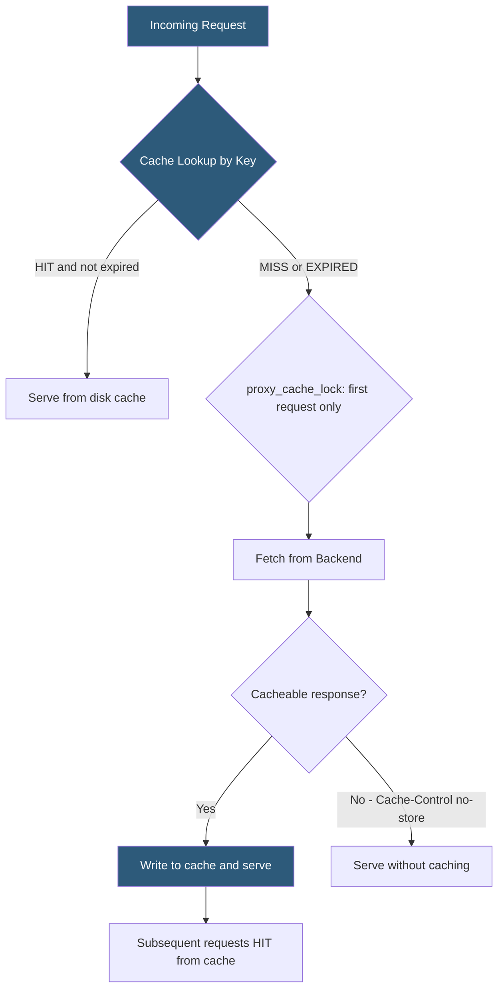

**Category:** Web Server Technologies
**Difficulty:** Intermediate
**Reading time:** 6 min read

---

Nginx provides a built-in proxy cache that stores backend responses on disk and serves them to subsequent requests without touching the application server. When combined with browser cache headers and CDN integration, Nginx caching can absorb the majority of traffic on content-heavy sites. Effective caching strategy requires understanding cache keys, invalidation mechanisms, and bypass conditions for authenticated requests.

- **proxy_cache_path** — directive defining the disk location, size, and key zone for the proxy cache
- **proxy_cache_key** — string used to generate a unique cache entry identifier (default: URL + host + scheme)
- **proxy_cache_valid** — directive setting cache TTL per HTTP response code
- **Cache-Control** — response header from the backend controlling whether and how long Nginx caches the response
- **proxy_cache_bypass** — condition under which Nginx skips the cache and fetches fresh from the backend
- **proxy_cache_lock** — directive preventing thundering herd by allowing only one request to populate an empty cache entry
- **X-Cache-Status** — custom response header added by Nginx indicating HIT, MISS, BYPASS, or EXPIRED
- **stale-while-revalidate** — directive allowing Nginx to serve stale cached content while refreshing in the background

The `proxy_cache_path` directive reserves a disk area and an in-memory key zone: `proxy_cache_path /var/cache/nginx levels=1:2 keys_zone=app_cache:10m max_size=1g inactive=60m;`. The `levels=1:2` parameter creates a two-level directory hierarchy using the MD5 hash of the cache key, preventing a single directory from containing too many files. The `keys_zone` allocates shared memory for the cache index — fast lookups without hitting disk.

The cache key defaults to `$scheme$proxy_host$request_uri` but can be overridden. Cookies and query strings in the URI must be carefully considered: if the key includes a session cookie, every logged-in user gets their own cache entry, negating cache efficiency for anonymous content.

`proxy_cache_bypass $cookie_sessionid` instructs Nginx to skip the cache when a session cookie is present, ensuring authenticated users always receive fresh, personalized content while anonymous visitors are served cached pages.

`proxy_cache_lock on` prevents the thundering herd problem: when a cache entry expires, only the first request is forwarded to the backend while subsequent requests wait for that response. Without this, a popular page expiring under high load would simultaneously send hundreds of requests to the backend.

For WordPress, the FastCGI cache variant (`fastcgi_cache_path` and `fastcgi_cache`) caches PHP-FPM responses directly, bypassing PHP processing entirely for cached pages. Cache purging requires either the `nginx_cache_purge` module or a workaround of deleting the corresponding cache file from disk.

- Caching WooCommerce or WordPress category pages for anonymous visitors
- Absorbing traffic spikes on news articles that go viral
- Reducing database query load on content-heavy sites
- Serving cached API responses for rate-limited upstream data sources
- Reducing cloud backend costs by fulfilling requests from Nginx cache

| Advantage | Disadvantage |
|-----------|--------------|
| Dramatically reduces backend load for cacheable content | Stale content served if cache invalidation is not implemented |
| Low latency cache hits served directly from RAM/disk | Disk cache consumes significant storage for large content sets |
| proxy_cache_lock prevents backend stampedes | Personalized or authenticated content cannot be cached safely |
| Configurable per-status-code TTLs | Cache purging requires additional module or manual file deletion |

- [Nginx Architecture](nginx-architecture.md)
- [Nginx Reverse Proxy Configuration](nginx-reverse-proxy-configuration.md)
- [Gzip Compression Configuration](gzip-compression-configuration.md)

---
*Part of the [Web Server Technologies](index.md) category · [Back to Master Index](../../index.md)*
