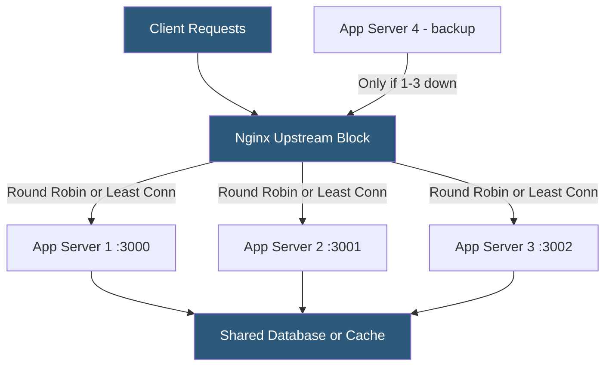

**Category:** Web Server Technologies
**Difficulty:** Intermediate
**Reading time:** 6 min read

---

Nginx's upstream module distributes incoming requests across a pool of backend servers using configurable load balancing algorithms. This enables horizontal scaling, eliminates single points of failure, and allows rolling deployments without downtime. Load balancing configuration is a core skill for any infrastructure handling traffic beyond what a single application instance can serve.

- **upstream** — Nginx block defining a named group of backend servers for load balancing
- **Round Robin** — default algorithm distributing requests sequentially across all servers in the pool
- **Least Connections** — algorithm sending new requests to the server with the fewest active connections
- **IP Hash** — algorithm hashing the client IP to always route the same client to the same backend (session affinity)
- **weight** — directive assigning proportional request share to a backend server (default 1)
- **max_fails / fail_timeout** — passive health check parameters removing unresponsive backends temporarily
- **keepalive** — directive maintaining a pool of persistent connections from Nginx to upstream servers
- **backup** — flag marking a server as standby, used only when all primary servers are unavailable

An `upstream` block named `app_servers` lists all backend servers with optional parameters. The simplest form uses round-robin, cycling through servers in order. Adding `least_conn;` as a directive inside the upstream block switches to least-connections routing, which is better for workloads with variable request durations — a long-running request on one server won't cause it to receive as many new requests as idle peers.

Weights adjust the distribution ratio: `server backend1 weight=3;` with `server backend2 weight=1;` directs 75% of traffic to backend1. This is useful when servers have different capacities.

Passive health checks use `max_fails` and `fail_timeout`: if a server fails to respond `max_fails` times within `fail_timeout` seconds, Nginx marks it unavailable for `fail_timeout` seconds, then re-tests it. Active health checks (probing backends at intervals) require Nginx Plus.

Session affinity via `ip_hash` computes a hash of the first three octets of the client IP, routing all requests from that subnet to the same backend. This is a rough approximation useful for stateful applications that store sessions in local memory. The better architectural approach is to store session state in a shared Redis or database layer, enabling true stateless backends that work perfectly with round-robin.

The `keepalive 32;` directive within the upstream block tells Nginx to maintain up to 32 idle keep-alive connections to each upstream, eliminating TCP handshake overhead for frequent backend requests. This requires backends to support HTTP/1.1 keep-alive and Nginx to set `proxy_http_version 1.1` and `proxy_set_header Connection ""`.

- Distributing traffic across a Node.js cluster where each process handles a CPU core
- Rolling deployment: removing servers one at a time from the pool to update without downtime
- A/B testing by routing a weighted percentage of traffic to a new application version
- Failover: marking a hot-standby server as backup that activates when primaries fail
- Scaling PHP-FPM across multiple servers with a shared NFS or database backend

| Advantage | Disadvantage |
|-----------|--------------|
| Horizontal scaling beyond single-server limits | Requires stateless application architecture or sticky sessions |
| Passive health checks remove failed backends automatically | Passive checks detect failures only after some requests fail |
| keepalive connections reduce backend TCP overhead | IP hash session affinity is broken by proxies or IPv6 diversity |
| Zero-downtime deploys via upstream server removal | Nginx Plus required for active health checks and advanced metrics |

- [Nginx Architecture](nginx-architecture.md)
- [Nginx Reverse Proxy Configuration](nginx-reverse-proxy-configuration.md)
- [Nginx as API Gateway](nginx-as-api-gateway.md)

---
*Part of the [Web Server Technologies](index.md) category · [Back to Master Index](../../index.md)*
