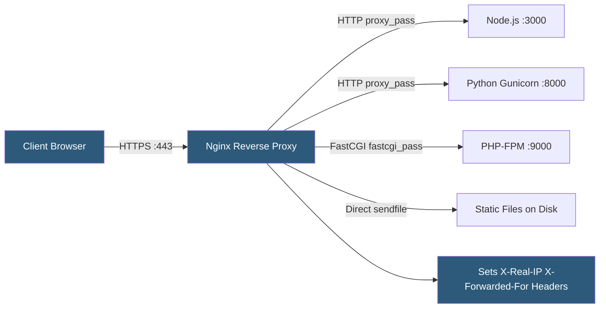

**Category:** Web Server Technologies
**Difficulty:** Intermediate
**Reading time:** 6 min read

---

Nginx is widely used as a reverse proxy, sitting in front of application servers (Node.js, Gunicorn, PHP-FPM, Java) to handle TLS termination, connection management, and static file serving before forwarding dynamic requests to the backend. Proper reverse proxy configuration requires setting forwarding headers, tuning buffer sizes, and handling upstream timeouts to ensure reliable pass-through of requests and responses.

- **Reverse proxy** — server accepting client requests and forwarding them to a backend server, returning the response
- **proxy_pass** — Nginx directive specifying the upstream URL or Unix socket to proxy requests to
- **X-Real-IP** — request header added by Nginx carrying the original client IP for backend logging
- **X-Forwarded-For** — standard header carrying the full chain of proxy IPs the request traversed
- **proxy_set_header Host** — directive forwarding the original Host header to the backend application
- **proxy_buffer_size** — size of the buffer Nginx uses to store the first part of the backend response
- **proxy_read_timeout** — time Nginx waits for the backend to send a response before timing out
- **upstream block** — Nginx configuration block defining a named pool of backend servers

A reverse proxy `location` block uses `proxy_pass http://localhost:3000;` to forward matching requests to a backend. Nginx establishes a new HTTP connection to the backend, forwards the request (minus hop-by-hop headers), and buffers the response before returning it to the client. TLS is terminated at Nginx, so backend servers receive plain HTTP — dramatically simplifying certificate management since only Nginx requires the certificate.

Three headers must be set explicitly for backends to see correct client information: `proxy_set_header Host $host;` forwards the original domain; `proxy_set_header X-Real-IP $remote_addr;` passes the client IP; and `proxy_set_header X-Forwarded-Proto $scheme;` tells the backend whether the original request was HTTP or HTTPS (critical for redirect generation in frameworks like Django and Laravel).

Buffer tuning controls whether Nginx waits for the full backend response before forwarding to the client. `proxy_buffering on` (default) allows Nginx to read the full response from a slow backend and send it quickly to the client, then close the backend connection faster. For streaming responses or server-sent events, `proxy_buffering off` is required.

WebSocket proxying requires two additional headers: `Upgrade $http_upgrade` and `Connection "upgrade"`, instructing Nginx to upgrade the HTTP connection for the backend. The `proxy_http_version 1.1` directive is also necessary since WebSocket requires HTTP/1.1 keep-alive.

The `upstream` block enables named backend pools with health checks (Nginx Plus) and load balancing algorithms, separating pool definition from `proxy_pass` references.

- Terminating HTTPS at Nginx while backends speak plain HTTP
- Serving React/Vue static builds directly from disk with API calls proxied to Node.js
- Fronting a Docker Compose application stack with each service on a different port
- Distributing traffic across multiple application instances for horizontal scaling
- Providing a single entry point that routes subdomains to different backend services

| Advantage | Disadvantage |
|-----------|--------------|
| Centralizes TLS certificate management at the proxy layer | Additional network hop adds latency (typically < 1 ms local) |
| Static file serving bypasses the application server entirely | Misconfigured headers cause IP logging issues and redirect loops |
| Graceful reload allows zero-downtime backend changes | Buffer misconfiguration causes memory pressure or response delays |
| Health checks can remove failed backends automatically | Debugging requires checking both Nginx and backend logs |

- [Nginx Architecture](nginx-architecture.md)
- [Nginx Load Balancing](nginx-load-balancing.md)
- [Web Server SSL/TLS Configuration](web-server-ssl-tls-configuration.md)

---
*Part of the [Web Server Technologies](index.md) category · [Back to Master Index](../../index.md)*
