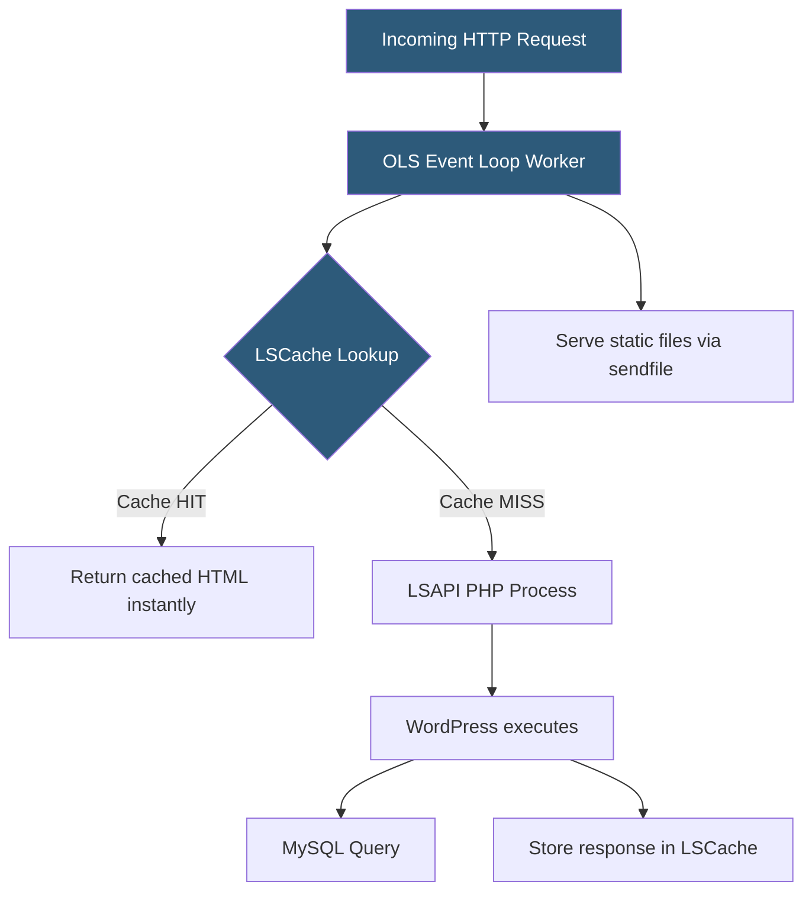

**Category:** Web Server Technologies
**Difficulty:** Intermediate
**Reading time:** 5 min read

---

OpenLiteSpeed (OLS) is the free, open-source edition of LiteSpeed Web Server, providing the same event-driven architecture and LSCache integration without the commercial license. It powers a growing share of managed WordPress hosting stacks and is the default web server on several VPS images and one-click apps. Understanding its performance characteristics, configuration differences from Apache, and cache integration helps operators extract maximum value from OLS deployments.

- **OpenLiteSpeed (OLS)** — free, open-source event-driven web server derived from LiteSpeed Web Server codebase
- **WebAdmin GUI** — browser interface on port 7080 for OLS configuration, replacing Apache's text-based config
- **vhost conf** — OLS virtual host configuration file using LiteSpeed's own syntax (not Apache-compatible like LSWS)
- **LSCache** — OLS's built-in full-page cache subsystem triggered by LSCache-compatible CMS plugins
- **PHP via LSAPI** — OLS runs PHP through the LiteSpeed SAPI for better performance than CGI or FastCGI
- **rewrite rules** — OLS supports Apache mod_rewrite-syntax rules in its virtual host configuration
- **worker processes** — OLS spawns one worker per CPU core plus optional additional workers
- **graceful restart** — OLS reloads configuration without dropping active connections via SIGUSR1

OpenLiteSpeed's event loop model uses epoll (Linux) to manage thousands of simultaneous connections across a small number of worker processes, just like commercial LiteSpeed. The key difference from Apache is that OLS uses a native configuration format edited via the WebAdmin GUI at `http://server:7080`, not `httpd.conf`. Configuration changes made in the GUI are saved to `/usr/local/lsws/conf/` as XML-formatted files and applied via graceful restart.

PHP execution uses the `lsphp` binary — a PHP build compiled against the LiteSpeed SAPI. Installing multiple PHP versions alongside OLS is done by compiling separate `lsphp74`, `lsphp80`, `lsphp82` binaries and configuring each virtual host's external application to point at the correct `lsphp` version. This provides per-vhost PHP version isolation similar to PHP-FPM but using LiteSpeed's faster LSAPI protocol.

LSCache on OLS works identically to LSWS: the LiteSpeed Cache WordPress plugin communicates cache hints via `X-LiteSpeed-Cache-Control` response headers, signaling OLS to cache the page. Cache purge requests are issued via `X-LiteSpeed-Purge` headers. The cached content is stored in `/tmp/lscache/` by default, served from disk or OS page cache on cache hits without invoking PHP at all.

OLS lacks some commercial LSWS features: no built-in clustering, no official cPanel plugin, and no QUIC/HTTP3 support in older versions. However, recent OLS releases have added HTTP/3 support, narrowing the gap significantly.

- Free alternative to commercial LSWS on self-managed VPS hosting stacks
- WordPress hosting VPS images on cloud providers (DigitalOcean, Vultr one-click apps)
- Development servers where LSWS licensing is not justified
- Testing LiteSpeed Cache behavior before committing to commercial LSWS
- CyberPanel (open-source hosting panel) uses OLS as its default web server

| Advantage | Disadvantage |
|-----------|--------------|
| Free license for any use case | Not Apache-config-compatible like commercial LSWS |
| LSCache provides near-static WordPress performance | WebAdmin GUI learning curve vs familiar httpd.conf editing |
| Low memory footprint for PHP hosting workloads | Fewer enterprise features than commercial LSWS |
| Multi-PHP-version support per virtual host | Smaller plugin and integration ecosystem than Nginx or Apache |

- [LiteSpeed Web Server](litespeed-web-server.md)
- [Nginx Caching Strategies](nginx-caching-strategies.md)
- [Web Server Benchmarking](web-server-benchmarking.md)

---
*Part of the [Web Server Technologies](index.md) category · [Back to Master Index](../../index.md)*
