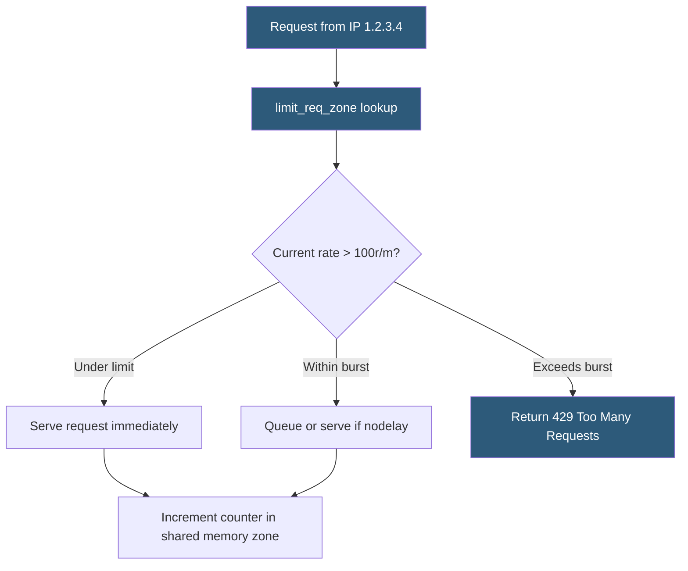

**Category:** Web Server Technologies
**Difficulty:** Intermediate
**Reading time:** 6 min read

---

Rate limiting at the web server layer restricts how many requests a client can make within a time window, protecting backends from abuse, brute-force attacks, and accidental DoS from misbehaving crawlers. Nginx implements rate limiting via the `limit_req` module; Apache uses `mod_ratelimit` and `mod_evasive`. Configuring appropriate burst allowances and rate zones is critical to avoiding false positives on legitimate users.

- **limit_req_zone** — Nginx directive creating a shared memory zone to track per-key request counts
- **limit_req** — Nginx directive applying a rate zone to a location block with optional burst tolerance
- **leaky bucket algorithm** — rate limiting algorithm processing requests at a fixed rate, queuing or dropping excess
- **token bucket** — algorithm allowing short bursts up to a capacity, refilling at a constant rate
- **burst** — Nginx parameter allowing a client to exceed the rate momentarily before requests are queued or rejected
- **nodelay** — Nginx flag processing burst requests immediately rather than queuing them (within burst limit)
- **binary_remote_addr** — compact 4/16-byte IP address representation used as the rate limit key
- **429 Too Many Requests** — HTTP status code returned to rate-limited clients

Nginx's `limit_req_zone $binary_remote_addr zone=api:10m rate=30r/m;` creates a 10MB shared memory zone named `api` that allows 30 requests per minute per client IP. The `$binary_remote_addr` key uses a compact 4-byte IPv4 or 16-byte IPv6 representation, allowing approximately 160,000 entries per megabyte. The directive is placed in the `http` block and referenced in location blocks with `limit_req zone=api burst=10 nodelay;`.

The `burst=10` parameter allows a client to exceed the rate limit by up to 10 requests before enforcement. Without `nodelay`, excess burst requests are queued, delaying responses. With `nodelay`, burst requests are served immediately but counted toward the burst allowance — once the allowance is exhausted, further excess requests receive 429 responses without queuing.

Rate limiting keys can be defined beyond raw IPs. `$http_x_api_key` limits by API key header value, enabling per-consumer rate limiting for API services. `$server_name$uri` creates URL-specific limits regardless of client. Combining multiple zones in one location is possible: `limit_req zone=per_ip; limit_req zone=per_server;`.

Apache's `mod_evasive` operates differently — it tracks requests per URL per IP in a hash table and blocks IPs making more than a configurable threshold of requests to the same page within a detection interval. It issues 403 responses and can execute shell commands to add firewall rules via `DOSSystemCommand`.

At the CDN layer, Cloudflare Rate Limiting rules (under WAF) apply rate limiting before traffic reaches the origin server, offloading the computation to the edge and protecting against volumetric attacks that exhaust bandwidth even before reaching Nginx.

- Protecting WordPress login page (/wp-login.php) from brute-force credential stuffing
- Limiting API endpoints to prevent a single client from monopolizing backend capacity
- Slowing down aggressive crawlers that ignore robots.txt
- Protecting resource-intensive search endpoints from denial-of-service via excessive queries
- Implementing tiered API rate limits (free: 100/min, paid: 1000/min) by API key

| Advantage | Disadvantage |
|-----------|--------------|
| Stops brute-force and scraping before reaching application code | IP-based limits ineffective against distributed botnets from many IPs |
| Very low overhead — counter lookup in shared memory | Legitimate users behind shared NAT IPs may hit collective limits |
| Configurable burst tolerance reduces impact on normal users | Requires tuning per endpoint; wrong values block or over-permit |
| 429 response allows well-behaved clients to retry with backoff | No built-in response to tell clients when they can retry (Retry-After header must be added manually) |

- [Nginx as API Gateway](nginx-as-api-gateway.md)
- [Web Server Security Hardening](web-server-security-hardening.md)
- [ModSecurity WAF Rules](modsecurity-waf-rules.md)

---
*Part of the [Web Server Technologies](index.md) category · [Back to Master Index](../../index.md)*
