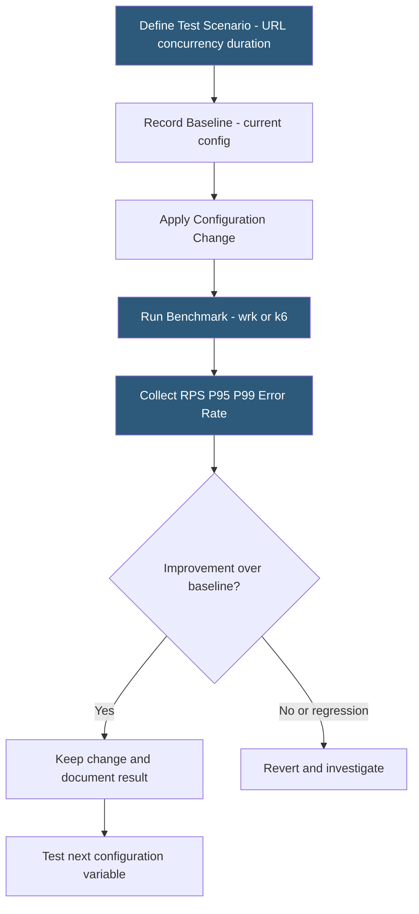

**Category:** Web Server Technologies
**Difficulty:** Intermediate
**Reading time:** 6 min read

---

Web server benchmarking measures throughput (requests per second), latency (response time distribution), and error rates under controlled load to validate configuration changes and capacity estimates. Tools like Apache Bench (ab), wrk, and k6 generate synthetic load against specific endpoints. Meaningful benchmarks isolate variables — testing one configuration change at a time — and measure percentile latencies, not just averages, to understand tail behavior under pressure.

- **Apache Bench (ab)** — simple command-line HTTP load testing tool bundled with Apache
- **wrk** — multi-threaded HTTP benchmarking tool with Lua scripting for dynamic request generation
- **k6** — modern load testing framework using JavaScript for test scripts with SaaS metrics
- **Requests Per Second (RPS)** — throughput metric measuring how many HTTP responses the server serves per second
- **P95 / P99 latency** — 95th/99th percentile response time; P99 represents the worst 1% of requests
- **concurrency** — number of simultaneous connections or virtual users sending requests during the test
- **warm-up period** — initial phase of a benchmark discarded from results to allow server caches to populate
- **baseline** — benchmark result recorded before making changes, used for comparison to measure improvement or regression

Apache Bench (`ab -n 10000 -c 100 https://example.com/`) sends 10,000 requests with 100 concurrent connections and reports mean, median, P99 latency, and total RPS. It is single-threaded on the client side and limited in its ability to saturate modern multi-core servers. `wrk -t4 -c100 -d30s https://example.com/` uses 4 threads and 100 connections for 30 seconds, providing more accurate high-throughput measurements. wrk's Lua scripting enables parameterized requests, authentication headers, and POST body generation.

The most critical metric is latency distribution, not average. Average latency hides outliers: a server averaging 50ms might have P99 at 2000ms, meaning 1% of users experience 40x worse performance. Tools that report P50, P95, P99, and P99.9 give a complete picture. Histogram tools like `hdrhistogram` (used by wrk2) provide coordinated omission-free measurements.

Benchmarks must run from a separate machine or network segment — running the load generator on the same server under test inflates results by sharing CPU with the server. For benchmarking configuration changes (Gzip level, MPM tuning, PHP-FPM pool size), the procedure is: record a baseline, make one change, benchmark again, compare percentile distributions, and revert if no improvement.

Cache warm-up matters: the first N requests after a server restart populate caches (PHP opcode cache, Nginx proxy cache, filesystem page cache). A warm-up period of 30–60 seconds before measuring ensures cache-warm results representative of steady-state production performance.

Error rate monitoring during benchmarks is as important as latency. A configuration that doubles RPS while introducing 1% error rate is not an improvement — the benchmark tool's error reporting must be checked alongside the server error log.

- Validating that a PHP opcode cache (OPcache) configuration change improves WordPress throughput
- Comparing Apache + mod_php vs Nginx + PHP-FPM for identical application load
- Determining the MaxRequestWorkers setting that maximizes throughput without OOM risk
- Stress testing before a product launch to identify the server's breaking point
- Benchmarking CDN vs origin response times for static asset serving

| Advantage | Disadvantage |
|-----------|--------------|
| Quantifies performance impact of configuration changes | Synthetic benchmarks may not represent real user traffic patterns |
| P99 latency exposes tail behavior invisible in averages | Benchmarking incorrectly (from same machine) produces misleading results |
| Identifies bottlenecks before they affect production users | Server caches must be warmed before meaningful steady-state measurements |
| Free tools (ab, wrk) available on any Linux server | Real-world performance affected by database, CDN, and network factors not in microbenchmarks |

- [Web Server Capacity Planning](web-server-capacity-planning.md)
- [Apache MPM Multi-Processing Modules](apache-mpm-multi-processing-modules.md)
- [Nginx Architecture](nginx-architecture.md)

---
*Part of the [Web Server Technologies](index.md) category · [Back to Master Index](../../index.md)*
