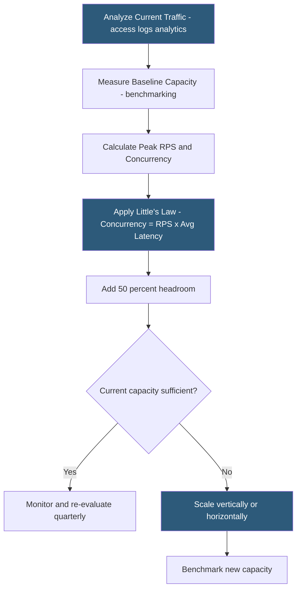

**Category:** Web Server Technologies
**Difficulty:** Advanced
**Reading time:** 7 min read

---

Web server capacity planning estimates the compute, memory, and network resources required to serve a target traffic volume with defined latency and error rate SLAs. It translates peak concurrent users and request rates into server sizing decisions, using benchmarking data, traffic analytics, and growth projections. Proper capacity planning prevents both under-provisioning (site outages) and over-provisioning (wasted cost).

- **Concurrent users** — number of users simultaneously making requests, distinct from total unique visitors
- **Requests per second (RPS)** — sustained request rate the server must handle during peak traffic periods
- **Response time SLA** — target P95/P99 latency that must be maintained under peak load
- **Little's Law** — relationship: Concurrency = Throughput × Latency; used to derive concurrency from RPS and response time
- **headroom** — safety margin (typically 30–50%) above expected peak load in planned capacity
- **vertical scaling** — adding more CPU/RAM to existing servers to handle more load
- **horizontal scaling** — adding more servers behind a load balancer to distribute load linearly
- **traffic spike factor** — multiplier applied to average peak load to account for sudden traffic surges (launches, viral content)

Capacity planning begins with measuring current traffic patterns. Web server access logs provide hourly and daily request rates. The peak RPS is typically 5–10x the daily average RPS, occurring during business hours or after high-traffic events. Analytics tools provide concurrent user estimates, but the more reliable metric is the peak simultaneous connections observed in Nginx's `active connections` stub status (`ngx_http_stub_status_module`).

Little's Law provides the fundamental relationship: at steady state, the number of concurrent in-flight requests equals the throughput (RPS) multiplied by the average response time in seconds. If a server handles 500 RPS at 200ms average response time, it needs 500 × 0.2 = 100 concurrent request slots. Apache's `MaxRequestWorkers` and Nginx's `worker_processes × worker_connections` must exceed this number to avoid queuing.

Memory capacity is calculated bottom-up: each PHP-FPM worker uses 30–80MB depending on the application. For WordPress, plan 40–60MB per worker. A server with 8GB RAM allocated to PHP-FPM can safely run ~120–150 workers (leaving OS and web server headroom). This worker count caps RPS at `workers / avg_php_execution_time_seconds`. If each PHP request takes 0.2s, 120 workers handle 600 RPS maximum.

Horizontal scaling via load balancers distributes capacity linearly: two identical servers each handling 600 RPS PHP requests deliver 1,200 RPS combined. Session state must either be stored in a shared Redis instance or use sticky sessions (IP hash) to maintain correctness when scaling horizontally.

Traffic spike planning adds a multiplier for sudden load events. A product launch, TV appearance, or viral social post can drive 10–50x normal traffic in minutes. Auto-scaling groups (AWS, GCP, Azure) or pre-provisioned standby servers with fast activation paths handle these events. Static caching (Nginx proxy cache, Varnish, CDN) absorbs spikes more cost-effectively than raw compute scaling.

- Sizing a new server before launching a high-traffic e-commerce site
- Planning capacity ahead of a Black Friday sale with expected 10x normal traffic
- Evaluating whether to scale vertically (bigger server) or horizontally (more servers + load balancer)
- Setting PHP-FPM `pm.max_children` based on available RAM and expected PHP memory per request
- Defining auto-scaling policies for cloud instances based on CPU/RPS thresholds

| Advantage | Disadvantage |
|-----------|--------------|
| Prevents site outages from underestimating peak load | Over-provisioning wastes significant infrastructure cost |
| Headroom margins accommodate unpredictable traffic spikes | Traffic patterns change; capacity plans require regular revisiting |
| Auto-scaling enables dynamic capacity without manual intervention | Horizontal scaling requires stateless application architecture |
| Static caching multiplies effective capacity at low cost | Caching is not a substitute for correct baseline capacity |

- [Web Server Benchmarking](web-server-benchmarking.md)
- [Nginx Load Balancing](nginx-load-balancing.md)
- [Web Server Resource Limits](web-server-resource-limits.md)

---
*Part of the [Web Server Technologies](index.md) category · [Back to Master Index](../../index.md)*
