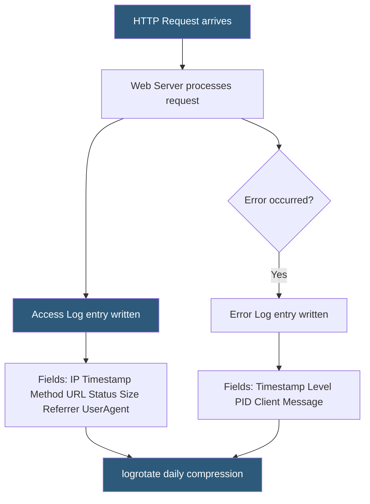

**Category:** Web Server Technologies
**Difficulty:** Beginner
**Reading time:** 5 min read

---

Web server access and error logs record every request processed and every error encountered, forming the foundation for traffic analysis, debugging, and security auditing. Apache and Nginx support flexible log format configuration, with the Combined Log Format being the near-universal standard. Structured logging in JSON is increasingly common for log aggregation pipelines. Understanding log fields enables accurate traffic analysis, bot detection, and incident investigation.

- **Combined Log Format** — Apache standard logging format including IP, timestamp, method, URL, status, size, referrer, and user-agent
- **access_log** — log file recording one line per HTTP request served
- **error_log** — log file recording server errors, warnings, and debug messages
- **LogFormat** — Apache directive defining named format strings for CustomLog entries
- **log_format** — Nginx directive defining named format strings for access_log entries
- **$request_time** — Nginx variable recording total time in seconds to process a request, including upstream wait
- **pipe logging** — directing log output to a program's stdin instead of a file (e.g., for real-time processing)
- **log rotation** — automatic archiving and compression of old log files to manage disk usage (logrotate on Linux)

The Combined Log Format produces lines like: `203.0.113.42 - - [25/May/2026:14:30:00 +0000] "GET /page/ HTTP/2.0" 200 48320 "https://referrer.com/" "Mozilla/5.0..."`. The fields are: remote IP, ident (unused, `-`), remote user (auth username or `-`), timestamp in brackets, request line in quotes, response status code, response body size in bytes, referrer URL, and User-Agent string.

Apache defines formats with `LogFormat "%h %l %u %t \"%r\" %>s %O \"%{Referer}i\" \"%{User-Agent}i\"" combined` then references them in virtual host configs with `CustomLog /var/log/apache2/access.log combined`. Per-virtual-host log files are preferable for multi-tenant servers, separating tenant traffic analysis.

Nginx's log_format directive uses a similar variable syntax: `log_format main '$remote_addr - $remote_user [$time_local] "$request" $status $body_bytes_sent "$http_referer" "$http_user_agent"';`. Adding `$request_time` and `$upstream_response_time` fields enables performance profiling to identify slow backend responses.

JSON logging transforms each access log line into a parseable object: `log_format json_combined escape=json '{"time":"$time_iso8601","ip":"$remote_addr","method":"$request_method","uri":"$request_uri","status":$status,"size":$body_bytes_sent}';`. JSON logs feed directly into Elasticsearch (via Filebeat), Splunk, or Loki without regex parsing.

Error logs use a level-based system: emerg, alert, crit, error, warn, notice, info, debug. Setting `LogLevel warn` in Apache or `error_log /var/log/nginx/error.log warn;` in Nginx suppresses verbose info/debug output in production while retaining actionable messages.

- Identifying which URLs generate the most traffic for CDN caching prioritization
- Finding 4xx and 5xx error spikes to diagnose deployment regressions
- Analyzing User-Agent strings to distinguish human visitors from bots and crawlers
- Extracting IP addresses for ban lists after security incidents
- Feeding access logs to analytics platforms as a privacy-respecting alternative to JavaScript tracking

| Advantage | Disadvantage |
|-----------|--------------|
| Complete request history without client-side tracking | Log files grow rapidly; require rotation and archiving |
| Error logs enable precise server-side debugging | Combined Log Format requires parsing; JSON logging is simpler for pipelines |
| Per-virtual-host files enable tenant-level traffic isolation | Synchronous disk writes add latency (use buffered or async logging) |
| Timestamps and IPs support forensic investigation | IP addresses are personal data under GDPR; retention policies required |

- [Access Log Analysis](access-log-analysis.md)
- [Error Log Monitoring](error-log-monitoring.md)
- [Web Server Security Hardening](web-server-security-hardening.md)

---
*Part of the [Web Server Technologies](index.md) category · [Back to Master Index](../../index.md)*
