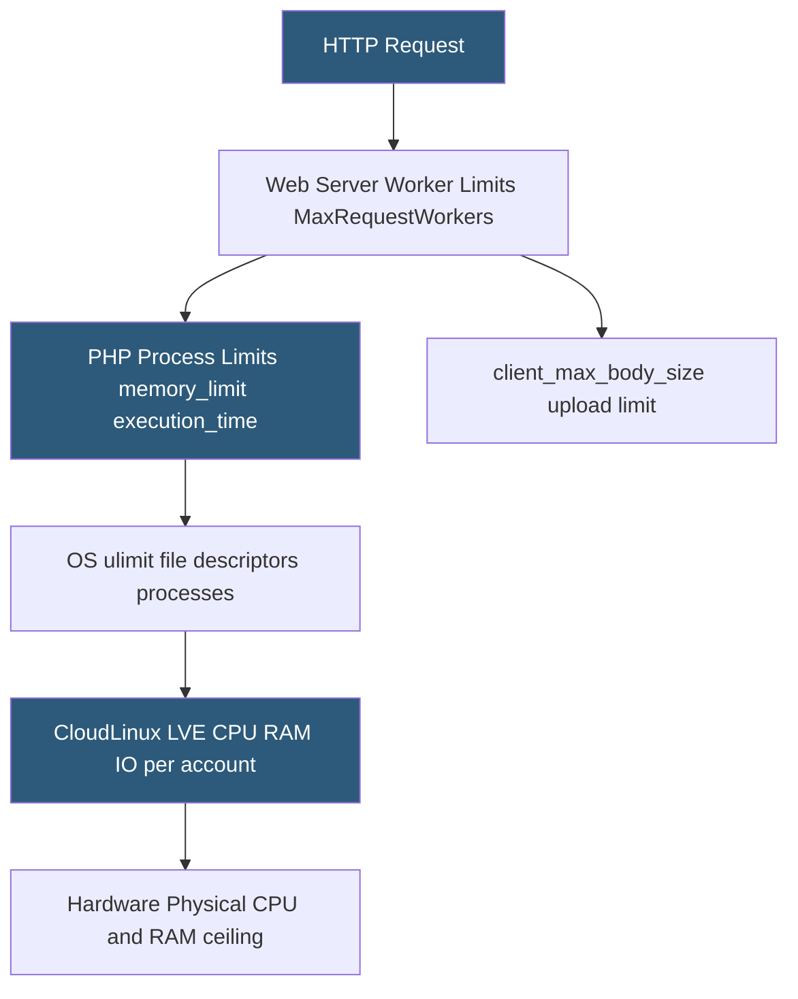

**Category:** Web Server Technologies
**Difficulty:** Advanced
**Reading time:** 6 min read

---

Web server resource limits prevent individual requests, PHP processes, or virtual hosts from consuming excessive CPU, memory, file descriptors, or connections. Limits are applied at multiple layers: PHP execution time and memory, web server worker counts, OS kernel limits, and CloudLinux LVE. Without these limits, a single slow query or memory leak can exhaust server capacity and take down all hosted sites.

- **PHP memory_limit** — maximum memory a single PHP process may consume before being killed
- **max_execution_time** — maximum seconds a PHP script can run before receiving a fatal timeout
- **worker_processes / MaxRequestWorkers** — Nginx/Apache directives capping simultaneous request handlers
- **ulimit** — Linux shell mechanism setting per-process limits on file descriptors, processes, and memory
- **LVE (Lightweight Virtual Environment)** — CloudLinux per-account limits on CPU cores, PMEM, VMEM, and I/O ops
- **client_max_body_size** — Nginx directive limiting the maximum upload size; returns 413 if exceeded
- **php_max_input_vars** — PHP limit on the number of input variables in a POST request
- **OOM Killer** — Linux kernel process that terminates the highest-memory process when RAM is exhausted

PHP resource limits are the first line of defense for application-level runaway processes. `memory_limit = 256M` kills PHP processes that exceed 256MB, preventing a single request from consuming gigabytes of RAM during an unoptimized import or loop bug. `max_execution_time = 30` terminates PHP scripts running longer than 30 seconds, stopping infinite loops from holding a PHP-FPM worker indefinitely. `upload_max_filesize` and `post_max_size` control maximum upload sizes before PHP even begins processing.

Web server concurrency limits prevent the server from being overwhelmed by too many simultaneous connections. Nginx's `worker_connections 1024;` sets the maximum connections per worker process. Apache's `MaxRequestWorkers 150` limits total concurrent requests — requests beyond this limit are queued or rejected. Setting this value too high causes OOM situations; too low causes unnecessary request refusals under moderate load.

The Linux kernel enforces per-process limits via `ulimit`. Web server processes are typically started with `LimitNOFILE=65536` in systemd service files, setting the open file descriptor limit high enough for thousands of concurrent connections. Without this, a busy Nginx server returns "too many open files" errors at the default system limit of 1024.

CloudLinux LVE applies simultaneous resource limits per hosting account: `NCPU` (CPU cores available), `PMEM` (physical memory), `VMEM` (virtual memory), `IO` (MB/s disk I/O), `IOPS` (operations/second), and `NPROC` (max processes). When a tenant hits an LVE limit, their processes are throttled rather than killed, keeping the overall server stable while signaling the tenant that they need an upgrade.

Monitoring resource limit violations is critical: PHP fatal `memory_limit` errors appear in the PHP error log; Apache `MaxRequestWorkers` exhaustion appears in the Apache error log as "server reached MaxRequestWorkers"; LVE limit hits are tracked in CloudLinux's `lvectl` reporting tools.

- Setting PHP memory limits per virtual host using php-fpm pool `php_value[memory_limit]` overrides
- Tuning MaxRequestWorkers to match available RAM without causing OOM
- Diagnosing slow pages caused by PHP max_execution_time terminations
- Monitoring LVE limit hits to identify accounts needing plan upgrades
- Configuring Nginx upload limits for media-heavy applications to prevent 413 errors

| Advantage | Disadvantage |
|-----------|--------------|
| Prevents single tenant from monopolizing server resources | Over-restrictive memory limits break legitimate large-import scripts |
| PHP execution time limits protect against infinite loops | Complex applications may need per-URL execution time overrides |
| LVE provides granular per-account resource throttling | OOM Killer decisions are unpredictable; may kill the wrong process |
| Upload size limits prevent disk exhaustion from malicious uploads | Limits must be tuned per application; defaults are not universal |

- [Virtual Host Isolation](virtual-host-isolation.md)
- [Apache MPM Multi-Processing Modules](apache-mpm-multi-processing-modules.md)
- [Web Server Capacity Planning](web-server-capacity-planning.md)

---
*Part of the [Web Server Technologies](index.md) category · [Back to Master Index](../../index.md)*
