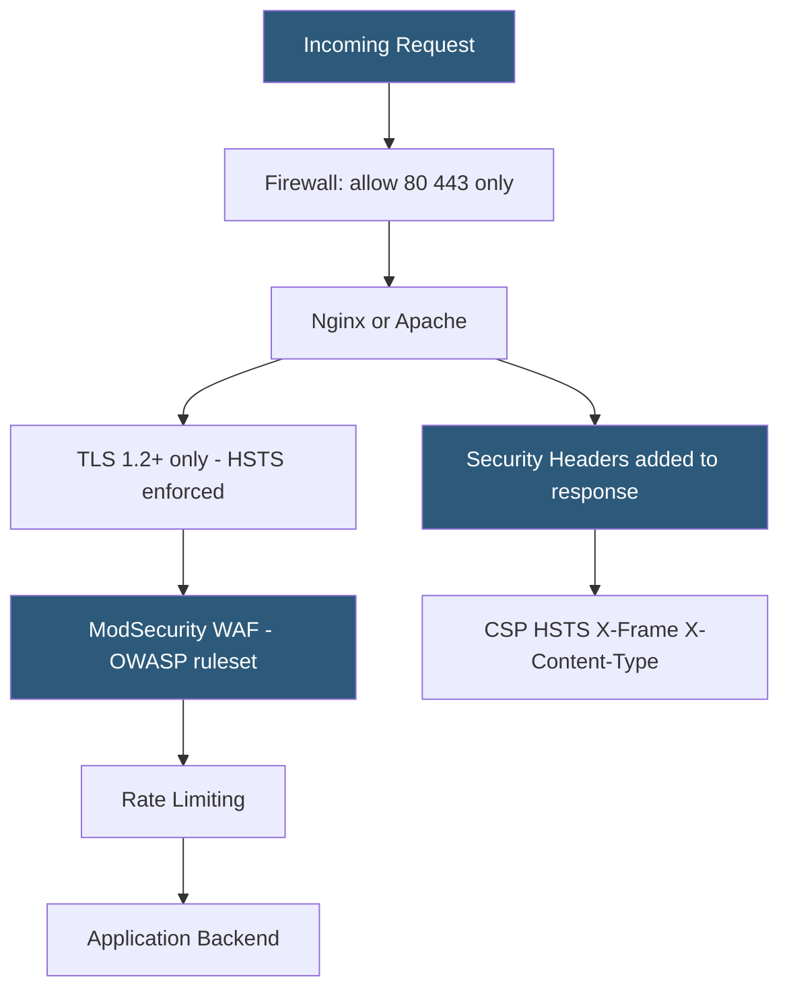

**Category:** Web Server Technologies
**Difficulty:** Advanced
**Reading time:** 7 min read

---

Web server security hardening reduces the attack surface of Apache, Nginx, or LiteSpeed by disabling unnecessary features, enforcing secure defaults, hiding version information, and configuring HTTP security headers. A hardened server is not impenetrable but makes common attacks — directory traversal, clickjacking, MIME-type confusion, SSL downgrade — significantly harder. Hardening is applied at both the server configuration level and the network perimeter.

- **Server Tokens** — Apache/Nginx directives controlling whether the server version appears in HTTP response headers
- **security headers** — HTTP response headers (CSP, HSTS, X-Frame-Options) instructing browsers to enforce security policies
- **HSTS (HTTP Strict Transport Security)** — header forcing browsers to use HTTPS for a domain for a specified duration
- **Content-Security-Policy (CSP)** — header restricting which scripts, styles, and resources a page may load
- **X-Frame-Options** — header preventing the page from being embedded in iframes (clickjacking protection)
- **ModSecurity WAF** — open-source Web Application Firewall module for Apache and Nginx
- **TLS 1.2+ enforcement** — disabling deprecated SSL/TLS protocol versions to prevent downgrade attacks
- **Permissions-Policy** — header controlling browser feature access (geolocation, camera, microphone) per page

Version disclosure is the first thing to address. Apache's `ServerTokens Prod` and `ServerSignature Off` directives reduce error pages and response headers to show only "Apache" without the version number. Nginx's `server_tokens off;` removes the version from both response headers and default error pages. This does not prevent exploitation but removes easy fingerprinting that drives automated scanners.

TLS configuration should enforce a minimum of TLS 1.2, disable weak cipher suites, and prefer ECDHE cipher suites for perfect forward secrecy. The Mozilla SSL Configuration Generator produces server-specific configs for Modern, Intermediate, and Old compatibility profiles. HSTS (`Strict-Transport-Security: max-age=31536000; includeSubDomains; preload`) instructs browsers to refuse HTTP connections for the entire domain and all subdomains for one year.

Security headers block entire classes of browser-side attacks. `X-Frame-Options: DENY` or `Content-Security-Policy: frame-ancestors 'none'` prevents clickjacking by blocking iframe embedding. `X-Content-Type-Options: nosniff` stops MIME-type sniffing attacks. `Referrer-Policy: strict-origin-when-cross-origin` controls referrer header leakage. `Permissions-Policy` limits access to browser APIs the application does not use.

Directory listing must be disabled: `Options -Indexes` in Apache, `autoindex off;` in Nginx. Sensitive file extensions (.log, .sql, .bak, .env) should return 403 via FilesMatch/location blocks. Upload directories should be served without script execution permissions.

ModSecurity with the OWASP Core Rule Set (CRS) provides a first line of WAF defense, blocking SQL injection, XSS, path traversal, and RCE attempts before they reach application code.

- Pre-deployment security checklist for new server provisioning
- Remediation after a security audit identifies missing headers
- Compliance with PCI-DSS requiring TLS 1.2 minimum and specific cipher suites
- Blocking directory traversal attempts on upload-heavy applications
- Adding HSTS and CSP headers to legacy applications that cannot generate them internally

| Advantage | Disadvantage |
|-----------|--------------|
| Reduces successful attack surface measurably | Overly strict CSP breaks legitimate third-party scripts |
| HSTS preloading provides browser-level HTTPS guarantee | HSTS preloading is permanent until removal request is processed |
| ModSecurity blocks common attacks at network layer | WAF rules require tuning; false positives block legitimate requests |
| Security headers are free to implement and test | Version hiding only obscures, does not fix underlying vulnerabilities |

- [ModSecurity WAF Rules](modsecurity-waf-rules.md)
- [Web Server SSL/TLS Configuration](web-server-ssl-tls-configuration.md)
- [Rate Limiting at Web Server](rate-limiting-at-web-server.md)

---
*Part of the [Web Server Technologies](index.md) category · [Back to Master Index](../../index.md)*
