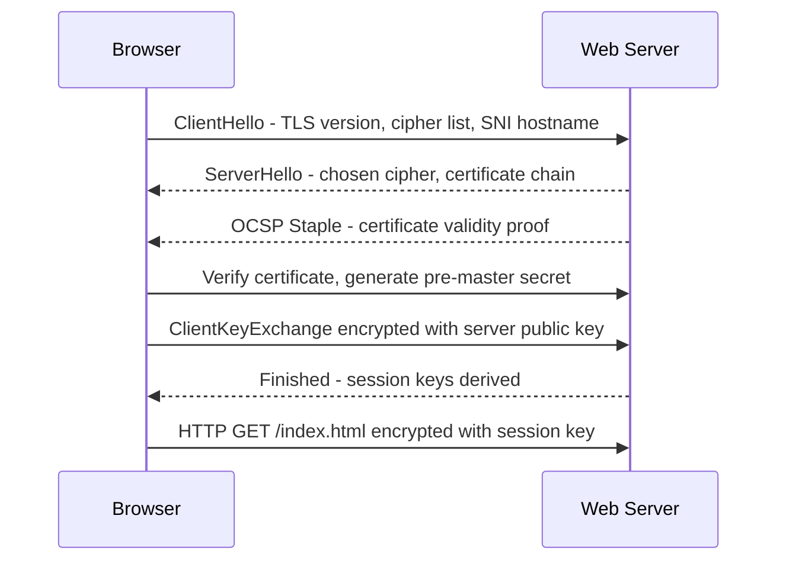

**Category:** Web Server Technologies
**Difficulty:** Intermediate
**Reading time:** 6 min read

---

SSL/TLS configuration on web servers secures data in transit between clients and the server using public-key cryptography. Correct TLS setup requires selecting appropriate protocol versions, cipher suites, certificate chains, and HTTP security headers. Misconfigured TLS — weak ciphers, expired certificates, missing HSTS — is one of the most common security vulnerabilities identified in web application audits.

- **TLS certificate** — X.509 certificate binding a domain name to a public key, signed by a Certificate Authority (CA)
- **Let's Encrypt** — free automated CA issuing 90-day DV certificates via the ACME protocol
- **OCSP Stapling** — server-side mechanism fetching and caching the certificate revocation status to include in the TLS handshake
- **SNI (Server Name Indication)** — TLS extension allowing multiple HTTPS virtual hosts on one IP
- **cipher suite** — combination of key exchange, authentication, encryption, and MAC algorithms negotiated during the TLS handshake
- **Forward secrecy (PFS)** — property ensuring past session keys cannot be derived if the server's private key is later compromised
- **ssl_session_cache** — Nginx/Apache directive caching TLS session parameters to avoid full handshakes on reconnection
- **HSTS** — HTTP Strict Transport Security header instructing browsers to refuse HTTP connections to the domain

A TLS certificate is obtained from a CA — either a paid CA (DigiCert, Sectigo) or free Let's Encrypt. Let's Encrypt uses the ACME protocol for automated issuance: Certbot or ACME.sh runs a challenge, proving domain control either by serving a file at `/.well-known/acme-challenge/` (HTTP-01) or by adding a DNS TXT record (DNS-01). Let's Encrypt issues 90-day certificates; Certbot's systemd timer renews them at 60 days automatically.

In Nginx, TLS is configured on a `server` block: `listen 443 ssl;`, `ssl_certificate /path/to/fullchain.pem;`, `ssl_certificate_key /path/to/privkey.pem;`. The Mozilla SSL Configuration Generator produces hardened protocol and cipher directives for the chosen compatibility level. For modern compatibility: `ssl_protocols TLSv1.2 TLSv1.3;`, `ssl_prefer_server_ciphers off;` (TLS 1.3 manages cipher selection itself), and an explicit `ssl_ciphers` string for TLS 1.2 excluding RC4, 3DES, and export-grade ciphers.

OCSP Stapling caches the certificate revocation check result on the server. Without stapling, the browser must make a separate request to the CA's OCSP server during every TLS handshake. `ssl_stapling on; ssl_stapling_verify on; resolver 8.8.8.8;` in Nginx enables this optimization.

The `ssl_session_cache shared:SSL:10m; ssl_session_timeout 1d;` directives store TLS session parameters in a shared memory zone, allowing clients to resume sessions without a full handshake for 24 hours. TLS 1.3 session tickets provide similar resumption performance.

Certbot's `--nginx` flag automatically modifies virtual host configs to add SSL directives and an HTTP-to-HTTPS redirect block, handling most of the configuration work.

- Deploying Let's Encrypt certificates on new VPS or dedicated server installations
- Hardening cipher suites to remove deprecated TLS 1.0/1.1 protocol support
- Configuring OCSP stapling to improve TLS handshake performance
- Setting up wildcard certificates for subdomains using DNS-01 challenge
- Testing TLS configuration quality against SSL Labs scan (ssllabs.com/ssltest)

| Advantage | Disadvantage |
|-----------|--------------|
| Let's Encrypt eliminates certificate cost for DV certs | 90-day expiry requires reliable automated renewal pipeline |
| TLS 1.3 significantly faster handshake than 1.2 | Strict cipher configuration breaks very old clients (IE8/XP) |
| OCSP stapling removes per-connection CA latency | Wildcard certs require DNS-01 challenge and DNS API access |
| Session caching reduces repeated TLS handshake overhead | Private key compromise requires immediate certificate revocation |

- [Web Server Security Hardening](web-server-security-hardening.md)
- [Apache Virtual Host Setup](apache-virtual-host-setup.md)
- [Nginx Reverse Proxy Configuration](nginx-reverse-proxy-configuration.md)

---
*Part of the [Web Server Technologies](index.md) category · [Back to Master Index](../../index.md)*
