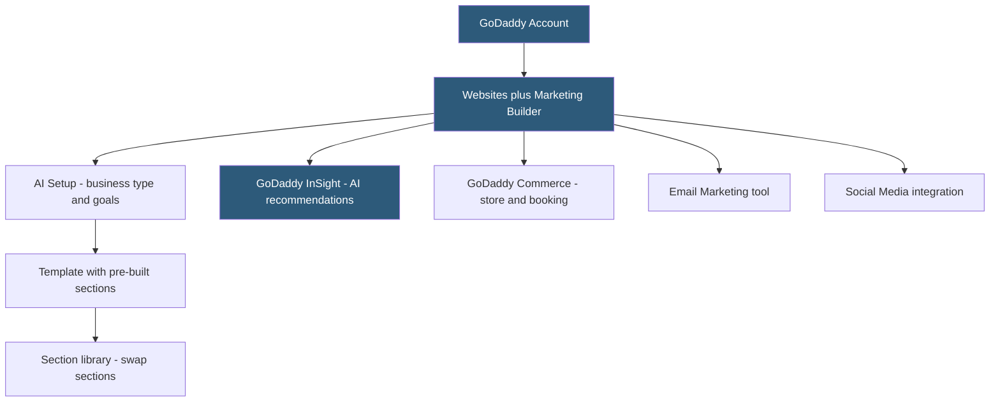

**Category:** Website Builder Platforms
**Difficulty:** Beginner
**Reading time:** 5 min read

---

GoDaddy Website Builder (marketed as Websites + Marketing) is a hosted website builder targeting small business owners who purchase domains and hosting from GoDaddy. It combines an AI-assisted design setup, pre-built industry templates, and integrated marketing tools in a platform designed for speed — GoDaddy's research showed their users wanted functional websites live within an hour. It includes built-in appointment booking, online store, and email marketing at higher tiers.

- **Websites + Marketing** — GoDaddy's website builder product combining site building with SEO, email, and social tools
- **GoDaddy InSight** — AI-powered analytics and recommendations engine scoring site performance and suggesting improvements
- **section-based editing** — editor model where pages are built from pre-designed sections swapped in and out
- **GoDaddy Studio** — mobile design tool for creating social media graphics and logo designs
- **online store** — integrated e-commerce functionality available on paid plans through GoDaddy Commerce
- **appointment booking** — built-in scheduling feature for service businesses, available on Commerce plans
- **GoDaddy Email Marketing** — integrated email campaign tool connected to site contacts
- **SEO tools** — built-in guidance for meta titles, descriptions, and Google Search Console connection

GoDaddy Website Builder begins with a brief setup process asking the user's business name, industry, and primary goals. The system generates a template based on these inputs, pre-populated with placeholder content appropriate for the industry. The editor uses a section-based model: pages are composed of full-width sections (hero, about, services, contact), and users can swap sections in and out from a library of pre-designed alternatives within each section type.

Editing within sections is straightforward: click text to edit, click images to replace from the image library or upload. The editor does not support free-form element positioning — elements stay within their section's predefined layout. This makes the editor very accessible to complete beginners but limits design creativity compared to Wix or Webflow.

GoDaddy InSight is the platform's differentiating feature: an AI engine that monitors the site and provides a performance score with actionable recommendations. InSight analyzes the site's content, SEO settings, online reviews, and social media activity to generate suggestions like "Add a business description to your Google Business Profile" or "Your site needs a call-to-action button above the fold." The score is benchmarked against similar businesses in the industry.

The Websites + Marketing plans include increasing levels of the integrated toolset: the Basic plan covers core site building; Standard adds email marketing; Premium adds advanced SEO tools; Commerce adds the online store and appointment booking. GoDaddy's domain and hosting upsell is built into the flow — a registered GoDaddy domain connects to the builder with one click.

- Small business owners who already have a GoDaddy domain needing a quick website
- Service businesses using GoDaddy's appointment booking for client scheduling
- Local businesses wanting AI-driven recommendations for improving online presence
- Retailers migrating from a GoDaddy domain-only setup to a commerce-enabled site
- Non-technical owners who need a functional site without any technical learning curve

| Advantage | Disadvantage |
|-----------|--------------|
| GoDaddy InSight provides actionable AI-driven performance recommendations | Limited design flexibility vs Squarespace or Webflow |
| One-stop-shop for domain, hosting, and website builder | Less polished template designs than Squarespace |
| Very fast setup from domain registration to live site | Lock-in: difficult to migrate to other platforms |
| Built-in email marketing and social media tools | Advanced features require upgrading to higher-priced plans |

- [GoDaddy InSight Design Intelligence](godaddy-insight-design-intelligence.md)
- [Squarespace Website Builder](squarespace-website-builder.md)
- [Hostinger Website Builder](hostinger-website-builder.md)

---
*Part of the [Website Builder Platforms](index.md) category · [Back to Master Index](../../index.md)*
