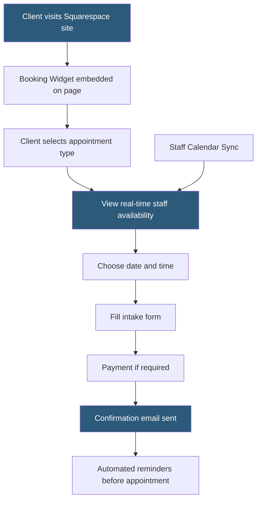

**Category:** Website Builder Platforms
**Difficulty:** Beginner
**Reading time:** 5 min read

---

Squarespace Acuity Scheduling is a full-featured appointment booking and scheduling platform integrated into Squarespace websites. Originally a standalone product acquired by Squarespace in 2019, Acuity provides client self-scheduling, staff calendar management, intake forms, payment collection at booking, and automated reminder emails. It serves service-based businesses — therapists, consultants, salons, fitness studios — that need sophisticated scheduling on their websites.

- **Acuity Scheduling** — cloud-based appointment scheduling platform integrated with Squarespace
- **appointment type** — configurable service definition including name, duration, price, and availability windows
- **availability** — configured time windows when a staff member accepts bookings
- **client self-scheduling** — process allowing clients to view real-time availability and book appointments without contacting staff
- **intake form** — custom questionnaire collected from clients at booking for appointment preparation
- **calendar sync** — two-way integration with Google Calendar or Outlook preventing double-booking
- **automated reminders** — email and SMS messages sent to clients before appointments to reduce no-shows
- **booking widget** — Acuity embed added to Squarespace pages for client-facing scheduling

Acuity is set up through the Scheduling section of the Squarespace dashboard. Appointment types define the services offered: each type has a name, duration, optional price, and optional limit on bookings per day. Staff members (multiple supported) have individual availability windows defined for each day of the week, with exceptions for holidays or specific dates.

Calendar synchronization is central to preventing double-booking. Acuity reads existing events from a connected Google Calendar or Outlook calendar and blocks those times in the booking interface. When a new appointment is booked, Acuity adds it to the connected calendar, so staff members see all appointments alongside personal calendar entries.

The client-facing booking interface is embedded on a Squarespace page as a booking widget. Clients see a list of appointment types, select one, choose a date, and see available time slots for that day. After selecting a time, they complete a customizable intake form (asking for name, contact details, or any service-specific questions). If the appointment type requires payment, Stripe or PayPal processing occurs during booking.

Automated communications reduce no-shows: Acuity sends a booking confirmation email immediately, then reminder emails or SMS messages at configurable intervals before the appointment (e.g., 24 hours before, 1 hour before). Cancellation and rescheduling are handled through links in the confirmation email.

Acuity's pricing is separate from Squarespace's site plans. The Emerging Entrepreneur plan covers solo practitioners; Growing Businesses adds multiple staff calendars; Powerhouse Player adds custom API and remove branding.

- Therapy practice enabling clients to book sessions and complete intake paperwork online
- Hair salon allowing clients to choose a stylist and service type with instant availability
- Personal trainer selling and scheduling training sessions with payment at booking
- Consulting firm managing multiple team members' appointment calendars from one interface
- Yoga studio offering class booking with automatic waitlist when classes fill

| Advantage | Disadvantage |
|-----------|--------------|
| Full-featured scheduling with payment, reminders, and intake forms | Acuity plan cost is separate from and additional to Squarespace plan |
| Two-way calendar sync prevents double-booking | Setup complexity higher than simple contact-form appointment requests |
| Client self-service reduces administrative burden on staff | Branding customization limited on lower-tier plans |
| Automated reminders measurably reduce no-show rates | Advanced API access for custom integrations requires highest plan tier |

- [Squarespace Website Builder](squarespace-website-builder.md)
- [Squarespace Extensions Marketplace](squarespace-extensions-marketplace.md)
- [Duda Responsive Website Builder](duda-responsive-website-builder.md)

---
*Part of the [Website Builder Platforms](index.md) category · [Back to Master Index](../../index.md)*
