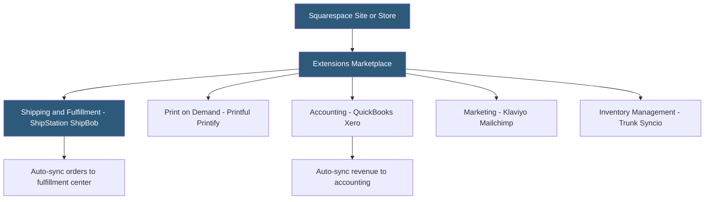

**Category:** Website Builder Platforms
**Difficulty:** Beginner
**Reading time:** 5 min read

---

Squarespace Extensions is the platform's marketplace for third-party integrations that expand site functionality beyond built-in features. Extensions connect Squarespace Commerce stores to external shipping, accounting, inventory, marketing, and analytics services. The marketplace is deliberately curated and smaller than Wix's App Market, prioritizing deep, reliable integrations over breadth.

- **Squarespace Extensions** — curated marketplace of third-party integrations for Squarespace sites
- **commerce extension** — integration focused on enhancing Squarespace store functionality (shipping, accounting, inventory)
- **marketing extension** — integration connecting Squarespace to email marketing, CRM, or advertising platforms
- **OAuth connection** — standard authorization flow used by extensions to access Squarespace site data
- **ShipBob / ShipStation** — third-party fulfillment and shipping management extensions
- **QuickBooks / Xero** — accounting extensions syncing Squarespace order data to financial software
- **Printful / Printify** — print-on-demand extensions adding custom merchandise to Squarespace stores
- **extension dashboard** — settings interface for managing a connected extension, accessible from Squarespace Commerce

Extensions are discovered in the Squarespace Extensions marketplace, accessible from the site's Commerce or website settings. Each extension listing describes its functionality, pricing, and supported Squarespace features. Installing an extension initiates an OAuth authorization flow: the user is redirected to the third-party service's website to log in and grant permission for the extension to access specific Squarespace data (orders, products, customer information). After authorization, the connection is established and the extension begins syncing data.

Commerce extensions are the most common category. Shipping extensions like ShipStation pull new Squarespace orders automatically, generate shipping labels, and push tracking numbers back to Squarespace to update customers. Print-on-demand extensions like Printful listen for product orders, produce custom merchandise, and fulfill them directly without inventory held by the site owner. The product catalog is synced between Squarespace and the print provider so product listings reflect available design variants.

Accounting extensions (QuickBooks Online, Xero) map Squarespace order data — line items, discounts, taxes, refunds — to accounting categories and create corresponding transactions in the accounting platform automatically, eliminating manual bookkeeping.

Marketing extensions like Klaviyo sync Squarespace customer and order data to Klaviyo's email marketing platform, enabling behavioral email automation (abandoned cart sequences, post-purchase flows) that Squarespace Email Campaigns cannot replicate natively.

Unlike Wix's App Market where apps can add visible widgets to site pages, most Squarespace Extensions are backend integrations that process data without frontend page elements.

- Connecting Squarespace Commerce to ShipStation for multi-carrier label generation
- Syncing Squarespace order revenue to QuickBooks for automated bookkeeping
- Adding print-on-demand merchandise via Printful without managing inventory
- Building abandoned cart email flows by connecting Squarespace to Klaviyo
- Managing multi-platform inventory across Squarespace and Etsy via a sync extension

| Advantage | Disadvantage |
|-----------|--------------|
| Curated marketplace ensures baseline integration quality | Much smaller selection than Wix App Market or WordPress plugins |
| OAuth connections are secure and revocable | Most extensions focused on commerce; limited for non-store sites |
| Backend integrations do not add page load overhead | Some high-value extensions (Klaviyo) have significant separate cost |
| Deep accounting and fulfillment integrations well-maintained | No extensions for adding new page widget types |

- [Squarespace Website Builder](squarespace-website-builder.md)
- [Squarespace Acuity Scheduling](squarespace-acuity-scheduling.md)
- [Wix App Market Integrations](wix-app-market-integrations.md)

---
*Part of the [Website Builder Platforms](index.md) category · [Back to Master Index](../../index.md)*
